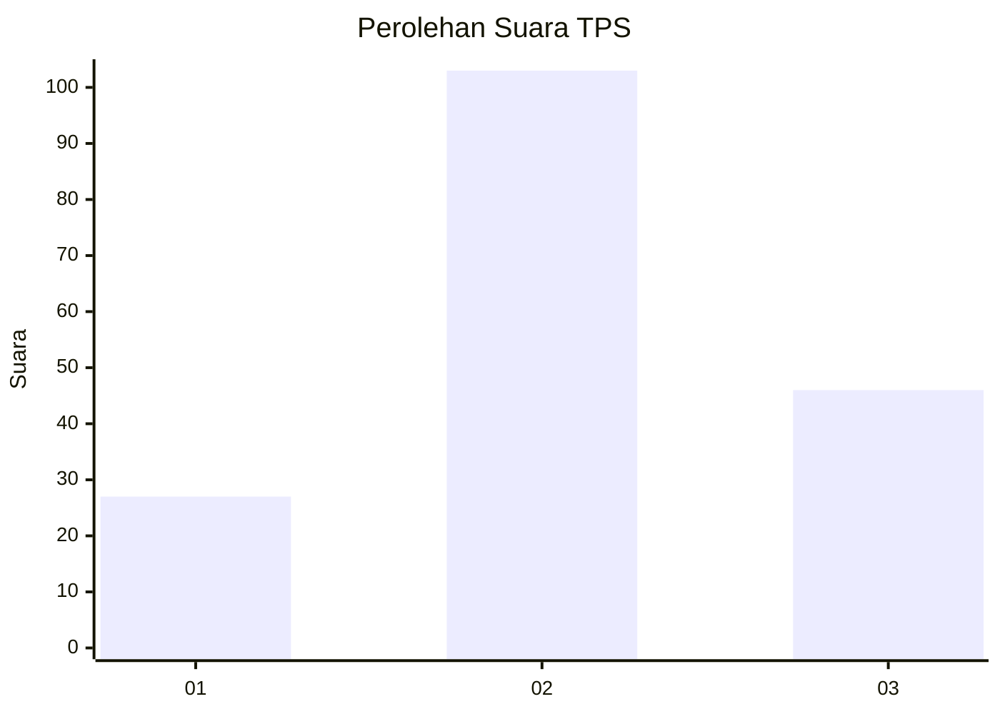
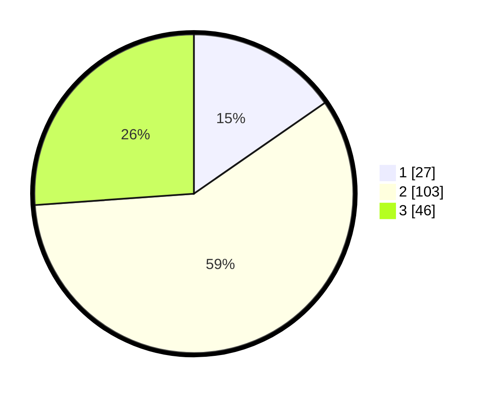

# Hasil

## Grafik

## Tabel

| No. | Nama Paslon    | Suara | Suara (raw) | Persentase |
|:--- |:-------------- | -----:| -----------:| ----------:|
| 1   | ANIES MUHAIMIN | 27    | [27][p-1]   | 15,34      |
| 2   | PRABOWO GIBRAN | 103   | [103][p-2]  | 58,52      |
| 3   | GANJAR MAHFUD  | 46    | [46][p-3]   | 26,14      |

[p-1]: https://github.com/gigit-pemilu/pemilu-2024/blob/main/pilpres/hitung-suara/sub/35-jawa-timur/sub/09-jember/sub/09-bangsalsari/sub/2008-tisnogambar/sub/001-tps/sub/paslon-1.txt
[p-2]: https://github.com/gigit-pemilu/pemilu-2024/blob/main/pilpres/hitung-suara/sub/35-jawa-timur/sub/09-jember/sub/09-bangsalsari/sub/2008-tisnogambar/sub/001-tps/sub/paslon-2.txt
[p-3]: https://github.com/gigit-pemilu/pemilu-2024/blob/main/pilpres/hitung-suara/sub/35-jawa-timur/sub/09-jember/sub/09-bangsalsari/sub/2008-tisnogambar/sub/001-tps/sub/paslon-3.txt

## Foto C Plano

https://sirekap-obj-formc.kpu.go.id/dfa2/pemilu/ppwp/35/09/09/20/08/3509092008001-20240214-224258--0ef17397-b625-4b79-b4f2-54047c84c9d1.jpg

https://sirekap-obj-formc.kpu.go.id/dfa2/pemilu/ppwp/35/09/09/20/08/3509092008001-20240214-224411--e5f97894-f062-4f83-a83e-2309b7ebe6bc.jpg

https://sirekap-obj-formc.kpu.go.id/dfa2/pemilu/ppwp/35/09/09/20/08/3509092008001-20240214-232240--e1948f55-9243-418e-8fe0-7a55efe6812b.jpg

## Metadata

| Key        | Value               |
| ---------- | ------------------- |
| Time Stamp | 2024-02-16 16:25:10 |

