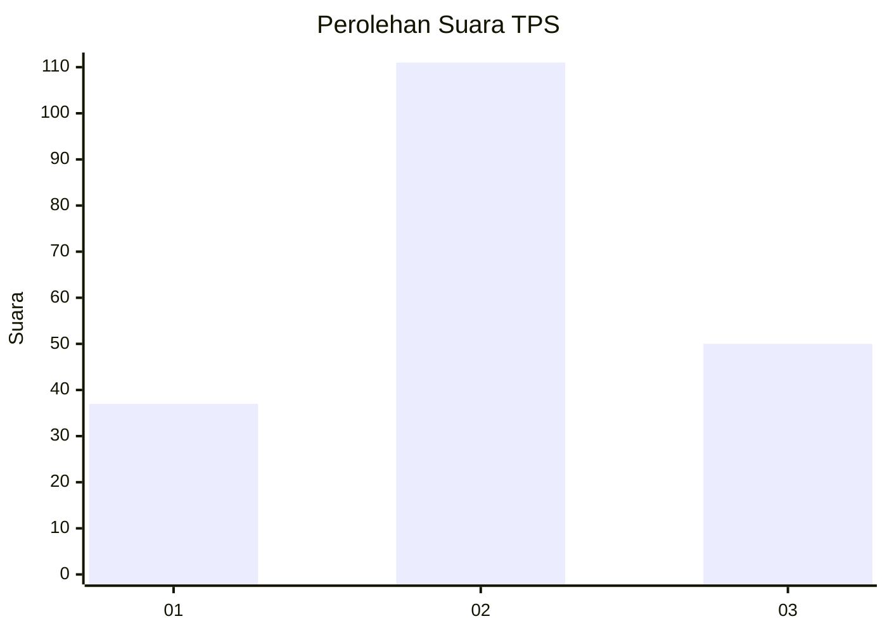
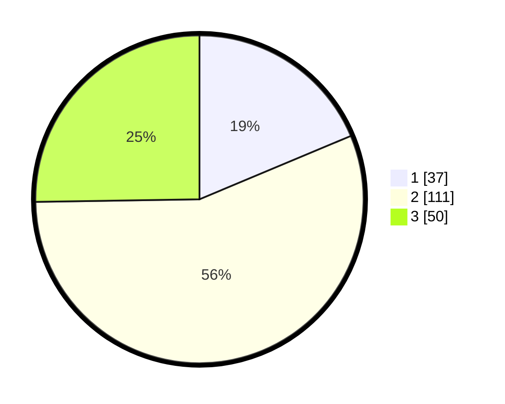

# Hasil

## Grafik

## Tabel

| No. | Nama Paslon    | Suara | Suara (raw) | Persentase |
|:--- |:-------------- | -----:| -----------:| ----------:|
| 1   | ANIES MUHAIMIN | 37    | [37][p-1]   | 18,69      |
| 2   | PRABOWO GIBRAN | 111   | [111][p-2]  | 56,06      |
| 3   | GANJAR MAHFUD  | 50    | [50][p-3]   | 25,25      |

[p-1]: https://github.com/gigit-pemilu/pemilu-2024/blob/main/pilpres/hitung-suara/sub/35-jawa-timur/sub/09-jember/sub/09-bangsalsari/sub/2008-tisnogambar/sub/002-tps/sub/paslon-1.txt
[p-2]: https://github.com/gigit-pemilu/pemilu-2024/blob/main/pilpres/hitung-suara/sub/35-jawa-timur/sub/09-jember/sub/09-bangsalsari/sub/2008-tisnogambar/sub/002-tps/sub/paslon-2.txt
[p-3]: https://github.com/gigit-pemilu/pemilu-2024/blob/main/pilpres/hitung-suara/sub/35-jawa-timur/sub/09-jember/sub/09-bangsalsari/sub/2008-tisnogambar/sub/002-tps/sub/paslon-3.txt

## Foto C Plano

https://sirekap-obj-formc.kpu.go.id/68db/pemilu/ppwp/35/09/09/20/08/3509092008002-20240214-220142--0f07f08f-43dc-4f81-911f-4041b9f1c42d.jpg

https://sirekap-obj-formc.kpu.go.id/68db/pemilu/ppwp/35/09/09/20/08/3509092008002-20240214-220400--0794f6ee-715b-42b8-97b8-35997a6023c1.jpg

https://sirekap-obj-formc.kpu.go.id/68db/pemilu/ppwp/35/09/09/20/08/3509092008002-20240214-220529--44576afe-023b-4bc9-b41e-c741493c98d6.jpg

## Metadata

| Key        | Value               |
| ---------- | ------------------- |
| Time Stamp | 2024-02-16 16:25:10 |

