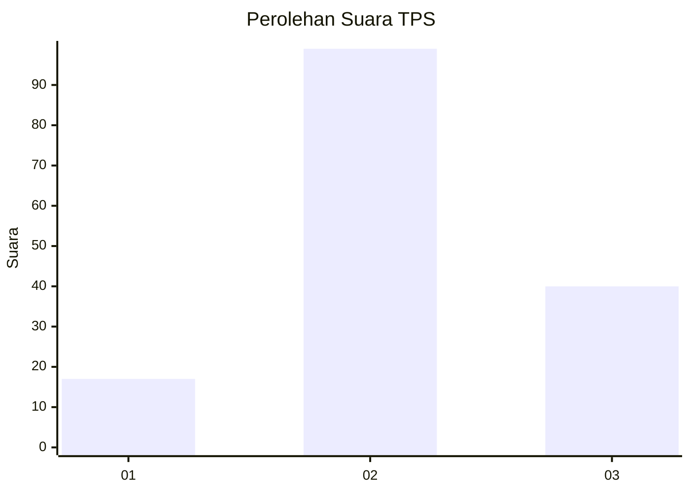
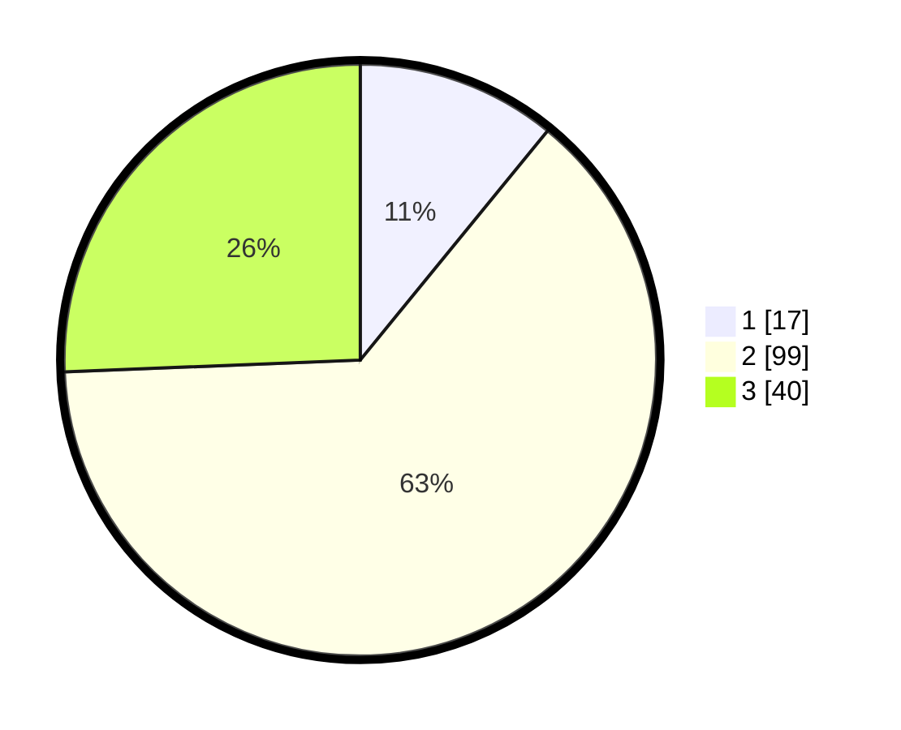

# Hasil

## Grafik

## Tabel

| No. | Nama Paslon    | Suara | Suara (raw) | Persentase |
|:--- |:-------------- | -----:| -----------:| ----------:|
| 1   | ANIES MUHAIMIN | 17    | [17][p-1]   | 10,90      |
| 2   | PRABOWO GIBRAN | 99    | [99][p-2]   | 63,46      |
| 3   | GANJAR MAHFUD  | 40    | [40][p-3]   | 25,64      |

[p-1]: https://github.com/gigit-pemilu/pemilu-2024/blob/main/pilpres/hitung-suara/sub/35-jawa-timur/sub/09-jember/sub/09-bangsalsari/sub/2008-tisnogambar/sub/005-tps/sub/paslon-1.txt
[p-2]: https://github.com/gigit-pemilu/pemilu-2024/blob/main/pilpres/hitung-suara/sub/35-jawa-timur/sub/09-jember/sub/09-bangsalsari/sub/2008-tisnogambar/sub/005-tps/sub/paslon-2.txt
[p-3]: https://github.com/gigit-pemilu/pemilu-2024/blob/main/pilpres/hitung-suara/sub/35-jawa-timur/sub/09-jember/sub/09-bangsalsari/sub/2008-tisnogambar/sub/005-tps/sub/paslon-3.txt

## Foto C Plano

https://sirekap-obj-formc.kpu.go.id/42c9/pemilu/ppwp/35/09/09/20/08/3509092008005-20240214-222432--287246bf-dfca-4e23-996a-ade0ea02f585.jpg

https://sirekap-obj-formc.kpu.go.id/42c9/pemilu/ppwp/35/09/09/20/08/3509092008005-20240214-222536--9ae87ad8-5963-43fc-8cf8-cce3125551a7.jpg

https://sirekap-obj-formc.kpu.go.id/42c9/pemilu/ppwp/35/09/09/20/08/3509092008005-20240214-222639--2ba325b5-d447-440c-99f5-13d126dd5328.jpg

## Metadata

| Key        | Value               |
| ---------- | ------------------- |
| Time Stamp | 2024-02-16 23:45:47 |

