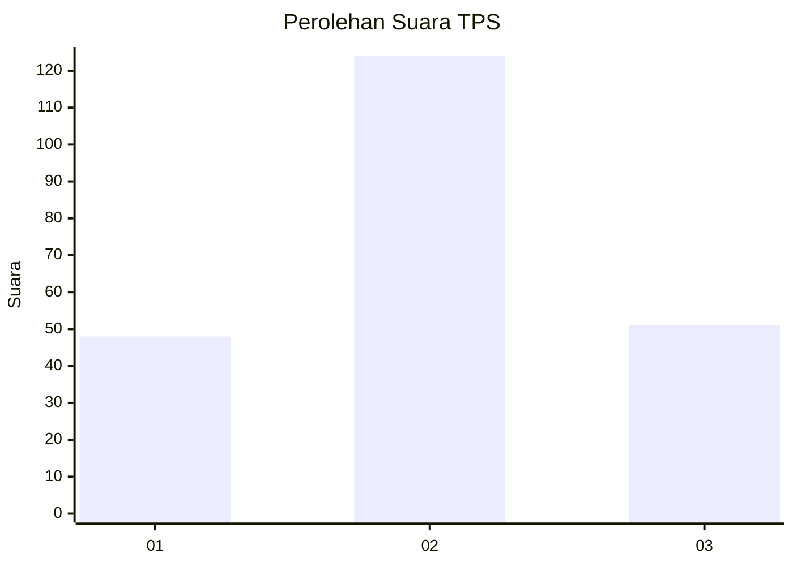
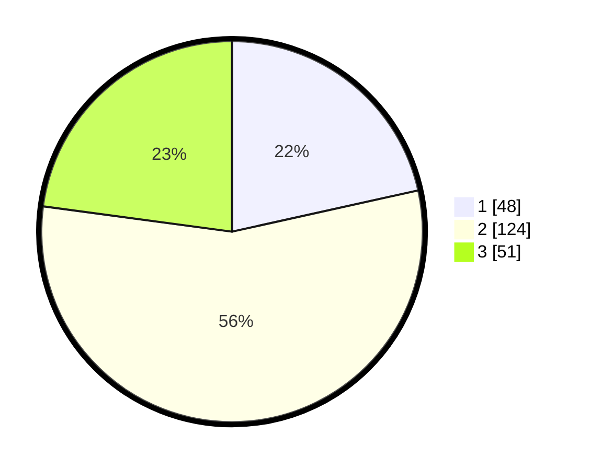

# Hasil

## Grafik

## Tabel

| No. | Nama Paslon    | Suara | Suara (raw) | Persentase |
|:--- |:-------------- | -----:| -----------:| ----------:|
| 1   | ANIES MUHAIMIN | 48    | [48][p-1]   | 21,52      |
| 2   | PRABOWO GIBRAN | 124   | [124][p-2]  | 55,61      |
| 3   | GANJAR MAHFUD  | 51    | [51][p-3]   | 22,87      |

[p-1]: https://github.com/gigit-pemilu/pemilu-2024-35-jawa-timur/blob/main/pilpres/hitung-suara/sub/35-jawa-timur/sub/09-jember/sub/09-bangsalsari/sub/2008-tisnogambar/sub/008-tps/sub/paslon-1.txt
[p-2]: https://github.com/gigit-pemilu/pemilu-2024-35-jawa-timur/blob/main/pilpres/hitung-suara/sub/35-jawa-timur/sub/09-jember/sub/09-bangsalsari/sub/2008-tisnogambar/sub/008-tps/sub/paslon-2.txt
[p-3]: https://github.com/gigit-pemilu/pemilu-2024-35-jawa-timur/blob/main/pilpres/hitung-suara/sub/35-jawa-timur/sub/09-jember/sub/09-bangsalsari/sub/2008-tisnogambar/sub/008-tps/sub/paslon-3.txt

## Foto C Plano

https://sirekap-obj-formc.kpu.go.id/2bd8/pemilu/ppwp/35/09/09/20/08/3509092008008-20240214-211742--4685b8bf-3f6f-4e0c-9368-c92b7787f4c0.jpg

https://sirekap-obj-formc.kpu.go.id/2bd8/pemilu/ppwp/35/09/09/20/08/3509092008008-20240214-211751--53aa00d7-9dc3-430a-85b0-2a98f9ddabe4.jpg

https://sirekap-obj-formc.kpu.go.id/2bd8/pemilu/ppwp/35/09/09/20/08/3509092008008-20240214-211759--af9a33f4-90d4-40fc-a442-d3585938c487.jpg

## Metadata

| Key        | Value               |
| ---------- | ------------------- |
| Time Stamp | 2024-02-16 16:25:10 |

