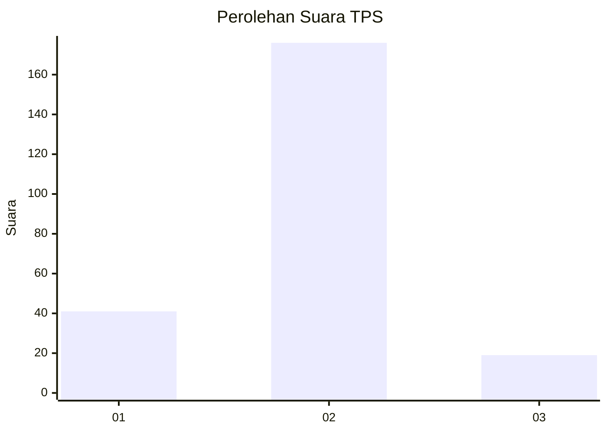
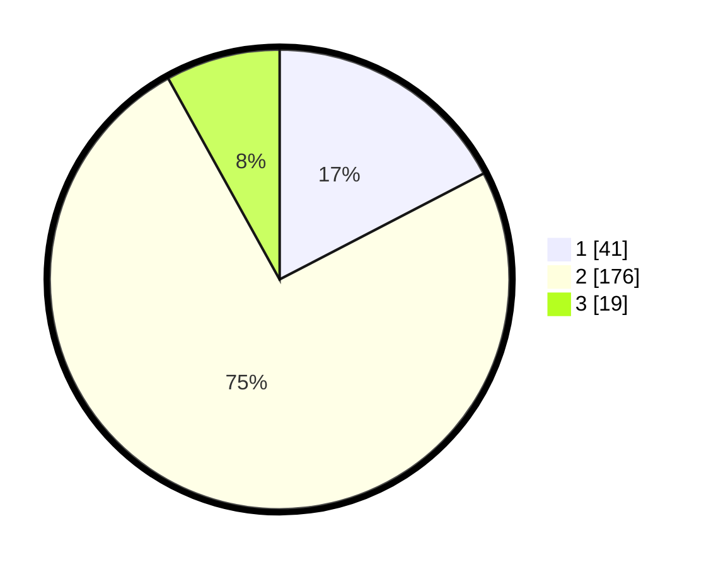

# Hasil

## Grafik

## Tabel

| No. | Nama Paslon    | Suara | Suara (raw) | Persentase |
|:--- |:-------------- | -----:| -----------:| ----------:|
| 1   | ANIES MUHAIMIN | 41    | [41][p-1]   | 17,37      |
| 2   | PRABOWO GIBRAN | 176   | [176][p-2]  | 74,58      |
| 3   | GANJAR MAHFUD  | 19    | [19][p-3]   | 8,05       |

[p-1]: https://github.com/gigit-pemilu/pemilu-2024/blob/main/pilpres/hitung-suara/sub/35-jawa-timur/sub/09-jember/sub/09-bangsalsari/sub/2008-tisnogambar/sub/011-tps/sub/paslon-1.txt
[p-2]: https://github.com/gigit-pemilu/pemilu-2024/blob/main/pilpres/hitung-suara/sub/35-jawa-timur/sub/09-jember/sub/09-bangsalsari/sub/2008-tisnogambar/sub/011-tps/sub/paslon-2.txt
[p-3]: https://github.com/gigit-pemilu/pemilu-2024/blob/main/pilpres/hitung-suara/sub/35-jawa-timur/sub/09-jember/sub/09-bangsalsari/sub/2008-tisnogambar/sub/011-tps/sub/paslon-3.txt

## Foto C Plano

https://sirekap-obj-formc.kpu.go.id/73ea/pemilu/ppwp/35/09/09/20/08/3509092008011-20240215-003221--413fc5df-ceb6-43b4-a648-8e1560e8c6d7.jpg

https://sirekap-obj-formc.kpu.go.id/73ea/pemilu/ppwp/35/09/09/20/08/3509092008011-20240215-030557--37d43e3c-a005-4aac-ab75-5f0acda7d31d.jpg

https://sirekap-obj-formc.kpu.go.id/73ea/pemilu/ppwp/35/09/09/20/08/3509092008011-20240215-003439--e1ce4656-e2b7-4aec-ae39-453d85f62325.jpg

## Metadata

| Key        | Value               |
| ---------- | ------------------- |
| Time Stamp | 2024-02-16 16:25:10 |

