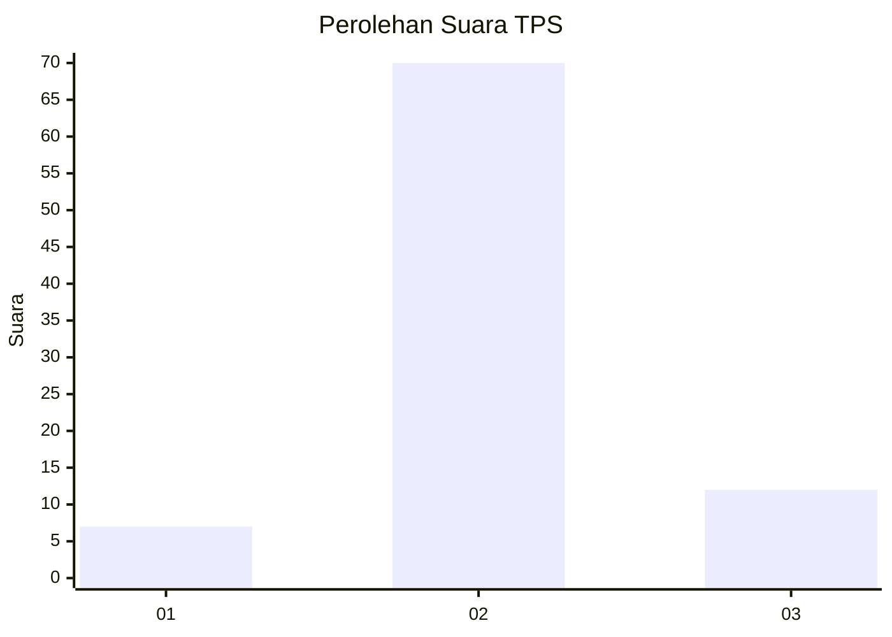
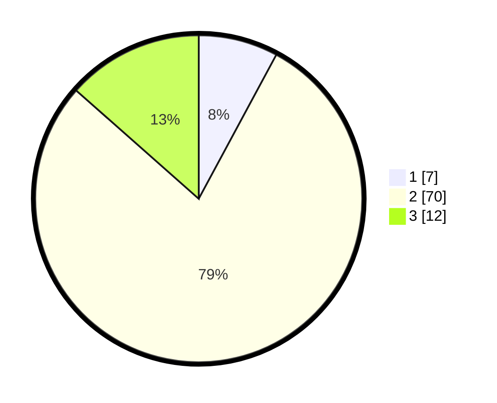

# Hasil

## Grafik

## Tabel

| No. | Nama Paslon    | Suara | Suara (raw) | Persentase |
|:--- |:-------------- | -----:| -----------:| ----------:|
| 1   | ANIES MUHAIMIN | 7     | [7][p-1]    | 7,87       |
| 2   | PRABOWO GIBRAN | 70    | [70][p-2]   | 78,65      |
| 3   | GANJAR MAHFUD  | 12    | [12][p-3]   | 13,48      |

[p-1]: https://github.com/gigit-pemilu/pemilu-2024-35-jawa-timur/blob/main/pilpres/hitung-suara/sub/35-jawa-timur/sub/09-jember/sub/09-bangsalsari/sub/2008-tisnogambar/sub/018-tps/sub/paslon-1.txt
[p-2]: https://github.com/gigit-pemilu/pemilu-2024-35-jawa-timur/blob/main/pilpres/hitung-suara/sub/35-jawa-timur/sub/09-jember/sub/09-bangsalsari/sub/2008-tisnogambar/sub/018-tps/sub/paslon-2.txt
[p-3]: https://github.com/gigit-pemilu/pemilu-2024-35-jawa-timur/blob/main/pilpres/hitung-suara/sub/35-jawa-timur/sub/09-jember/sub/09-bangsalsari/sub/2008-tisnogambar/sub/018-tps/sub/paslon-3.txt

## Foto C Plano

https://sirekap-obj-formc.kpu.go.id/a179/pemilu/ppwp/35/09/09/20/08/3509092008018-20240214-202931--bd1f349d-9871-4d92-898a-5e9e9c596c41.jpg

https://sirekap-obj-formc.kpu.go.id/a179/pemilu/ppwp/35/09/09/20/08/3509092008018-20240214-203202--b5ee6952-f438-4f75-b80a-5e992216e98c.jpg

https://sirekap-obj-formc.kpu.go.id/a179/pemilu/ppwp/35/09/09/20/08/3509092008018-20240214-203422--e2afb8e7-506b-42f0-911c-2f7552e11f74.jpg

## Metadata

| Key        | Value               |
| ---------- | ------------------- |
| Time Stamp | 2024-02-15 15:00:29 |

