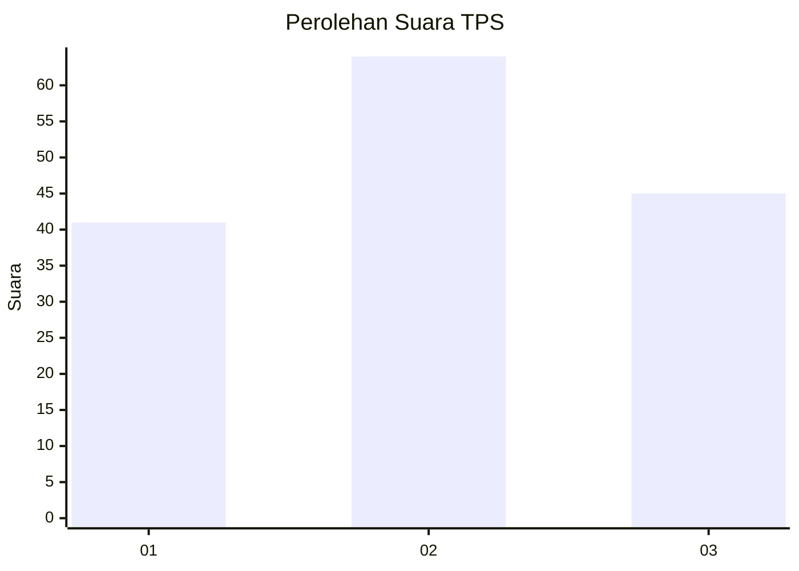
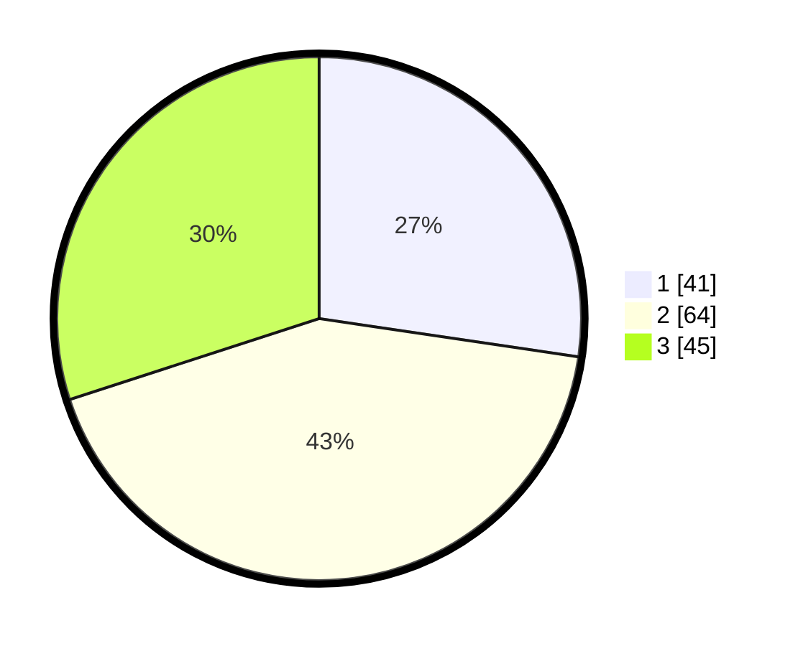

# Hasil

## Grafik

## Tabel

| No. | Nama Paslon    | Suara | Suara (raw) | Persentase |
|:--- |:-------------- | -----:| -----------:| ----------:|
| 1   | ANIES MUHAIMIN | 41    | [41][p-1]   | 27,33      |
| 2   | PRABOWO GIBRAN | 64    | [64][p-2]   | 42,67      |
| 3   | GANJAR MAHFUD  | 45    | [45][p-3]   | 30,00      |

[p-1]: https://github.com/gigit-pemilu/pemilu-2024-35-jawa-timur/blob/main/pilpres/hitung-suara/sub/35-jawa-timur/sub/09-jember/sub/09-bangsalsari/sub/2008-tisnogambar/sub/020-tps/sub/paslon-1.txt
[p-2]: https://github.com/gigit-pemilu/pemilu-2024-35-jawa-timur/blob/main/pilpres/hitung-suara/sub/35-jawa-timur/sub/09-jember/sub/09-bangsalsari/sub/2008-tisnogambar/sub/020-tps/sub/paslon-2.txt
[p-3]: https://github.com/gigit-pemilu/pemilu-2024-35-jawa-timur/blob/main/pilpres/hitung-suara/sub/35-jawa-timur/sub/09-jember/sub/09-bangsalsari/sub/2008-tisnogambar/sub/020-tps/sub/paslon-3.txt

## Foto C Plano

https://sirekap-obj-formc.kpu.go.id/da27/pemilu/ppwp/35/09/09/20/08/3509092008020-20240215-030625--fd22961e-a5e0-446c-a786-8675e6109535.jpg

https://sirekap-obj-formc.kpu.go.id/da27/pemilu/ppwp/35/09/09/20/08/3509092008020-20240214-194631--8023ef39-83a3-485d-ab7f-86f69fc7308e.jpg

https://sirekap-obj-formc.kpu.go.id/da27/pemilu/ppwp/35/09/09/20/08/3509092008020-20240214-194908--fbd85567-ea5f-43a1-8e6e-57977189adfa.jpg

## Metadata

| Key        | Value               |
| ---------- | ------------------- |
| Time Stamp | 2024-02-15 12:00:28 |

