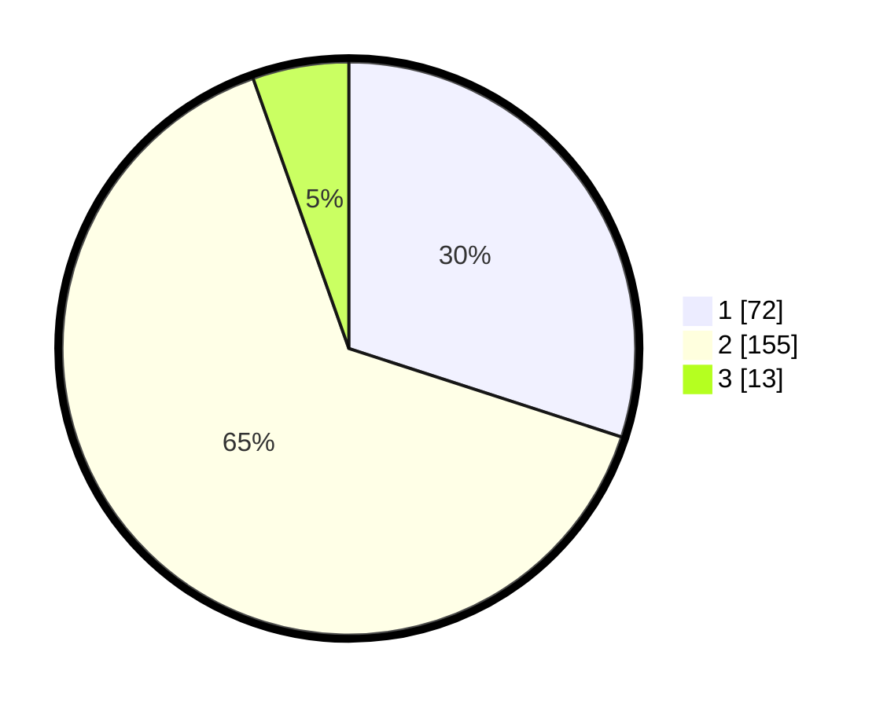

# Hasil

## Grafik

## Tabel

| No. | Nama Paslon    | Suara | Suara (raw) | Persentase |
|:--- |:-------------- | -----:| -----------:| ----------:|
| 1   | ANIES MUHAIMIN | 72    | [72][p-1]   | 30,00      |
| 2   | PRABOWO GIBRAN | 155   | [155][p-2]  | 64,58      |
| 3   | GANJAR MAHFUD  | 13    | [13][p-3]   | 5,42       |

[p-1]: https://github.com/gigit-pemilu/pemilu-2024/blob/main/pilpres/hitung-suara/sub/35-jawa-timur/sub/09-jember/sub/09-bangsalsari/sub/2008-tisnogambar/sub/031-tps/sub/paslon-1.txt
[p-2]: https://github.com/gigit-pemilu/pemilu-2024/blob/main/pilpres/hitung-suara/sub/35-jawa-timur/sub/09-jember/sub/09-bangsalsari/sub/2008-tisnogambar/sub/031-tps/sub/paslon-2.txt
[p-3]: https://github.com/gigit-pemilu/pemilu-2024/blob/main/pilpres/hitung-suara/sub/35-jawa-timur/sub/09-jember/sub/09-bangsalsari/sub/2008-tisnogambar/sub/031-tps/sub/paslon-3.txt

## Foto C Plano

https://sirekap-obj-formc.kpu.go.id/dc29/pemilu/ppwp/35/09/09/20/08/3509092008031-20240214-214131--d3e2efb8-4b10-4138-b464-a979b1d83fd1.jpg

https://sirekap-obj-formc.kpu.go.id/dc29/pemilu/ppwp/35/09/09/20/08/3509092008031-20240214-201345--82e34868-de38-49ac-a2f3-2d4119141115.jpg

https://sirekap-obj-formc.kpu.go.id/dc29/pemilu/ppwp/35/09/09/20/08/3509092008031-20240215-024833--346d7a2f-1afb-4885-a2bc-c38bb33d0651.jpg

## Metadata

| Key        | Value               |
| ---------- | ------------------- |
| Time Stamp | 2024-02-15 15:00:29 |

