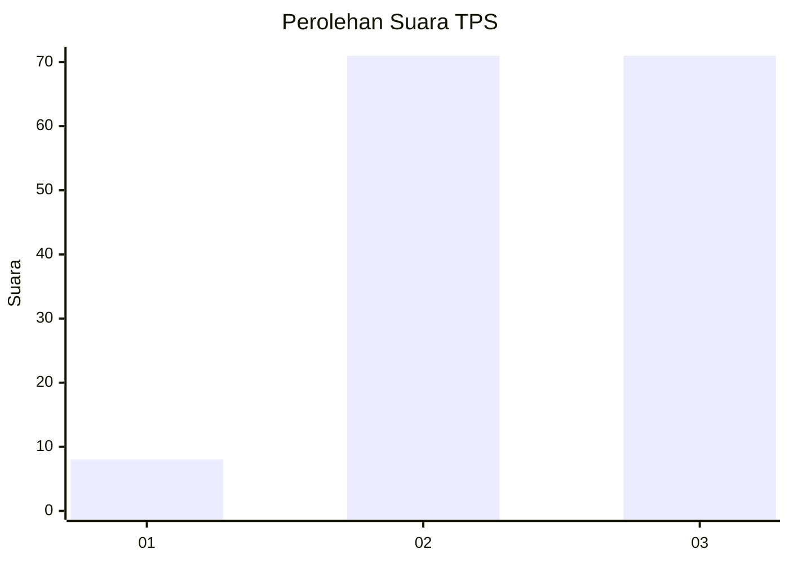
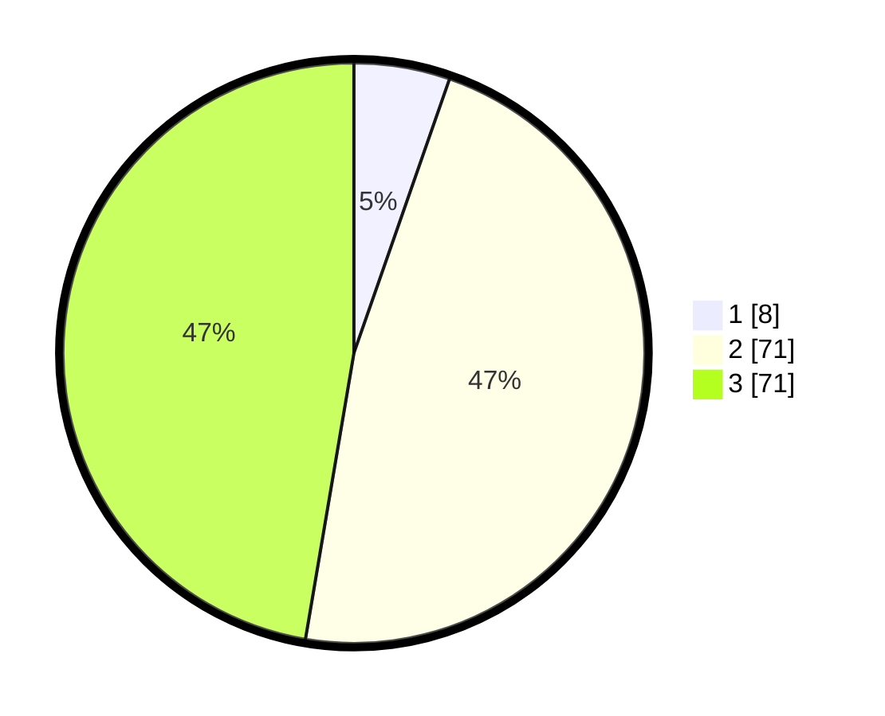

# Hasil

## Grafik

## Tabel

| No. | Nama Paslon    | Suara | Suara (raw) | Persentase |
|:--- |:-------------- | -----:| -----------:| ----------:|
| 1   | ANIES MUHAIMIN | 8     | [8][p-1]    | 5,33       |
| 2   | PRABOWO GIBRAN | 71    | [71][p-2]   | 47,33      |
| 3   | GANJAR MAHFUD  | 71    | [71][p-3]   | 47,33      |

[p-1]: https://github.com/gigit-pemilu/pemilu-2024-35-jawa-timur/blob/main/pilpres/hitung-suara/sub/35-jawa-timur/sub/09-jember/sub/09-bangsalsari/sub/2008-tisnogambar/sub/036-tps/sub/paslon-1.txt
[p-2]: https://github.com/gigit-pemilu/pemilu-2024-35-jawa-timur/blob/main/pilpres/hitung-suara/sub/35-jawa-timur/sub/09-jember/sub/09-bangsalsari/sub/2008-tisnogambar/sub/036-tps/sub/paslon-2.txt
[p-3]: https://github.com/gigit-pemilu/pemilu-2024-35-jawa-timur/blob/main/pilpres/hitung-suara/sub/35-jawa-timur/sub/09-jember/sub/09-bangsalsari/sub/2008-tisnogambar/sub/036-tps/sub/paslon-3.txt

## Foto C Plano

https://sirekap-obj-formc.kpu.go.id/6f39/pemilu/ppwp/35/09/09/20/08/3509092008036-20240215-034615--bf2b413b-c8f4-4688-9793-1decddecaf4c.jpg

https://sirekap-obj-formc.kpu.go.id/6f39/pemilu/ppwp/35/09/09/20/08/3509092008036-20240215-034907--b4ff93d1-2b7d-4efa-a83c-7247d0009c83.jpg

https://sirekap-obj-formc.kpu.go.id/6f39/pemilu/ppwp/35/09/09/20/08/3509092008036-20240215-035118--b835ac16-c66a-4408-93d1-20c6861bd5d5.jpg

## Metadata

| Key        | Value               |
| ---------- | ------------------- |
| Time Stamp | 2024-02-15 15:00:29 |

