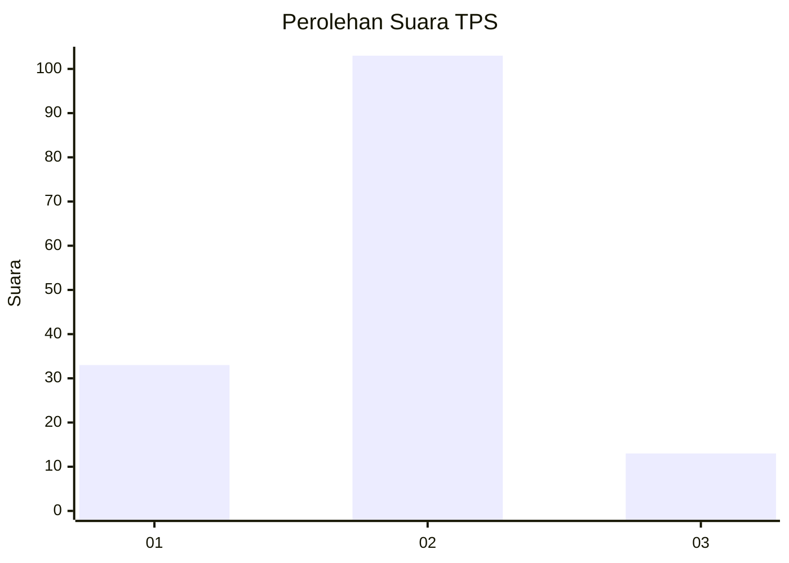
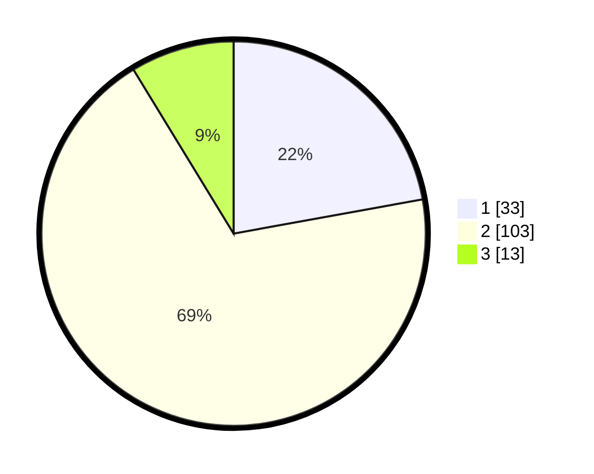

# Hasil

## Grafik

## Tabel

| No. | Nama Paslon    | Suara | Suara (raw) | Persentase |
|:--- |:-------------- | -----:| -----------:| ----------:|
| 1   | ANIES MUHAIMIN | 33    | [33][p-1]   | 22,15      |
| 2   | PRABOWO GIBRAN | 103   | [103][p-2]  | 69,13      |
| 3   | GANJAR MAHFUD  | 13    | [13][p-3]   | 8,72       |

[p-1]: https://github.com/gigit-pemilu/pemilu-2024/blob/main/pilpres/hitung-suara/sub/35-jawa-timur/sub/09-jember/sub/09-bangsalsari/sub/2009-petung/sub/008-tps/sub/paslon-1.txt
[p-2]: https://github.com/gigit-pemilu/pemilu-2024/blob/main/pilpres/hitung-suara/sub/35-jawa-timur/sub/09-jember/sub/09-bangsalsari/sub/2009-petung/sub/008-tps/sub/paslon-2.txt
[p-3]: https://github.com/gigit-pemilu/pemilu-2024/blob/main/pilpres/hitung-suara/sub/35-jawa-timur/sub/09-jember/sub/09-bangsalsari/sub/2009-petung/sub/008-tps/sub/paslon-3.txt

## Foto C Plano

https://sirekap-obj-formc.kpu.go.id/8db1/pemilu/ppwp/35/09/09/20/09/3509092009008-20240214-221934--4f55805b-d493-4517-900a-ae9bd6b2903e.jpg

https://sirekap-obj-formc.kpu.go.id/8db1/pemilu/ppwp/35/09/09/20/09/3509092009008-20240214-230354--366fec73-a7eb-4171-870d-d68c4066c375.jpg

https://sirekap-obj-formc.kpu.go.id/8db1/pemilu/ppwp/35/09/09/20/09/3509092009008-20240214-222634--5cf7ae37-86c4-421b-a3c9-8268c0952b51.jpg

## Metadata

| Key        | Value               |
| ---------- | ------------------- |
| Time Stamp | 2024-02-16 16:25:10 |

