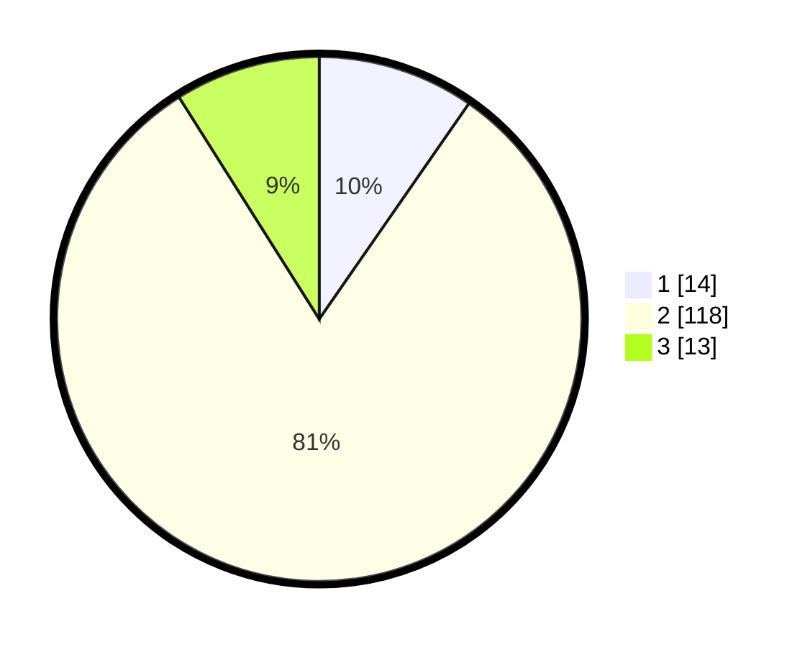

# Hasil

## Grafik

## Tabel

| No. | Nama Paslon    | Suara | Suara (raw) | Persentase |
|:--- |:-------------- | -----:| -----------:| ----------:|
| 1   | ANIES MUHAIMIN | 14    | [14][p-1]   | 9,66       |
| 2   | PRABOWO GIBRAN | 118   | [118][p-2]  | 81,38      |
| 3   | GANJAR MAHFUD  | 13    | [13][p-3]   | 8,97       |

[p-1]: https://github.com/gigit-pemilu/pemilu-2024/blob/main/pilpres/hitung-suara/sub/35-jawa-timur/sub/09-jember/sub/09-bangsalsari/sub/2009-petung/sub/010-tps/sub/paslon-1.txt
[p-2]: https://github.com/gigit-pemilu/pemilu-2024/blob/main/pilpres/hitung-suara/sub/35-jawa-timur/sub/09-jember/sub/09-bangsalsari/sub/2009-petung/sub/010-tps/sub/paslon-2.txt
[p-3]: https://github.com/gigit-pemilu/pemilu-2024/blob/main/pilpres/hitung-suara/sub/35-jawa-timur/sub/09-jember/sub/09-bangsalsari/sub/2009-petung/sub/010-tps/sub/paslon-3.txt

## Foto C Plano

https://sirekap-obj-formc.kpu.go.id/60d5/pemilu/ppwp/35/09/09/20/09/3509092009010-20240215-025744--8be7b500-0b02-4f05-8a01-87552856d3c6.jpg

https://sirekap-obj-formc.kpu.go.id/60d5/pemilu/ppwp/35/09/09/20/09/3509092009010-20240214-222454--465686bf-5f86-49bb-ba17-2eaa9b61e3e1.jpg

https://sirekap-obj-formc.kpu.go.id/60d5/pemilu/ppwp/35/09/09/20/09/3509092009010-20240214-221910--5763ecea-e6ef-406a-b615-d83a211a8634.jpg

## Metadata

| Key        | Value               |
| ---------- | ------------------- |
| Time Stamp | 2024-02-16 23:45:47 |

