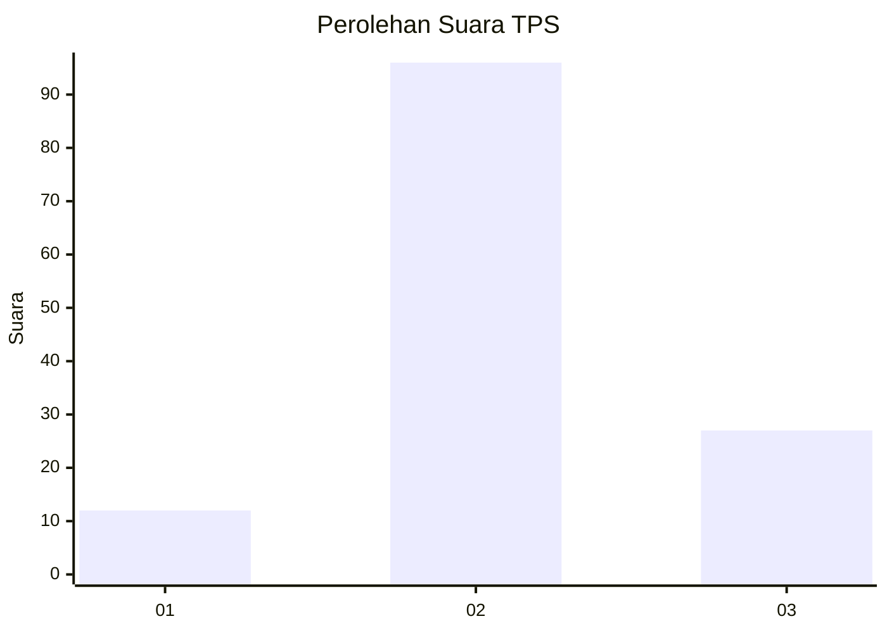
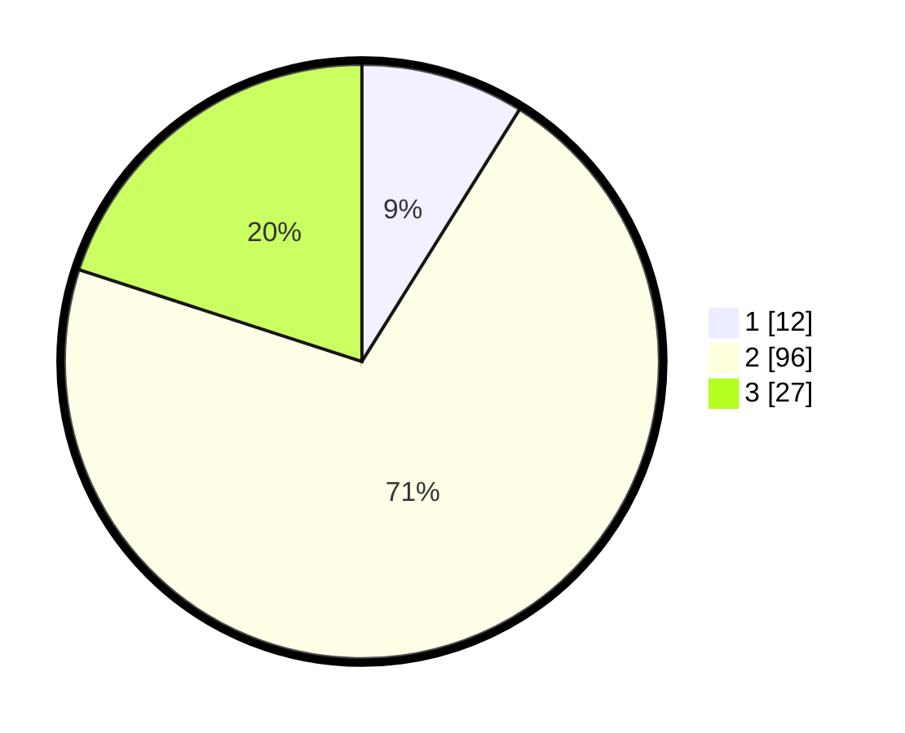

# Hasil

## Grafik

## Tabel

| No. | Nama Paslon    | Suara | Suara (raw) | Persentase |
|:--- |:-------------- | -----:| -----------:| ----------:|
| 1   | ANIES MUHAIMIN | 12    | [12][p-1]   | 8,89       |
| 2   | PRABOWO GIBRAN | 96    | [96][p-2]   | 71,11      |
| 3   | GANJAR MAHFUD  | 27    | [27][p-3]   | 20,00      |

[p-1]: https://github.com/gigit-pemilu/pemilu-2024-35-jawa-timur/blob/main/pilpres/hitung-suara/sub/35-jawa-timur/sub/09-jember/sub/09-bangsalsari/sub/2009-petung/sub/012-tps/sub/paslon-1.txt
[p-2]: https://github.com/gigit-pemilu/pemilu-2024-35-jawa-timur/blob/main/pilpres/hitung-suara/sub/35-jawa-timur/sub/09-jember/sub/09-bangsalsari/sub/2009-petung/sub/012-tps/sub/paslon-2.txt
[p-3]: https://github.com/gigit-pemilu/pemilu-2024-35-jawa-timur/blob/main/pilpres/hitung-suara/sub/35-jawa-timur/sub/09-jember/sub/09-bangsalsari/sub/2009-petung/sub/012-tps/sub/paslon-3.txt

## Foto C Plano

https://sirekap-obj-formc.kpu.go.id/2045/pemilu/ppwp/35/09/09/20/09/3509092009012-20240215-001405--795ff0de-eff0-404e-98e1-7daebf7e7578.jpg

https://sirekap-obj-formc.kpu.go.id/2045/pemilu/ppwp/35/09/09/20/09/3509092009012-20240215-001548--b4eec1b9-e8ed-430e-9e04-a14aeeeecf39.jpg

https://sirekap-obj-formc.kpu.go.id/2045/pemilu/ppwp/35/09/09/20/09/3509092009012-20240215-001639--04122b23-d618-44b9-9578-2aad4f92b6b9.jpg

## Metadata

| Key        | Value               |
| ---------- | ------------------- |
| Time Stamp | 2024-02-16 16:25:10 |

