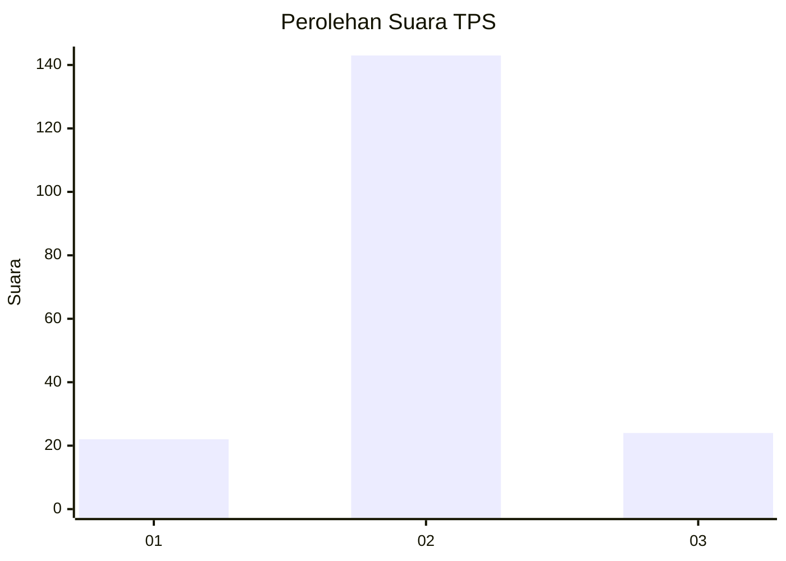
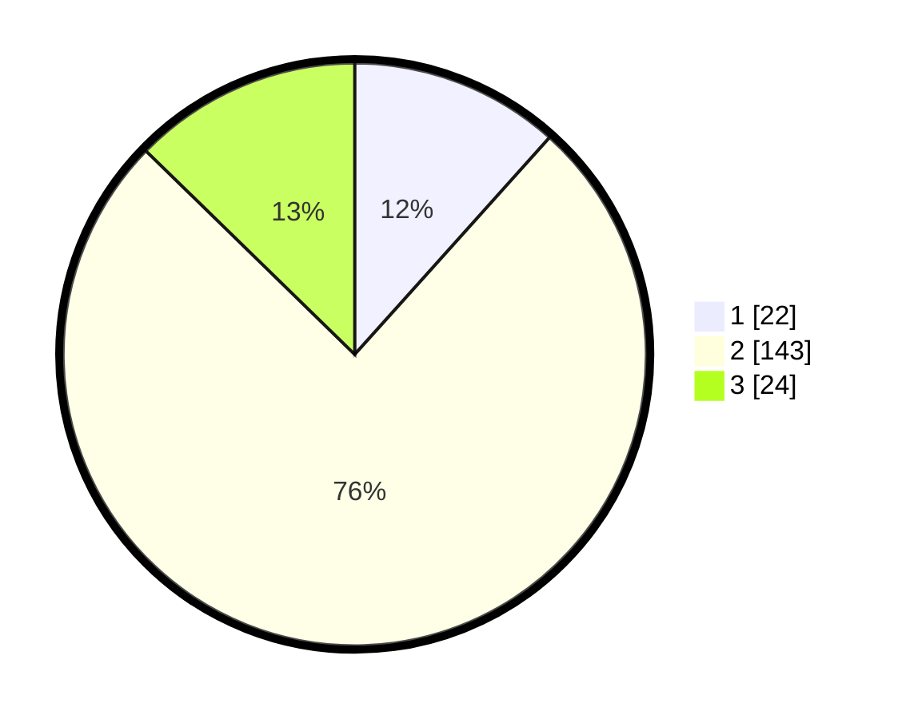

# Hasil

## Grafik

## Tabel

| No. | Nama Paslon    | Suara | Suara (raw) | Persentase |
|:--- |:-------------- | -----:| -----------:| ----------:|
| 1   | ANIES MUHAIMIN | 22    | [22][p-1]   | 11,64      |
| 2   | PRABOWO GIBRAN | 143   | [143][p-2]  | 75,66      |
| 3   | GANJAR MAHFUD  | 24    | [24][p-3]   | 12,70      |

[p-1]: https://github.com/gigit-pemilu/pemilu-2024/blob/main/pilpres/hitung-suara/sub/35-jawa-timur/sub/09-jember/sub/09-bangsalsari/sub/2009-petung/sub/016-tps/sub/paslon-1.txt
[p-2]: https://github.com/gigit-pemilu/pemilu-2024/blob/main/pilpres/hitung-suara/sub/35-jawa-timur/sub/09-jember/sub/09-bangsalsari/sub/2009-petung/sub/016-tps/sub/paslon-2.txt
[p-3]: https://github.com/gigit-pemilu/pemilu-2024/blob/main/pilpres/hitung-suara/sub/35-jawa-timur/sub/09-jember/sub/09-bangsalsari/sub/2009-petung/sub/016-tps/sub/paslon-3.txt

## Foto C Plano

https://sirekap-obj-formc.kpu.go.id/f855/pemilu/ppwp/35/09/09/20/09/3509092009016-20240214-222956--fbae0469-0b3d-4733-bf3b-e58e5fe017b8.jpg

https://sirekap-obj-formc.kpu.go.id/f855/pemilu/ppwp/35/09/09/20/09/3509092009016-20240214-230239--4d057a1e-501a-4e5c-9ec0-aa2e5ce9e647.jpg

https://sirekap-obj-formc.kpu.go.id/f855/pemilu/ppwp/35/09/09/20/09/3509092009016-20240214-230255--0725bc38-4aa2-4309-8767-2e5b6def43e6.jpg

## Metadata

| Key        | Value               |
| ---------- | ------------------- |
| Time Stamp | 2024-02-25 12:00:00 |

