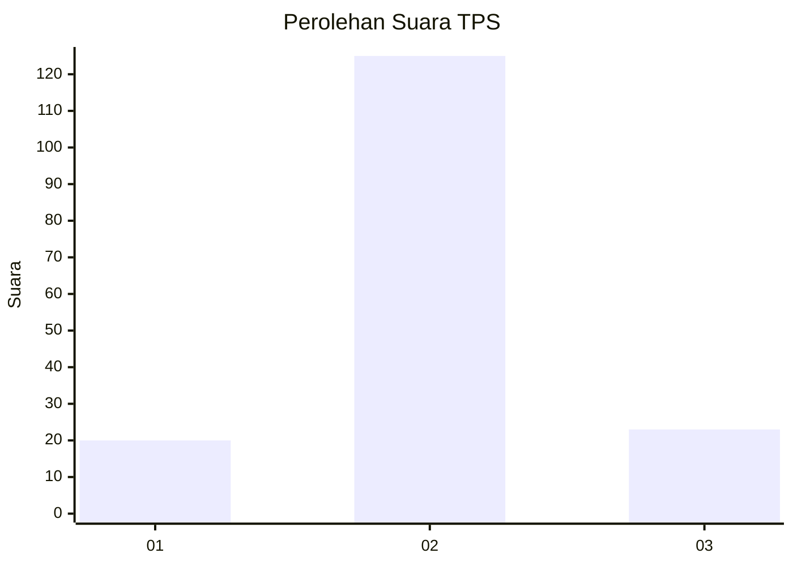
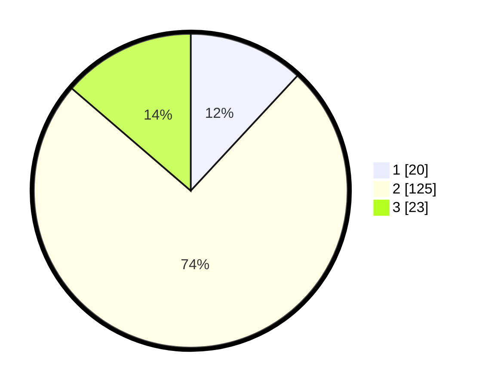

# Hasil

## Grafik

## Tabel

| No. | Nama Paslon    | Suara | Suara (raw) | Persentase |
|:--- |:-------------- | -----:| -----------:| ----------:|
| 1   | ANIES MUHAIMIN | 20    | [20][p-1]   | 11,90      |
| 2   | PRABOWO GIBRAN | 125   | [125][p-2]  | 74,40      |
| 3   | GANJAR MAHFUD  | 23    | [23][p-3]   | 13,69      |

[p-1]: https://github.com/gigit-pemilu/pemilu-2024-35-jawa-timur/blob/main/pilpres/hitung-suara/sub/35-jawa-timur/sub/09-jember/sub/09-bangsalsari/sub/2009-petung/sub/017-tps/sub/paslon-1.txt
[p-2]: https://github.com/gigit-pemilu/pemilu-2024-35-jawa-timur/blob/main/pilpres/hitung-suara/sub/35-jawa-timur/sub/09-jember/sub/09-bangsalsari/sub/2009-petung/sub/017-tps/sub/paslon-2.txt
[p-3]: https://github.com/gigit-pemilu/pemilu-2024-35-jawa-timur/blob/main/pilpres/hitung-suara/sub/35-jawa-timur/sub/09-jember/sub/09-bangsalsari/sub/2009-petung/sub/017-tps/sub/paslon-3.txt

## Foto C Plano

https://sirekap-obj-formc.kpu.go.id/de72/pemilu/ppwp/35/09/09/20/09/3509092009017-20240215-011617--93cb5deb-da65-4838-961f-4de899b1da1b.jpg

https://sirekap-obj-formc.kpu.go.id/de72/pemilu/ppwp/35/09/09/20/09/3509092009017-20240215-012038--8b39d699-10d2-4c9a-8a0c-e5df875a465a.jpg

https://sirekap-obj-formc.kpu.go.id/de72/pemilu/ppwp/35/09/09/20/09/3509092009017-20240215-012254--1eb9d5ff-c2d9-4795-a386-3c67547ef272.jpg

## Metadata

| Key        | Value               |
| ---------- | ------------------- |
| Time Stamp | 2024-02-25 12:00:00 |

