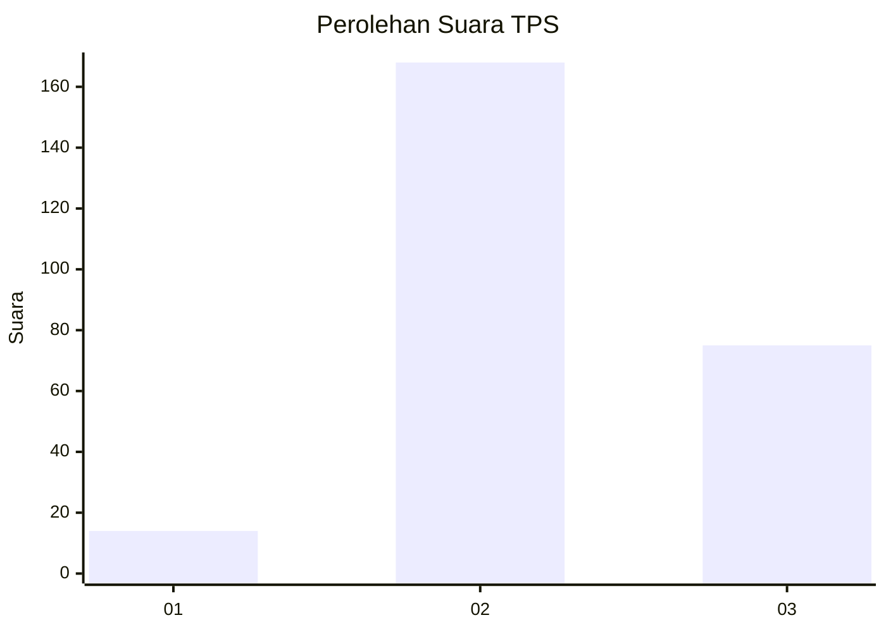

# Hasil

## Grafik

## Tabel

| No. | Nama Paslon    | Suara | Suara (raw) | Persentase |
|:--- |:-------------- | -----:| -----------:| ----------:|
| 1   | ANIES MUHAIMIN | 14    | [14][p-1]   | 5,45       |
| 2   | PRABOWO GIBRAN | 168   | [168][p-2]  | 65,37      |
| 3   | GANJAR MAHFUD  | 75    | [75][p-3]   | 29,18      |

[p-1]: https://github.com/gigit-pemilu/pemilu-2024-35-jawa-timur/blob/main/pilpres/hitung-suara/sub/35-jawa-timur/sub/09-jember/sub/09-bangsalsari/sub/2009-petung/sub/027-tps/sub/paslon-1.txt
[p-2]: https://github.com/gigit-pemilu/pemilu-2024-35-jawa-timur/blob/main/pilpres/hitung-suara/sub/35-jawa-timur/sub/09-jember/sub/09-bangsalsari/sub/2009-petung/sub/027-tps/sub/paslon-2.txt
[p-3]: https://github.com/gigit-pemilu/pemilu-2024-35-jawa-timur/blob/main/pilpres/hitung-suara/sub/35-jawa-timur/sub/09-jember/sub/09-bangsalsari/sub/2009-petung/sub/027-tps/sub/paslon-3.txt

## Foto C Plano

https://sirekap-obj-formc.kpu.go.id/b123/pemilu/ppwp/35/09/09/20/09/3509092009027-20240214-223055--fee98b7a-faa8-49e0-8f7f-edac5888fde9.jpg

https://sirekap-obj-formc.kpu.go.id/b123/pemilu/ppwp/35/09/09/20/09/3509092009027-20240214-223432--be0fe4c3-fbb4-4739-b95f-0e7d6fd9c831.jpg

https://sirekap-obj-formc.kpu.go.id/b123/pemilu/ppwp/35/09/09/20/09/3509092009027-20240214-224021--e16fd0d2-0e72-4ce9-8c7a-649bbe5c1800.jpg

## Metadata

| Key        | Value               |
| ---------- | ------------------- |
| Time Stamp | 2024-02-25 15:00:00 |

