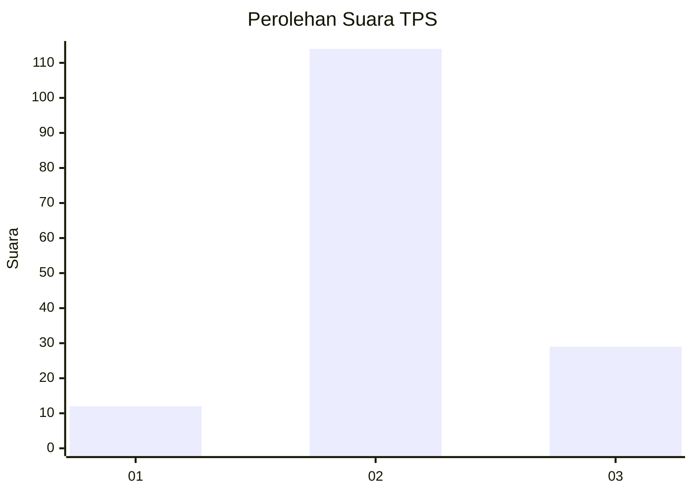
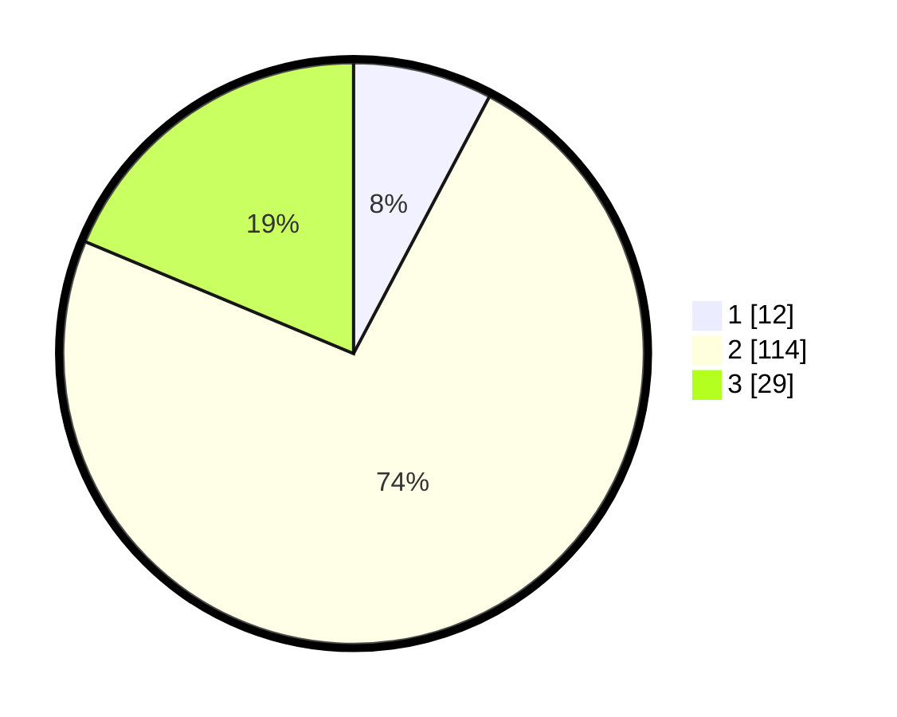

# Hasil

## Grafik

## Tabel

| No. | Nama Paslon    | Suara | Suara (raw) | Persentase |
|:--- |:-------------- | -----:| -----------:| ----------:|
| 1   | ANIES MUHAIMIN | 12    | [12][p-1]   | 7,74       |
| 2   | PRABOWO GIBRAN | 114   | [114][p-2]  | 73,55      |
| 3   | GANJAR MAHFUD  | 29    | [29][p-3]   | 18,71      |

[p-1]: https://github.com/gigit-pemilu/pemilu-2024-35-jawa-timur/blob/main/pilpres/hitung-suara/sub/35-jawa-timur/sub/09-jember/sub/09-bangsalsari/sub/2010-banjarsari/sub/001-tps/sub/paslon-1.txt
[p-2]: https://github.com/gigit-pemilu/pemilu-2024-35-jawa-timur/blob/main/pilpres/hitung-suara/sub/35-jawa-timur/sub/09-jember/sub/09-bangsalsari/sub/2010-banjarsari/sub/001-tps/sub/paslon-2.txt
[p-3]: https://github.com/gigit-pemilu/pemilu-2024-35-jawa-timur/blob/main/pilpres/hitung-suara/sub/35-jawa-timur/sub/09-jember/sub/09-bangsalsari/sub/2010-banjarsari/sub/001-tps/sub/paslon-3.txt

## Foto C Plano

https://sirekap-obj-formc.kpu.go.id/af45/pemilu/ppwp/35/09/09/20/10/3509092010001-20240215-081338--8b894117-6d95-40e1-a580-acbeffd7353d.jpg

https://sirekap-obj-formc.kpu.go.id/af45/pemilu/ppwp/35/09/09/20/10/3509092010001-20240215-143741--b84ebbb8-9c18-4948-8ed1-79224ff0a6f4.jpg

https://sirekap-obj-formc.kpu.go.id/af45/pemilu/ppwp/35/09/09/20/10/3509092010001-20240215-081414--11f360b1-2a2c-4c75-abab-9c9fd20f6a5d.jpg

## Metadata

| Key        | Value               |
| ---------- | ------------------- |
| Time Stamp | 2024-02-17 00:00:00 |

