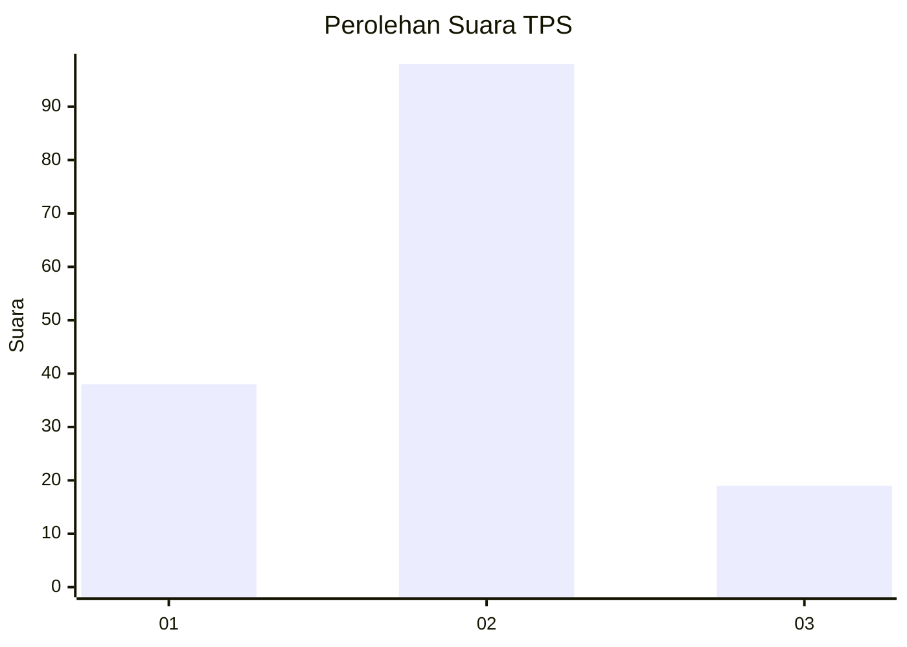
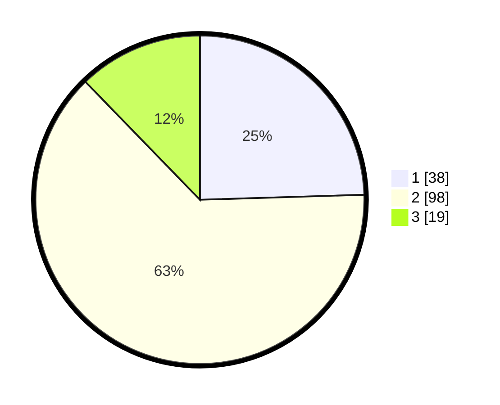

# Hasil

## Grafik

## Tabel

| No. | Nama Paslon    | Suara | Suara (raw) | Persentase |
|:--- |:-------------- | -----:| -----------:| ----------:|
| 1   | ANIES MUHAIMIN | 38    | [38][p-1]   | 24,52      |
| 2   | PRABOWO GIBRAN | 98    | [98][p-2]   | 63,23      |
| 3   | GANJAR MAHFUD  | 19    | [19][p-3]   | 12,26      |

[p-1]: https://github.com/gigit-pemilu/pemilu-2024/blob/main/pilpres/hitung-suara/sub/35-jawa-timur/sub/09-jember/sub/09-bangsalsari/sub/2010-banjarsari/sub/003-tps/sub/paslon-1.txt
[p-2]: https://github.com/gigit-pemilu/pemilu-2024/blob/main/pilpres/hitung-suara/sub/35-jawa-timur/sub/09-jember/sub/09-bangsalsari/sub/2010-banjarsari/sub/003-tps/sub/paslon-2.txt
[p-3]: https://github.com/gigit-pemilu/pemilu-2024/blob/main/pilpres/hitung-suara/sub/35-jawa-timur/sub/09-jember/sub/09-bangsalsari/sub/2010-banjarsari/sub/003-tps/sub/paslon-3.txt

## Foto C Plano

https://sirekap-obj-formc.kpu.go.id/ee35/pemilu/ppwp/35/09/09/20/10/3509092010003-20240215-073510--f89ddff8-8d3b-4b13-8e62-35433b5b6f37.jpg

https://sirekap-obj-formc.kpu.go.id/ee35/pemilu/ppwp/35/09/09/20/10/3509092010003-20240215-073707--0a356dc1-8865-4eb0-9c0c-72e514be1d96.jpg

https://sirekap-obj-formc.kpu.go.id/ee35/pemilu/ppwp/35/09/09/20/10/3509092010003-20240215-073858--76fc2d11-ee47-45be-bddc-91c10fb948ab.jpg

## Metadata

| Key        | Value               |
| ---------- | ------------------- |
| Time Stamp | 2024-02-24 22:31:28 |

