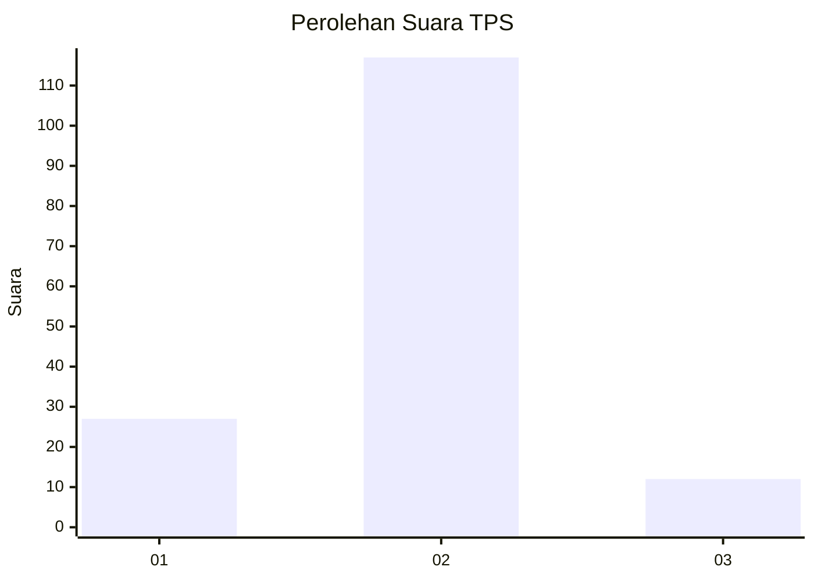
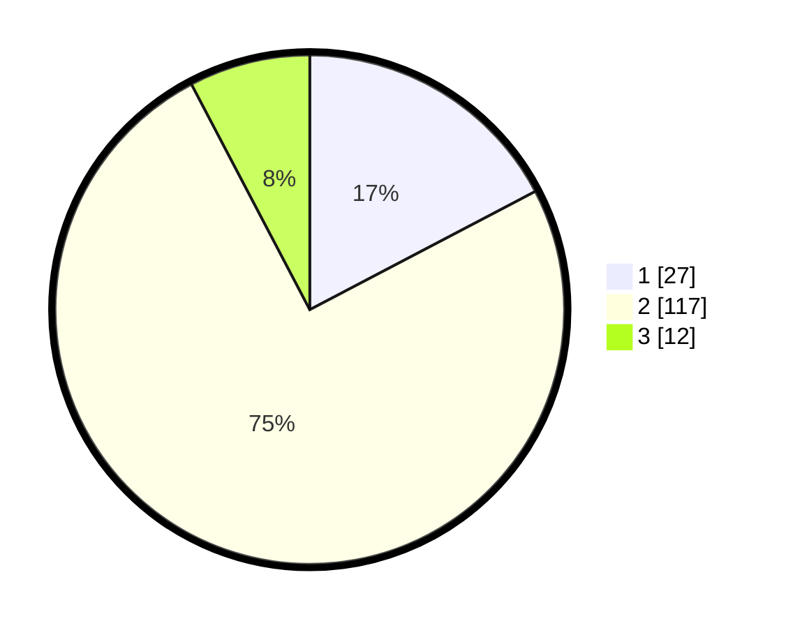

# Hasil

## Grafik

## Tabel

| No. | Nama Paslon    | Suara | Suara (raw) | Persentase |
|:--- |:-------------- | -----:| -----------:| ----------:|
| 1   | ANIES MUHAIMIN | 27    | [27][p-1]   | 17,31      |
| 2   | PRABOWO GIBRAN | 117   | [117][p-2]  | 75,00      |
| 3   | GANJAR MAHFUD  | 12    | [12][p-3]   | 7,69       |

[p-1]: https://github.com/gigit-pemilu/pemilu-2024-35-jawa-timur/blob/main/pilpres/hitung-suara/sub/35-jawa-timur/sub/09-jember/sub/09-bangsalsari/sub/2010-banjarsari/sub/005-tps/sub/paslon-1.txt
[p-2]: https://github.com/gigit-pemilu/pemilu-2024-35-jawa-timur/blob/main/pilpres/hitung-suara/sub/35-jawa-timur/sub/09-jember/sub/09-bangsalsari/sub/2010-banjarsari/sub/005-tps/sub/paslon-2.txt
[p-3]: https://github.com/gigit-pemilu/pemilu-2024-35-jawa-timur/blob/main/pilpres/hitung-suara/sub/35-jawa-timur/sub/09-jember/sub/09-bangsalsari/sub/2010-banjarsari/sub/005-tps/sub/paslon-3.txt

## Foto C Plano

https://sirekap-obj-formc.kpu.go.id/ac99/pemilu/ppwp/35/09/09/20/10/3509092010005-20240218-112640--d56c435a-dd47-4b90-b846-c36e5c2e44da.jpg

https://sirekap-obj-formc.kpu.go.id/ac99/pemilu/ppwp/35/09/09/20/10/3509092010005-20240218-112857--640d7b69-11d2-455c-b881-f66afafd899c.jpg

https://sirekap-obj-formc.kpu.go.id/ac99/pemilu/ppwp/35/09/09/20/10/3509092010005-20240218-113113--35648724-3385-45a8-a8ac-ef82f1918496.jpg

## Metadata

| Key        | Value               |
| ---------- | ------------------- |
| Time Stamp | 2024-02-25 21:00:00 |

