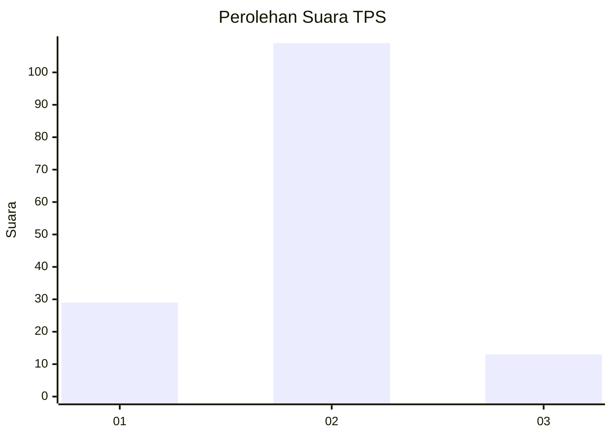
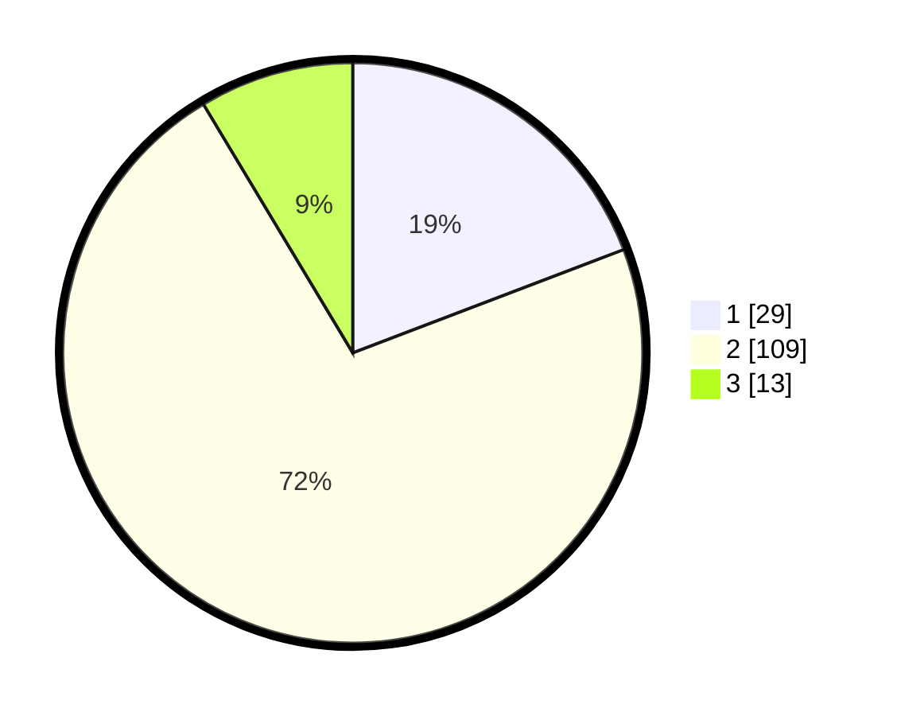

# Hasil

## Grafik

## Tabel

| No. | Nama Paslon    | Suara | Suara (raw) | Persentase |
|:--- |:-------------- | -----:| -----------:| ----------:|
| 1   | ANIES MUHAIMIN | 29    | [29][p-1]   | 19,21      |
| 2   | PRABOWO GIBRAN | 109   | [109][p-2]  | 72,19      |
| 3   | GANJAR MAHFUD  | 13    | [13][p-3]   | 8,61       |

[p-1]: https://github.com/gigit-pemilu/pemilu-2024-35-jawa-timur/blob/main/pilpres/hitung-suara/sub/35-jawa-timur/sub/09-jember/sub/09-bangsalsari/sub/2010-banjarsari/sub/008-tps/sub/paslon-1.txt
[p-2]: https://github.com/gigit-pemilu/pemilu-2024-35-jawa-timur/blob/main/pilpres/hitung-suara/sub/35-jawa-timur/sub/09-jember/sub/09-bangsalsari/sub/2010-banjarsari/sub/008-tps/sub/paslon-2.txt
[p-3]: https://github.com/gigit-pemilu/pemilu-2024-35-jawa-timur/blob/main/pilpres/hitung-suara/sub/35-jawa-timur/sub/09-jember/sub/09-bangsalsari/sub/2010-banjarsari/sub/008-tps/sub/paslon-3.txt

## Foto C Plano

https://sirekap-obj-formc.kpu.go.id/f404/pemilu/ppwp/35/09/09/20/10/3509092010008-20240215-132853--afe1950b-0027-4cf9-9513-21eca0b646f6.jpg

https://sirekap-obj-formc.kpu.go.id/f404/pemilu/ppwp/35/09/09/20/10/3509092010008-20240215-110750--db6deeac-5b86-4b23-b0ce-d697185cb160.jpg

https://sirekap-obj-formc.kpu.go.id/f404/pemilu/ppwp/35/09/09/20/10/3509092010008-20240215-133042--08e84c28-66ae-40c1-84f6-02d8dbee4b34.jpg

## Metadata

| Key        | Value               |
| ---------- | ------------------- |
| Time Stamp | 2024-02-16 12:51:22 |

