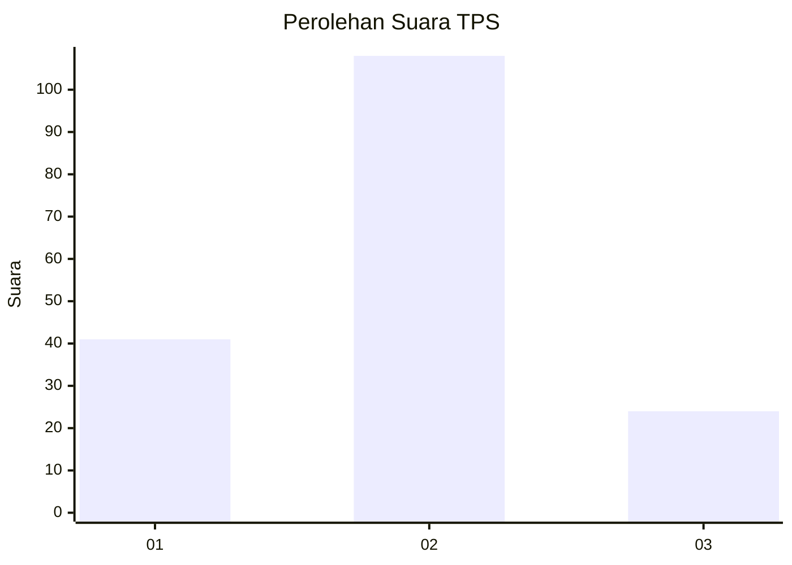
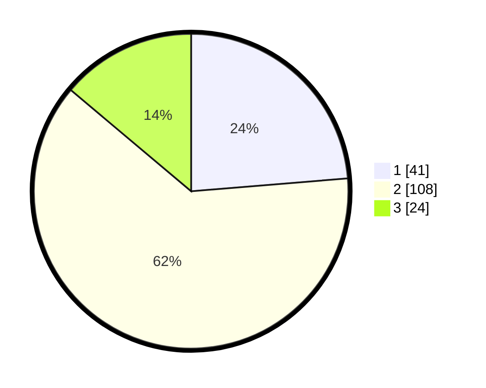

# Hasil

## Grafik

## Tabel

| No. | Nama Paslon    | Suara | Suara (raw) | Persentase |
|:--- |:-------------- | -----:| -----------:| ----------:|
| 1   | ANIES MUHAIMIN | 41    | [41][p-1]   | 23,70      |
| 2   | PRABOWO GIBRAN | 108   | [108][p-2]  | 62,43      |
| 3   | GANJAR MAHFUD  | 24    | [24][p-3]   | 13,87      |

[p-1]: https://github.com/gigit-pemilu/pemilu-2024-35-jawa-timur/blob/main/pilpres/hitung-suara/sub/35-jawa-timur/sub/09-jember/sub/09-bangsalsari/sub/2010-banjarsari/sub/009-tps/sub/paslon-1.txt
[p-2]: https://github.com/gigit-pemilu/pemilu-2024-35-jawa-timur/blob/main/pilpres/hitung-suara/sub/35-jawa-timur/sub/09-jember/sub/09-bangsalsari/sub/2010-banjarsari/sub/009-tps/sub/paslon-2.txt
[p-3]: https://github.com/gigit-pemilu/pemilu-2024-35-jawa-timur/blob/main/pilpres/hitung-suara/sub/35-jawa-timur/sub/09-jember/sub/09-bangsalsari/sub/2010-banjarsari/sub/009-tps/sub/paslon-3.txt

## Foto C Plano

https://sirekap-obj-formc.kpu.go.id/266b/pemilu/ppwp/35/09/09/20/10/3509092010009-20240215-114112--be65f266-3b25-468a-a9e2-b3ed87083ff8.jpg

https://sirekap-obj-formc.kpu.go.id/266b/pemilu/ppwp/35/09/09/20/10/3509092010009-20240215-114153--7a4eace2-310d-49ab-8840-01c0cdfbf34e.jpg

https://sirekap-obj-formc.kpu.go.id/266b/pemilu/ppwp/35/09/09/20/10/3509092010009-20240215-114245--88e75f7a-756f-46f3-9a08-82b6ec3cea82.jpg

## Metadata

| Key        | Value               |
| ---------- | ------------------- |
| Time Stamp | 2024-02-15 15:00:29 |

