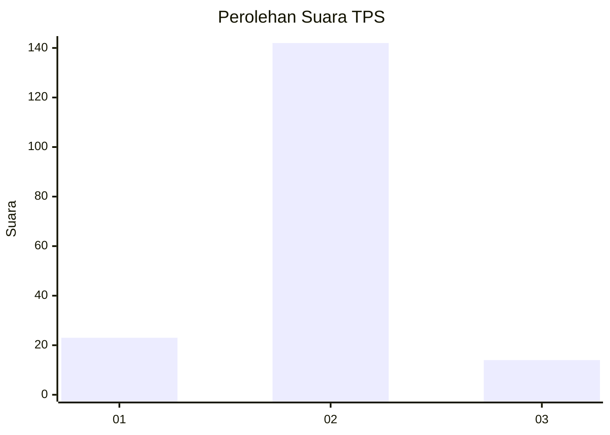
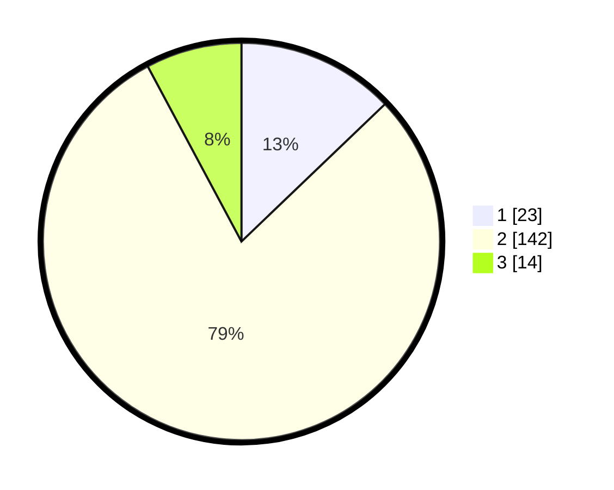

# Hasil

## Grafik

## Tabel

| No. | Nama Paslon    | Suara | Suara (raw) | Persentase |
|:--- |:-------------- | -----:| -----------:| ----------:|
| 1   | ANIES MUHAIMIN | 23    | [23][p-1]   | 12,85      |
| 2   | PRABOWO GIBRAN | 142   | [142][p-2]  | 79,33      |
| 3   | GANJAR MAHFUD  | 14    | [14][p-3]   | 7,82       |

[p-1]: https://github.com/gigit-pemilu/pemilu-2024/blob/main/pilpres/hitung-suara/sub/35-jawa-timur/sub/09-jember/sub/09-bangsalsari/sub/2010-banjarsari/sub/010-tps/sub/paslon-1.txt
[p-2]: https://github.com/gigit-pemilu/pemilu-2024/blob/main/pilpres/hitung-suara/sub/35-jawa-timur/sub/09-jember/sub/09-bangsalsari/sub/2010-banjarsari/sub/010-tps/sub/paslon-2.txt
[p-3]: https://github.com/gigit-pemilu/pemilu-2024/blob/main/pilpres/hitung-suara/sub/35-jawa-timur/sub/09-jember/sub/09-bangsalsari/sub/2010-banjarsari/sub/010-tps/sub/paslon-3.txt

## Foto C Plano

https://sirekap-obj-formc.kpu.go.id/0fca/pemilu/ppwp/35/09/09/20/10/3509092010010-20240215-093132--d01a8a62-dafd-4352-b20c-b2a1a463a1ad.jpg

https://sirekap-obj-formc.kpu.go.id/0fca/pemilu/ppwp/35/09/09/20/10/3509092010010-20240215-093330--7db66ec3-4900-41a8-9710-76d6242ced9c.jpg

https://sirekap-obj-formc.kpu.go.id/0fca/pemilu/ppwp/35/09/09/20/10/3509092010010-20240215-093501--01faed87-ab4f-4042-bd5b-f22ad00a6f3d.jpg

## Metadata

| Key        | Value               |
| ---------- | ------------------- |
| Time Stamp | 2024-02-24 22:31:28 |

