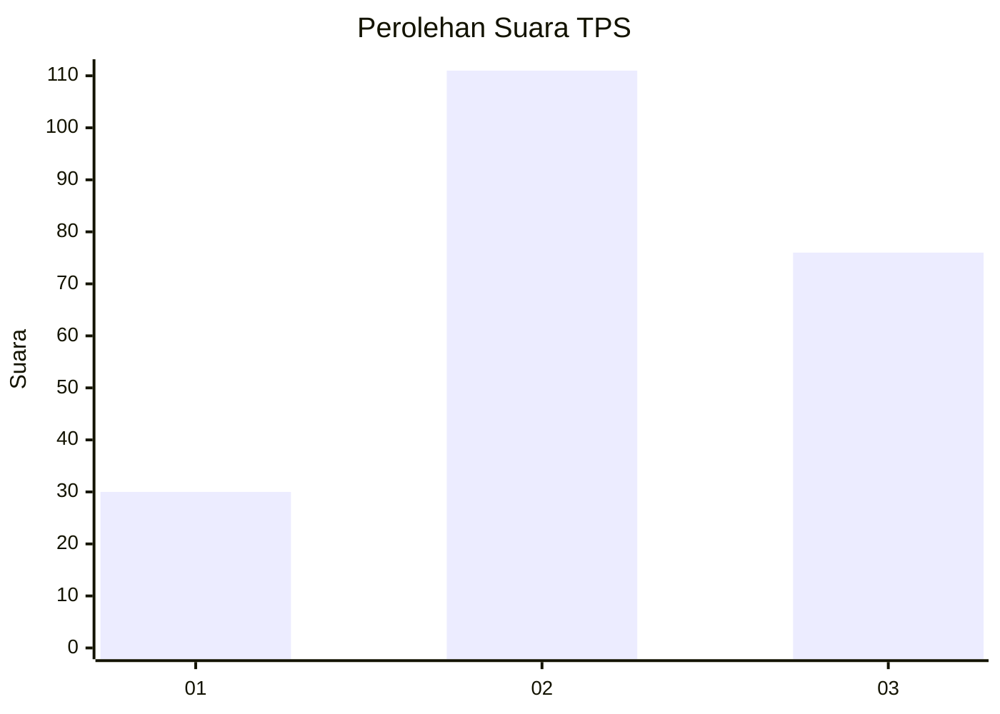
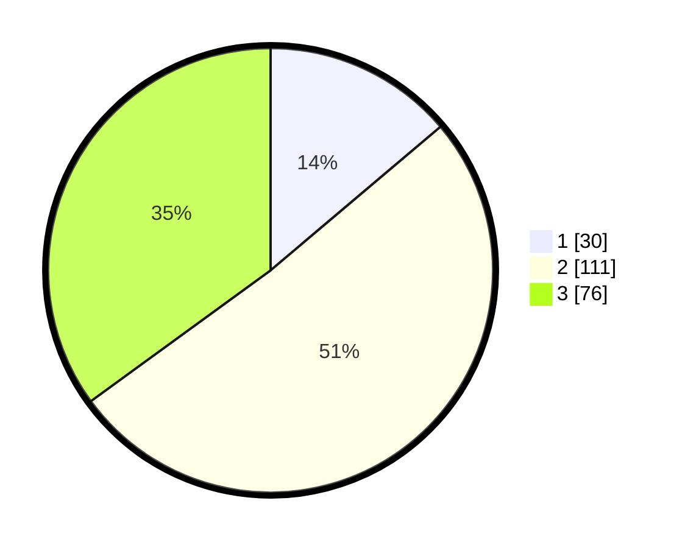

# Hasil

## Grafik

## Tabel

| No. | Nama Paslon    | Suara | Suara (raw) | Persentase |
|:--- |:-------------- | -----:| -----------:| ----------:|
| 1   | ANIES MUHAIMIN | 30    | [30][p-1]   | 13,82      |
| 2   | PRABOWO GIBRAN | 111   | [111][p-2]  | 51,15      |
| 3   | GANJAR MAHFUD  | 76    | [76][p-3]   | 35,02      |

[p-1]: https://github.com/gigit-pemilu/pemilu-2024-35-jawa-timur/blob/main/pilpres/hitung-suara/sub/35-jawa-timur/sub/09-jember/sub/09-bangsalsari/sub/2011-badean/sub/006-tps/sub/paslon-1.txt
[p-2]: https://github.com/gigit-pemilu/pemilu-2024-35-jawa-timur/blob/main/pilpres/hitung-suara/sub/35-jawa-timur/sub/09-jember/sub/09-bangsalsari/sub/2011-badean/sub/006-tps/sub/paslon-2.txt
[p-3]: https://github.com/gigit-pemilu/pemilu-2024-35-jawa-timur/blob/main/pilpres/hitung-suara/sub/35-jawa-timur/sub/09-jember/sub/09-bangsalsari/sub/2011-badean/sub/006-tps/sub/paslon-3.txt

## Foto C Plano

https://sirekap-obj-formc.kpu.go.id/a94a/pemilu/ppwp/35/09/09/20/11/3509092011006-20240214-194806--5fff7cd1-b7f3-4419-b973-33bdd40a6c3f.jpg

https://sirekap-obj-formc.kpu.go.id/a94a/pemilu/ppwp/35/09/09/20/11/3509092011006-20240214-195839--6f1b3ea4-31b0-41b4-819f-6ca4a6b4690f.jpg

https://sirekap-obj-formc.kpu.go.id/a94a/pemilu/ppwp/35/09/09/20/11/3509092011006-20240214-195238--f7d84769-7df4-4709-b297-5bce230909d9.jpg

## Metadata

| Key        | Value               |
| ---------- | ------------------- |
| Time Stamp | 2024-02-24 22:31:28 |

