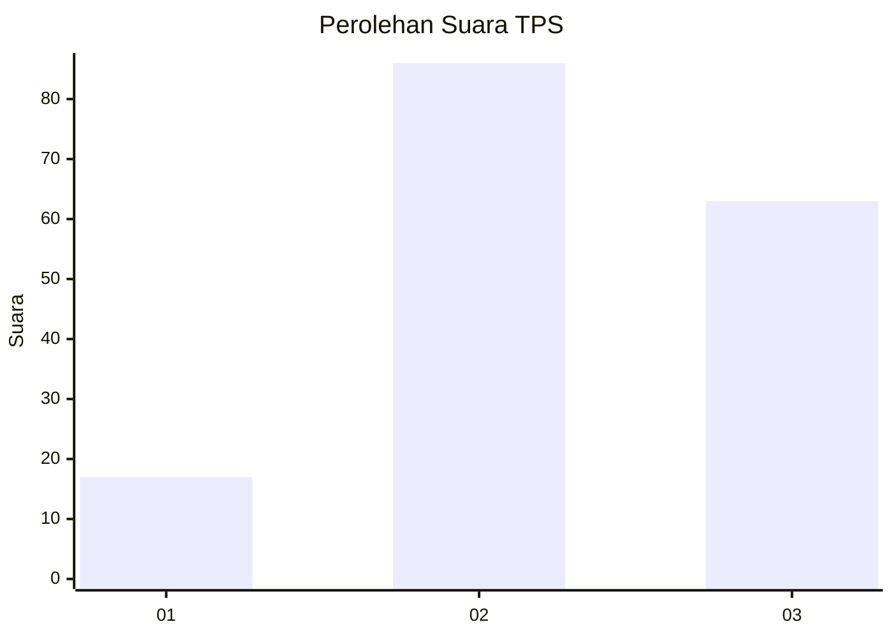
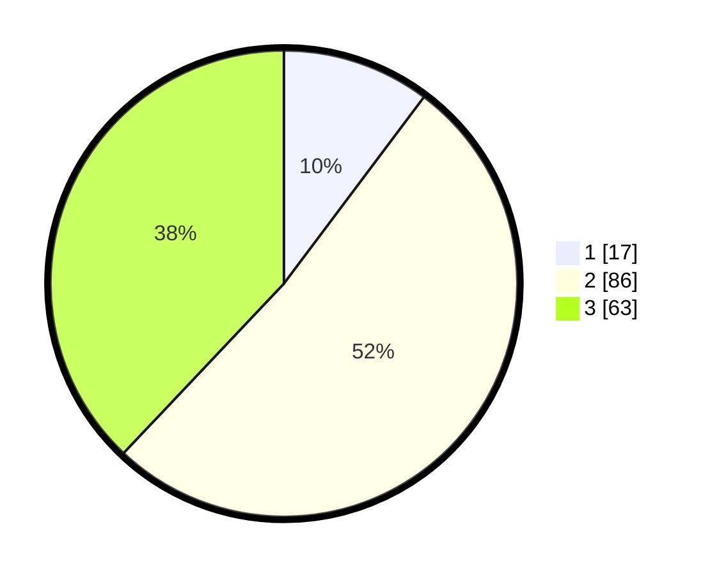

# Hasil

## Grafik

## Tabel

| No. | Nama Paslon    | Suara | Suara (raw) | Persentase |
|:--- |:-------------- | -----:| -----------:| ----------:|
| 1   | ANIES MUHAIMIN | 17    | [17][p-1]   | 10,24      |
| 2   | PRABOWO GIBRAN | 86    | [86][p-2]   | 51,81      |
| 3   | GANJAR MAHFUD  | 63    | [63][p-3]   | 37,95      |

[p-1]: https://github.com/gigit-pemilu/pemilu-2024-35-jawa-timur/blob/main/pilpres/hitung-suara/sub/35-jawa-timur/sub/09-jember/sub/09-bangsalsari/sub/2011-badean/sub/009-tps/sub/paslon-1.txt
[p-2]: https://github.com/gigit-pemilu/pemilu-2024-35-jawa-timur/blob/main/pilpres/hitung-suara/sub/35-jawa-timur/sub/09-jember/sub/09-bangsalsari/sub/2011-badean/sub/009-tps/sub/paslon-2.txt
[p-3]: https://github.com/gigit-pemilu/pemilu-2024-35-jawa-timur/blob/main/pilpres/hitung-suara/sub/35-jawa-timur/sub/09-jember/sub/09-bangsalsari/sub/2011-badean/sub/009-tps/sub/paslon-3.txt

## Foto C Plano

https://sirekap-obj-formc.kpu.go.id/bbf4/pemilu/ppwp/35/09/09/20/11/3509092011009-20240214-155641--c21b65b9-f575-4216-84e4-187ce7b40feb.jpg

https://sirekap-obj-formc.kpu.go.id/bbf4/pemilu/ppwp/35/09/09/20/11/3509092011009-20240214-155754--dbb25741-56c6-423e-81ae-1d6b4fbb3ab8.jpg

https://sirekap-obj-formc.kpu.go.id/bbf4/pemilu/ppwp/35/09/09/20/11/3509092011009-20240214-234847--d9da649f-b69e-45d0-b6d1-3f03ea03ce06.jpg

## Metadata

| Key        | Value               |
| ---------- | ------------------- |
| Time Stamp | 2024-02-24 22:31:28 |

