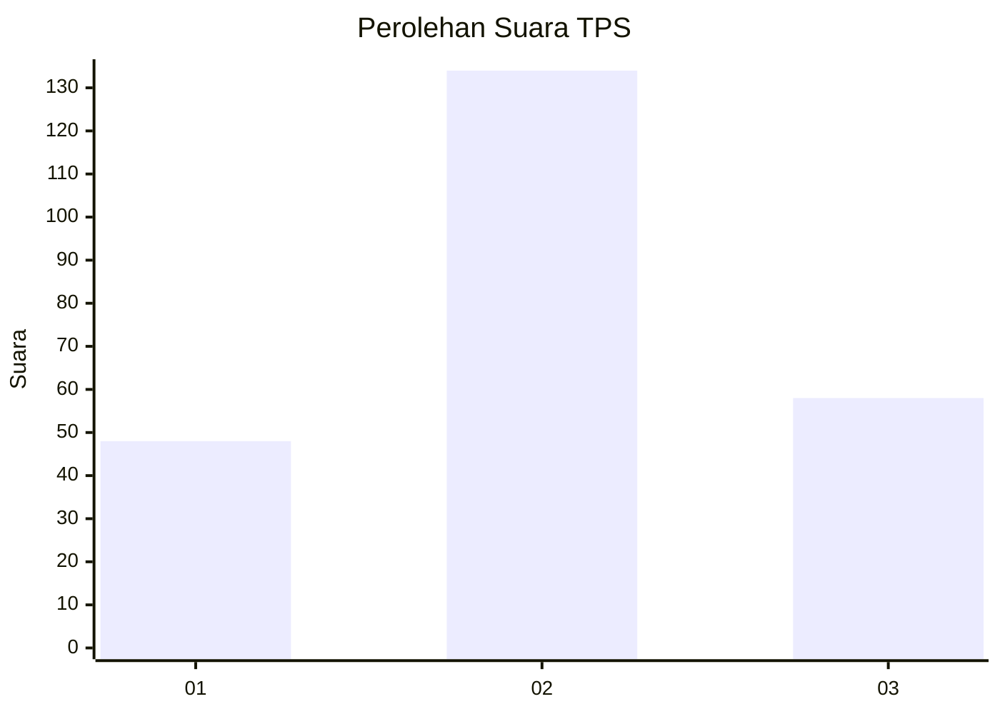
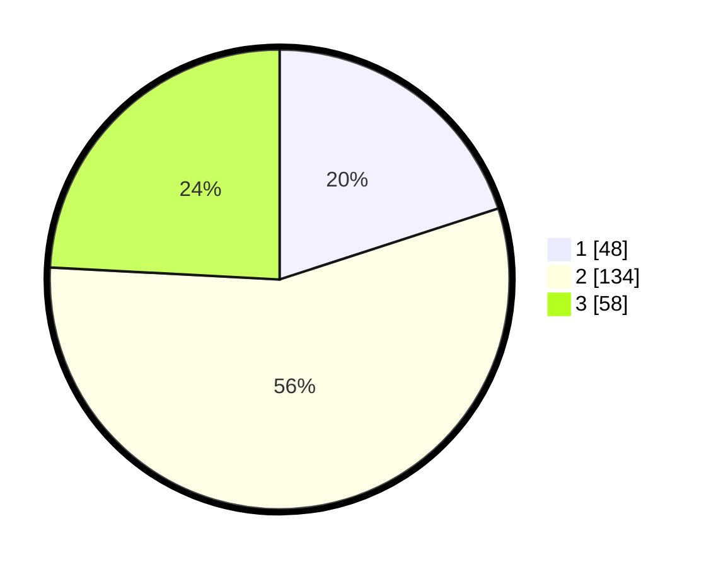

# Hasil

## Grafik

## Tabel

| No. | Nama Paslon    | Suara | Suara (raw) | Persentase |
|:--- |:-------------- | -----:| -----------:| ----------:|
| 1   | ANIES MUHAIMIN | 48    | [48][p-1]   | 20,00      |
| 2   | PRABOWO GIBRAN | 134   | [134][p-2]  | 55,83      |
| 3   | GANJAR MAHFUD  | 58    | [58][p-3]   | 24,17      |

[p-1]: https://github.com/gigit-pemilu/pemilu-2024/blob/main/pilpres/hitung-suara/sub/35-jawa-timur/sub/09-jember/sub/09-bangsalsari/sub/2011-badean/sub/012-tps/sub/paslon-1.txt
[p-2]: https://github.com/gigit-pemilu/pemilu-2024/blob/main/pilpres/hitung-suara/sub/35-jawa-timur/sub/09-jember/sub/09-bangsalsari/sub/2011-badean/sub/012-tps/sub/paslon-2.txt
[p-3]: https://github.com/gigit-pemilu/pemilu-2024/blob/main/pilpres/hitung-suara/sub/35-jawa-timur/sub/09-jember/sub/09-bangsalsari/sub/2011-badean/sub/012-tps/sub/paslon-3.txt

## Foto C Plano

https://sirekap-obj-formc.kpu.go.id/91ee/pemilu/ppwp/35/09/09/20/11/3509092011012-20240214-204443--8abd1fda-188f-4f43-a303-fd75664ee74d.jpg

https://sirekap-obj-formc.kpu.go.id/91ee/pemilu/ppwp/35/09/09/20/11/3509092011012-20240214-204506--ee04a197-df42-4559-a781-8c482a3b2589.jpg

https://sirekap-obj-formc.kpu.go.id/91ee/pemilu/ppwp/35/09/09/20/11/3509092011012-20240214-204511--0ee791e6-cad2-406b-a93c-cdd64df10715.jpg

## Metadata

| Key        | Value               |
| ---------- | ------------------- |
| Time Stamp | 2024-02-24 22:31:28 |

