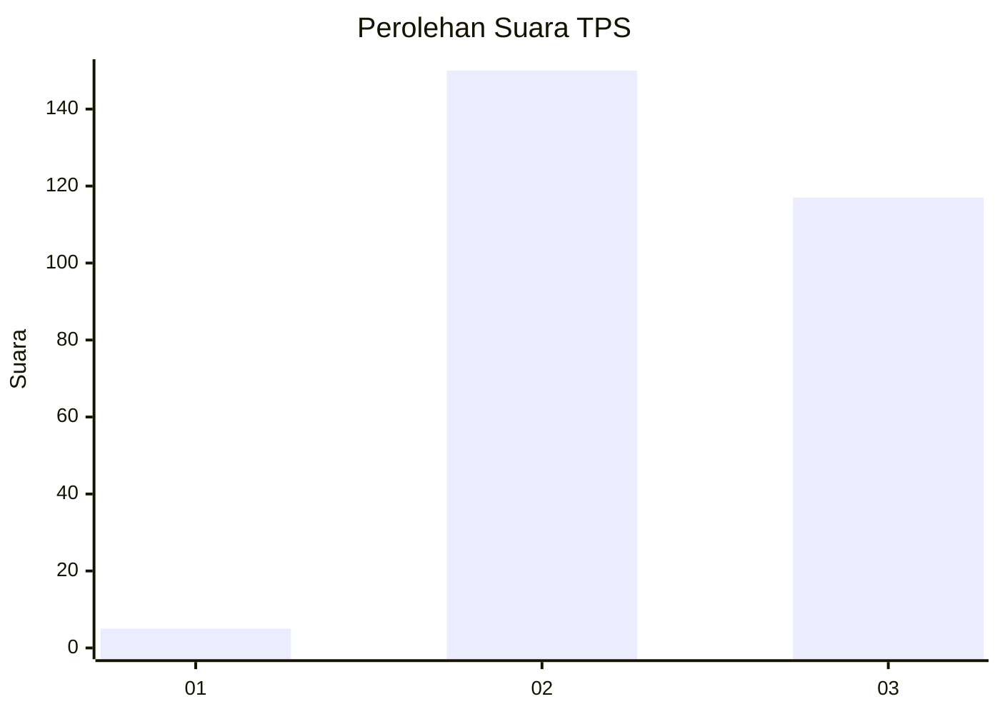
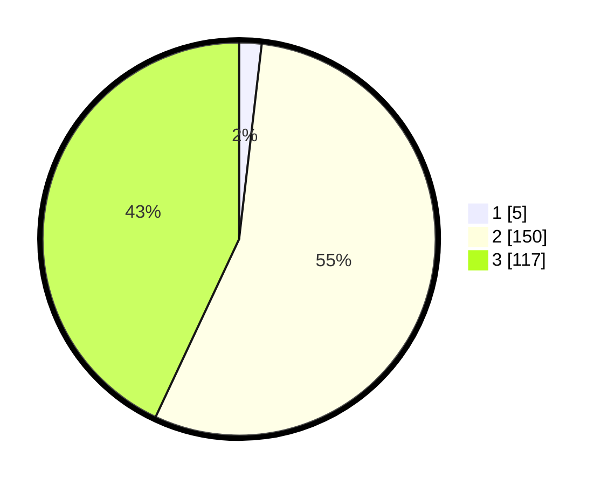

# Hasil

## Grafik

## Tabel

| No. | Nama Paslon    | Suara | Suara (raw) | Persentase |
|:--- |:-------------- | -----:| -----------:| ----------:|
| 1   | ANIES MUHAIMIN | 5     | [5][p-1]    | 1,84       |
| 2   | PRABOWO GIBRAN | 150   | [150][p-2]  | 55,15      |
| 3   | GANJAR MAHFUD  | 117   | [117][p-3]  | 43,01      |

[p-1]: https://github.com/gigit-pemilu/pemilu-2024-35-jawa-timur/blob/main/pilpres/hitung-suara/sub/35-jawa-timur/sub/09-jember/sub/09-bangsalsari/sub/2011-badean/sub/013-tps/sub/paslon-1.txt
[p-2]: https://github.com/gigit-pemilu/pemilu-2024-35-jawa-timur/blob/main/pilpres/hitung-suara/sub/35-jawa-timur/sub/09-jember/sub/09-bangsalsari/sub/2011-badean/sub/013-tps/sub/paslon-2.txt
[p-3]: https://github.com/gigit-pemilu/pemilu-2024-35-jawa-timur/blob/main/pilpres/hitung-suara/sub/35-jawa-timur/sub/09-jember/sub/09-bangsalsari/sub/2011-badean/sub/013-tps/sub/paslon-3.txt

## Foto C Plano

https://sirekap-obj-formc.kpu.go.id/1f9a/pemilu/ppwp/35/09/09/20/11/3509092011013-20240214-194317--93f6d8f0-c254-49ab-8fc2-1f517e8e0693.jpg

https://sirekap-obj-formc.kpu.go.id/1f9a/pemilu/ppwp/35/09/09/20/11/3509092011013-20240214-194333--c01f2fa8-c52f-45ff-9c75-744f7a5ea8cd.jpg

https://sirekap-obj-formc.kpu.go.id/1f9a/pemilu/ppwp/35/09/09/20/11/3509092011013-20240214-194339--fa6aa010-7a54-4cb1-af9a-ba7c5f60a927.jpg

## Metadata

| Key        | Value               |
| ---------- | ------------------- |
| Time Stamp | 2024-02-24 22:31:28 |

