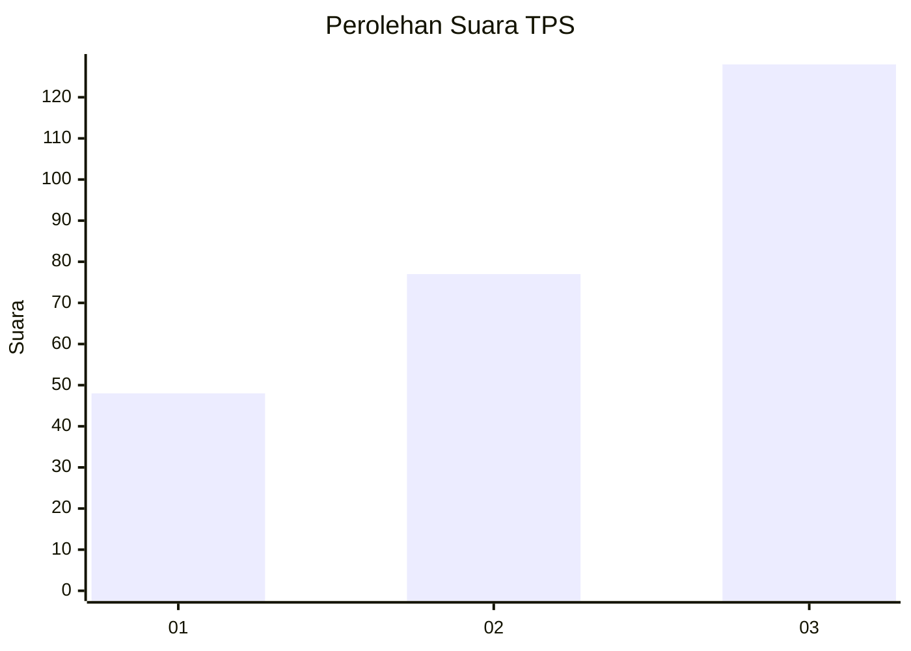
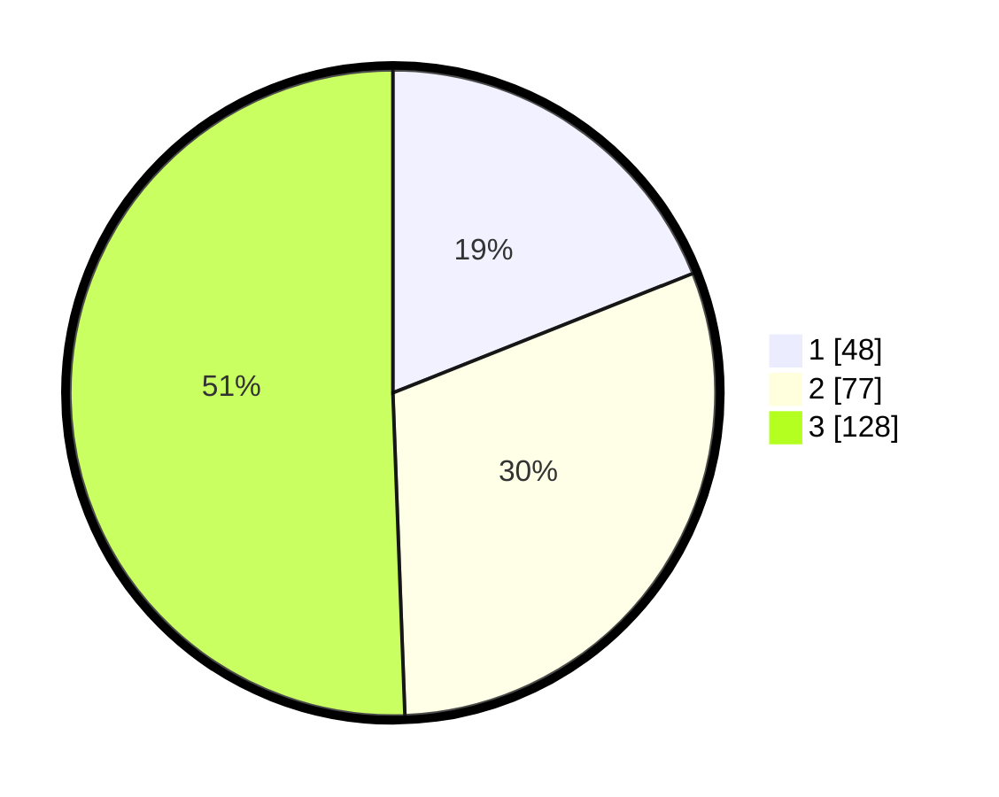

# Hasil

## Grafik

## Tabel

| No. | Nama Paslon    | Suara | Suara (raw) | Persentase |
|:--- |:-------------- | -----:| -----------:| ----------:|
| 1   | ANIES MUHAIMIN | 48    | [48][p-1]   | 18,97      |
| 2   | PRABOWO GIBRAN | 77    | [77][p-2]   | 30,43      |
| 3   | GANJAR MAHFUD  | 128   | [128][p-3]  | 50,59      |

[p-1]: https://github.com/gigit-pemilu/pemilu-2024-35-jawa-timur/blob/main/pilpres/hitung-suara/sub/35-jawa-timur/sub/09-jember/sub/09-bangsalsari/sub/2011-badean/sub/022-tps/sub/paslon-1.txt
[p-2]: https://github.com/gigit-pemilu/pemilu-2024-35-jawa-timur/blob/main/pilpres/hitung-suara/sub/35-jawa-timur/sub/09-jember/sub/09-bangsalsari/sub/2011-badean/sub/022-tps/sub/paslon-2.txt
[p-3]: https://github.com/gigit-pemilu/pemilu-2024-35-jawa-timur/blob/main/pilpres/hitung-suara/sub/35-jawa-timur/sub/09-jember/sub/09-bangsalsari/sub/2011-badean/sub/022-tps/sub/paslon-3.txt

## Foto C Plano

https://sirekap-obj-formc.kpu.go.id/8524/pemilu/ppwp/35/09/09/20/11/3509092011022-20240215-013920--65965123-3590-4f6b-8d10-b3ebb0ec0345.jpg

https://sirekap-obj-formc.kpu.go.id/8524/pemilu/ppwp/35/09/09/20/11/3509092011022-20240215-014051--d45c8ae4-fe74-47d0-ad59-45877ff3bab1.jpg

https://sirekap-obj-formc.kpu.go.id/8524/pemilu/ppwp/35/09/09/20/11/3509092011022-20240215-014155--25b1cd87-b564-4d08-9db4-405a9e156202.jpg

## Metadata

| Key        | Value               |
| ---------- | ------------------- |
| Time Stamp | 2024-02-15 15:00:29 |

