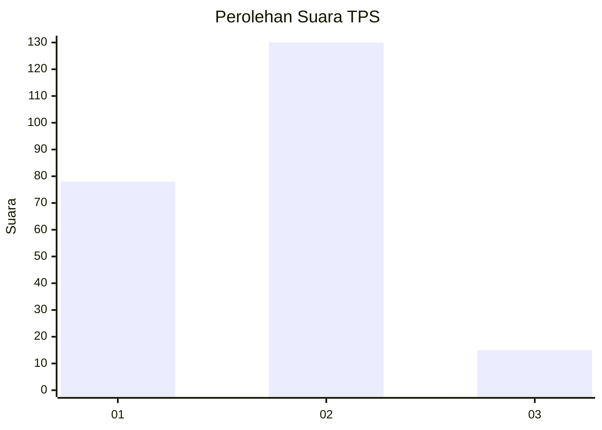
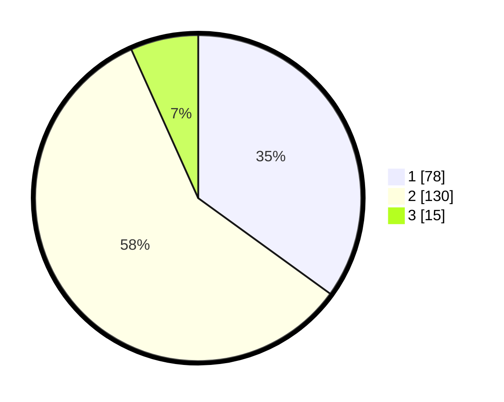

# Hasil

## Grafik

## Tabel

| No. | Nama Paslon    | Suara | Suara (raw) | Persentase |
|:--- |:-------------- | -----:| -----------:| ----------:|
| 1   | ANIES MUHAIMIN | 78    | [78][p-1]   | 34,98      |
| 2   | PRABOWO GIBRAN | 130   | [130][p-2]  | 58,30      |
| 3   | GANJAR MAHFUD  | 15    | [15][p-3]   | 6,73       |

[p-1]: https://github.com/gigit-pemilu/pemilu-2024/blob/main/pilpres/hitung-suara/sub/35-jawa-timur/sub/09-jember/sub/10-balung/sub/2002-karang-semanding/sub/010-tps/sub/paslon-1.txt
[p-2]: https://github.com/gigit-pemilu/pemilu-2024/blob/main/pilpres/hitung-suara/sub/35-jawa-timur/sub/09-jember/sub/10-balung/sub/2002-karang-semanding/sub/010-tps/sub/paslon-2.txt
[p-3]: https://github.com/gigit-pemilu/pemilu-2024/blob/main/pilpres/hitung-suara/sub/35-jawa-timur/sub/09-jember/sub/10-balung/sub/2002-karang-semanding/sub/010-tps/sub/paslon-3.txt

## Foto C Plano

https://sirekap-obj-formc.kpu.go.id/af34/pemilu/ppwp/35/09/10/20/02/3509102002010-20240218-202039--3ad1a321-5a52-49a4-a4c9-beb0ad03ed55.jpg

https://sirekap-obj-formc.kpu.go.id/af34/pemilu/ppwp/35/09/10/20/02/3509102002010-20240218-194950--f4a2b76d-d056-449b-addd-f57e369ee239.jpg

https://sirekap-obj-formc.kpu.go.id/af34/pemilu/ppwp/35/09/10/20/02/3509102002010-20240218-195149--bde615e2-7bb3-49b2-807a-0dc49027ea9a.jpg

## Metadata

| Key        | Value               |
| ---------- | ------------------- |
| Time Stamp | 2024-02-24 22:31:28 |

