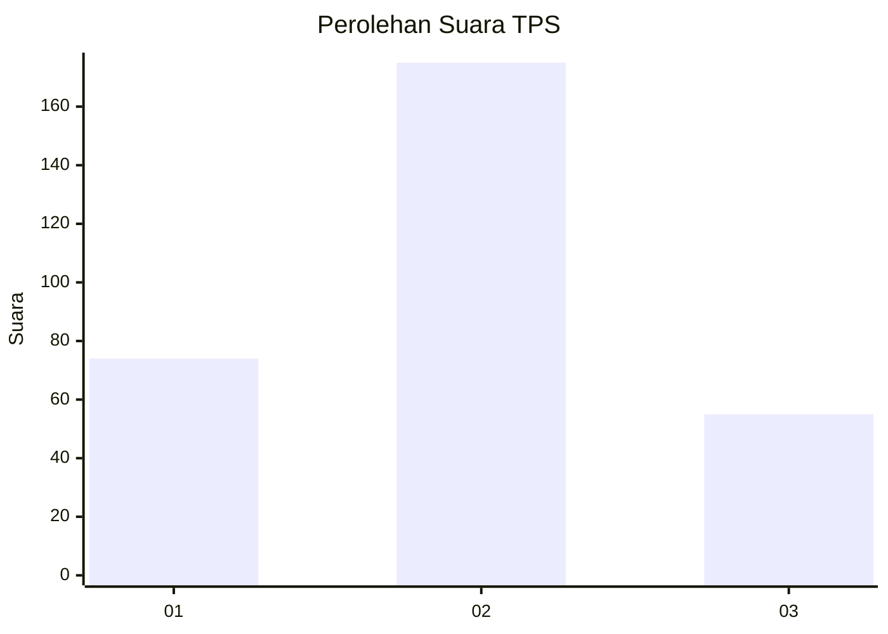
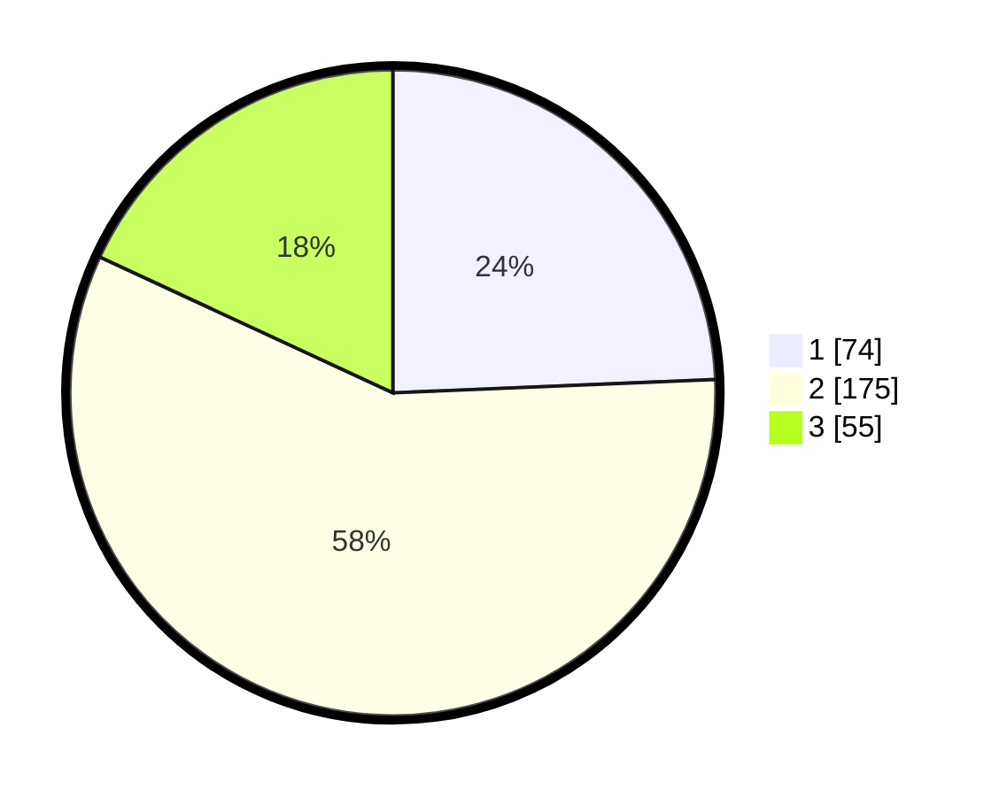

# Hasil

## Grafik

## Tabel

| No. | Nama Paslon    | Suara | Suara (raw) | Persentase |
|:--- |:-------------- | -----:| -----------:| ----------:|
| 1   | ANIES MUHAIMIN | 74    | [74][p-1]   | 24,34      |
| 2   | PRABOWO GIBRAN | 175   | [175][p-2]  | 57,57      |
| 3   | GANJAR MAHFUD  | 55    | [55][p-3]   | 18,09      |

[p-1]: https://github.com/gigit-pemilu/pemilu-2024-35-jawa-timur/blob/main/pilpres/hitung-suara/sub/35-jawa-timur/sub/09-jember/sub/10-balung/sub/2003-tutul/sub/010-tps/sub/paslon-1.txt
[p-2]: https://github.com/gigit-pemilu/pemilu-2024-35-jawa-timur/blob/main/pilpres/hitung-suara/sub/35-jawa-timur/sub/09-jember/sub/10-balung/sub/2003-tutul/sub/010-tps/sub/paslon-2.txt
[p-3]: https://github.com/gigit-pemilu/pemilu-2024-35-jawa-timur/blob/main/pilpres/hitung-suara/sub/35-jawa-timur/sub/09-jember/sub/10-balung/sub/2003-tutul/sub/010-tps/sub/paslon-3.txt

## Foto C Plano

https://sirekap-obj-formc.kpu.go.id/2e85/pemilu/ppwp/35/09/10/20/03/3509102003010-20240222-125405--9c969139-2cdb-4777-af90-4639f2edc899.jpg

https://sirekap-obj-formc.kpu.go.id/2e85/pemilu/ppwp/35/09/10/20/03/3509102003010-20240222-102559--837c6e25-aed3-479a-a477-017eaf5b0aff.jpg

https://sirekap-obj-formc.kpu.go.id/2e85/pemilu/ppwp/35/09/10/20/03/3509102003010-20240222-103039--41fad8a3-be03-4bac-a93c-8ae277e4eb46.jpg

## Metadata

| Key        | Value               |
| ---------- | ------------------- |
| Time Stamp | 2024-02-22 13:00:00 |

