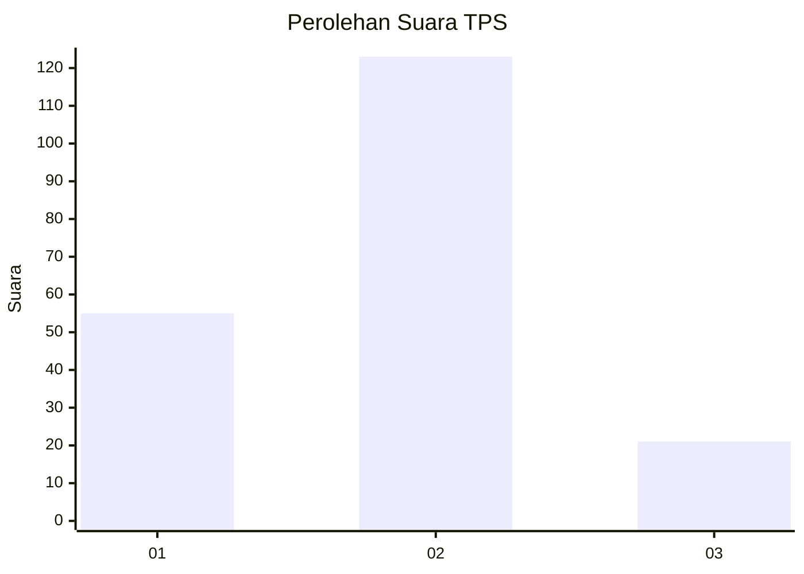
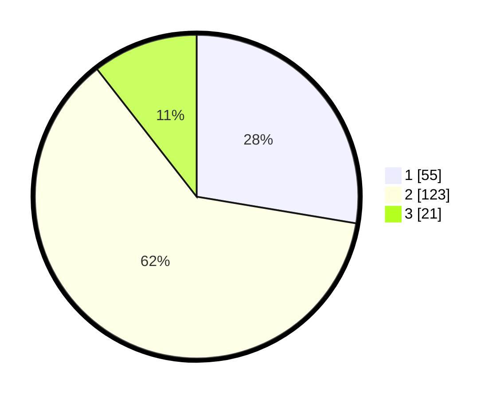

# Hasil

## Grafik

## Tabel

| No. | Nama Paslon    | Suara | Suara (raw) | Persentase |
|:--- |:-------------- | -----:| -----------:| ----------:|
| 1   | ANIES MUHAIMIN | 55    | [55][p-1]   | 27,64      |
| 2   | PRABOWO GIBRAN | 123   | [123][p-2]  | 61,81      |
| 3   | GANJAR MAHFUD  | 21    | [21][p-3]   | 10,55      |

[p-1]: https://github.com/gigit-pemilu/pemilu-2024/blob/main/pilpres/hitung-suara/sub/35-jawa-timur/sub/09-jember/sub/10-balung/sub/2005-balunglor/sub/005-tps/sub/paslon-1.txt
[p-2]: https://github.com/gigit-pemilu/pemilu-2024/blob/main/pilpres/hitung-suara/sub/35-jawa-timur/sub/09-jember/sub/10-balung/sub/2005-balunglor/sub/005-tps/sub/paslon-2.txt
[p-3]: https://github.com/gigit-pemilu/pemilu-2024/blob/main/pilpres/hitung-suara/sub/35-jawa-timur/sub/09-jember/sub/10-balung/sub/2005-balunglor/sub/005-tps/sub/paslon-3.txt

## Foto C Plano

https://sirekap-obj-formc.kpu.go.id/f762/pemilu/ppwp/35/09/10/20/05/3509102005005-20240215-084807--7f4259ed-36f1-46b3-b90a-a9c01b50eb89.jpg

https://sirekap-obj-formc.kpu.go.id/f762/pemilu/ppwp/35/09/10/20/05/3509102005005-20240214-202317--99394230-abb0-4b7f-a40b-9d66f0f6e7a2.jpg

https://sirekap-obj-formc.kpu.go.id/f762/pemilu/ppwp/35/09/10/20/05/3509102005005-20240214-202346--fdf5b284-1819-4825-a30b-d94c757739c7.jpg

## Metadata

| Key        | Value               |
| ---------- | ------------------- |
| Time Stamp | 2024-02-15 22:30:27 |

