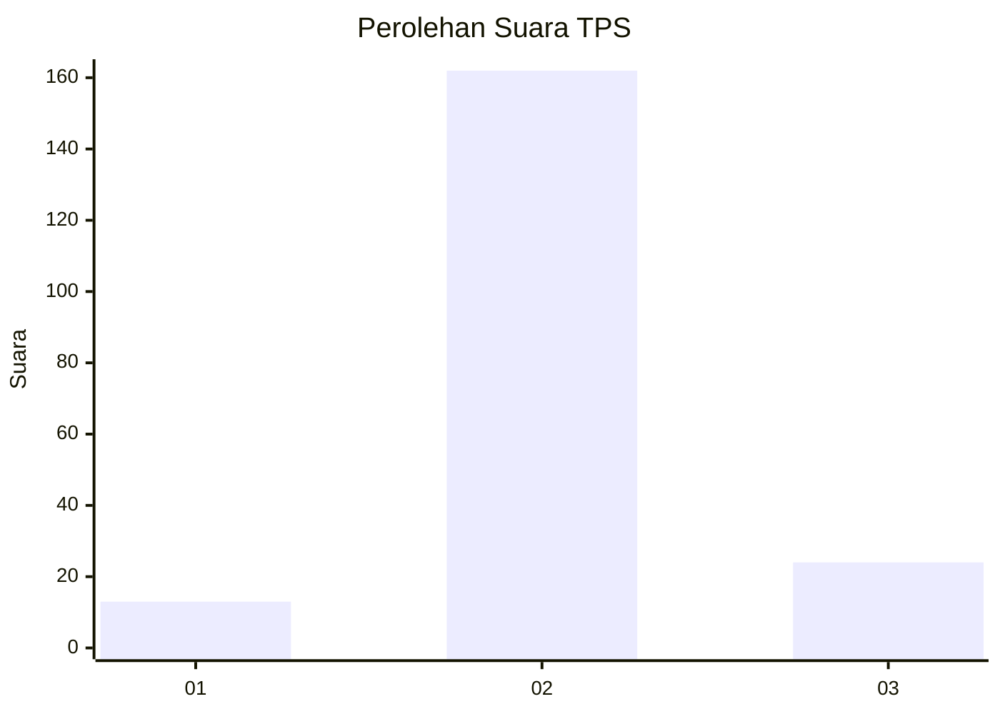
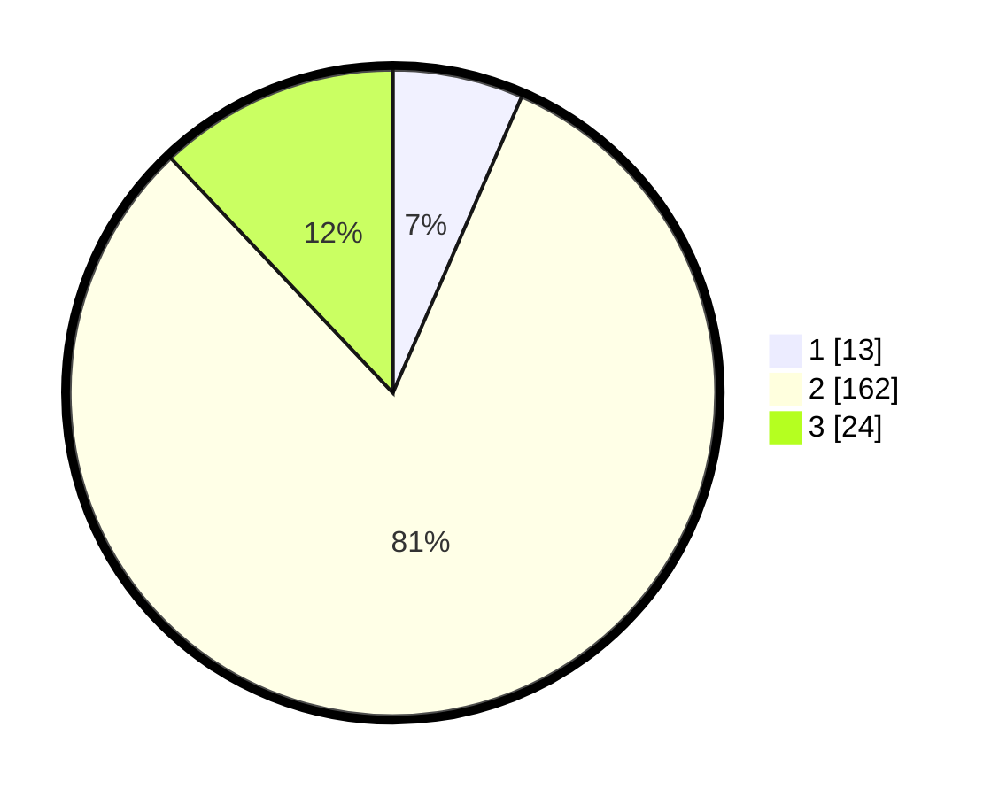

# Hasil

## Grafik

## Tabel

| No. | Nama Paslon    | Suara | Suara (raw) | Persentase |
|:--- |:-------------- | -----:| -----------:| ----------:|
| 1   | ANIES MUHAIMIN | 13    | [13][p-1]   | 6,53       |
| 2   | PRABOWO GIBRAN | 162   | [162][p-2]  | 81,41      |
| 3   | GANJAR MAHFUD  | 24    | [24][p-3]   | 12,06      |

[p-1]: https://github.com/gigit-pemilu/pemilu-2024/blob/main/pilpres/hitung-suara/sub/35-jawa-timur/sub/09-jember/sub/10-balung/sub/2005-balunglor/sub/017-tps/sub/paslon-1.txt
[p-2]: https://github.com/gigit-pemilu/pemilu-2024/blob/main/pilpres/hitung-suara/sub/35-jawa-timur/sub/09-jember/sub/10-balung/sub/2005-balunglor/sub/017-tps/sub/paslon-2.txt
[p-3]: https://github.com/gigit-pemilu/pemilu-2024/blob/main/pilpres/hitung-suara/sub/35-jawa-timur/sub/09-jember/sub/10-balung/sub/2005-balunglor/sub/017-tps/sub/paslon-3.txt

## Foto C Plano

https://sirekap-obj-formc.kpu.go.id/d958/pemilu/ppwp/35/09/10/20/05/3509102005017-20240215-111235--9d02b994-1bfe-44cb-9b37-0037e95212cc.jpg

https://sirekap-obj-formc.kpu.go.id/d958/pemilu/ppwp/35/09/10/20/05/3509102005017-20240215-111331--4bf339f7-0a31-49b4-afe5-229280a68a3c.jpg

https://sirekap-obj-formc.kpu.go.id/d958/pemilu/ppwp/35/09/10/20/05/3509102005017-20240215-111422--88576fb7-468d-4a96-84fb-8b64d5e0b26d.jpg

## Metadata

| Key        | Value               |
| ---------- | ------------------- |
| Time Stamp | 2024-02-15 16:00:26 |

