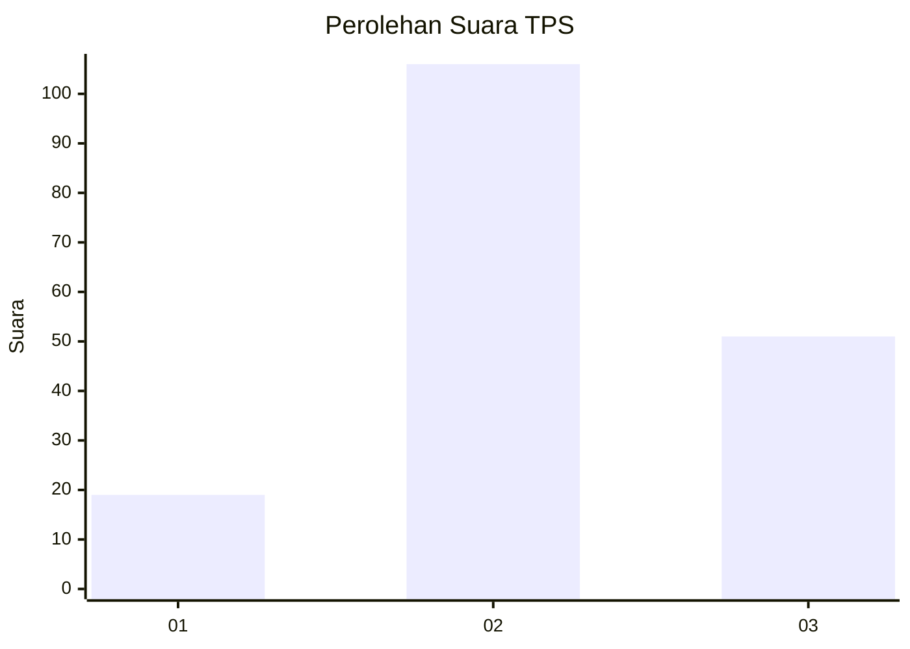
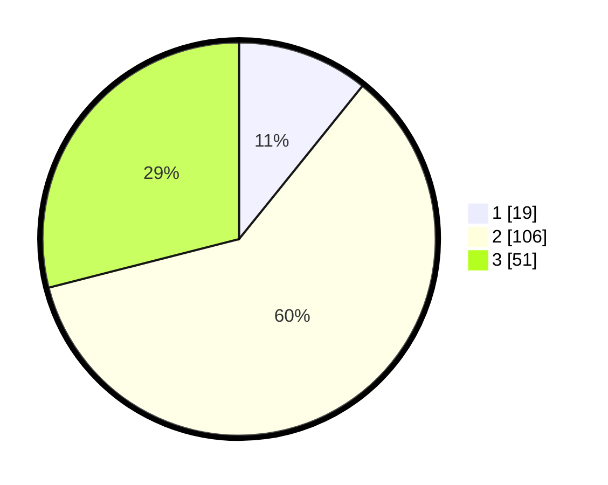

# Hasil

## Grafik

## Tabel

| No. | Nama Paslon    | Suara | Suara (raw) | Persentase |
|:--- |:-------------- | -----:| -----------:| ----------:|
| 1   | ANIES MUHAIMIN | 19    | [19][p-1]   | 10,80      |
| 2   | PRABOWO GIBRAN | 106   | [106][p-2]  | 60,23      |
| 3   | GANJAR MAHFUD  | 51    | [51][p-3]   | 28,98      |

[p-1]: https://github.com/gigit-pemilu/pemilu-2024/blob/main/pilpres/hitung-suara/sub/35-jawa-timur/sub/09-jember/sub/10-balung/sub/2005-balunglor/sub/019-tps/sub/paslon-1.txt
[p-2]: https://github.com/gigit-pemilu/pemilu-2024/blob/main/pilpres/hitung-suara/sub/35-jawa-timur/sub/09-jember/sub/10-balung/sub/2005-balunglor/sub/019-tps/sub/paslon-2.txt
[p-3]: https://github.com/gigit-pemilu/pemilu-2024/blob/main/pilpres/hitung-suara/sub/35-jawa-timur/sub/09-jember/sub/10-balung/sub/2005-balunglor/sub/019-tps/sub/paslon-3.txt

## Foto C Plano

https://sirekap-obj-formc.kpu.go.id/a0f4/pemilu/ppwp/35/09/10/20/05/3509102005019-20240214-214330--3a77da22-b0f2-4e83-818a-d7fa4caab390.jpg

https://sirekap-obj-formc.kpu.go.id/a0f4/pemilu/ppwp/35/09/10/20/05/3509102005019-20240214-214742--2134e879-1909-4d2b-9adb-55f4f7aac8b2.jpg

https://sirekap-obj-formc.kpu.go.id/a0f4/pemilu/ppwp/35/09/10/20/05/3509102005019-20240214-215243--9380719b-7f67-4ac1-988c-2fbdbeb3744b.jpg

## Metadata

| Key        | Value               |
| ---------- | ------------------- |
| Time Stamp | 2024-02-15 16:00:26 |

