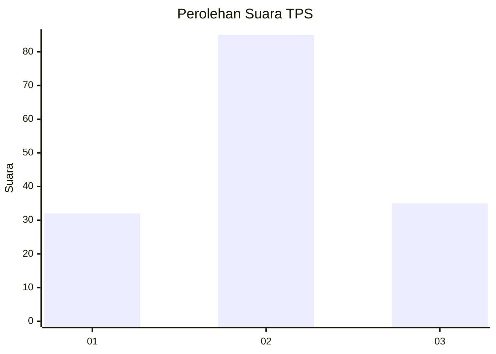
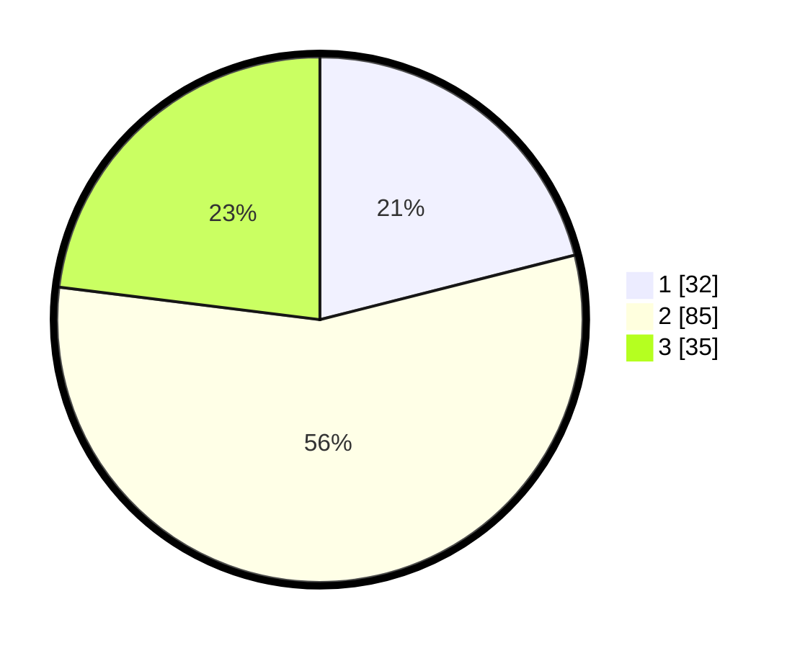

# Hasil

## Grafik

## Tabel

| No. | Nama Paslon    | Suara | Suara (raw) | Persentase |
|:--- |:-------------- | -----:| -----------:| ----------:|
| 1   | ANIES MUHAIMIN | 32    | [32][p-1]   | 21,05      |
| 2   | PRABOWO GIBRAN | 85    | [85][p-2]   | 55,92      |
| 3   | GANJAR MAHFUD  | 35    | [35][p-3]   | 23,03      |

[p-1]: https://github.com/gigit-pemilu/pemilu-2024/blob/main/pilpres/hitung-suara/sub/35-jawa-timur/sub/09-jember/sub/10-balung/sub/2005-balunglor/sub/023-tps/sub/paslon-1.txt
[p-2]: https://github.com/gigit-pemilu/pemilu-2024/blob/main/pilpres/hitung-suara/sub/35-jawa-timur/sub/09-jember/sub/10-balung/sub/2005-balunglor/sub/023-tps/sub/paslon-2.txt
[p-3]: https://github.com/gigit-pemilu/pemilu-2024/blob/main/pilpres/hitung-suara/sub/35-jawa-timur/sub/09-jember/sub/10-balung/sub/2005-balunglor/sub/023-tps/sub/paslon-3.txt

## Foto C Plano

https://sirekap-obj-formc.kpu.go.id/e50a/pemilu/ppwp/35/09/10/20/05/3509102005023-20240215-020059--872de513-292a-4acc-bb72-df15dbde14da.jpg

https://sirekap-obj-formc.kpu.go.id/e50a/pemilu/ppwp/35/09/10/20/05/3509102005023-20240215-011108--e3a39dfc-c691-4e29-9350-afa62f98a832.jpg

https://sirekap-obj-formc.kpu.go.id/e50a/pemilu/ppwp/35/09/10/20/05/3509102005023-20240215-020025--0303bfa1-4fae-400e-9d0d-0f5978b369ae.jpg

## Metadata

| Key        | Value               |
| ---------- | ------------------- |
| Time Stamp | 2024-02-25 15:00:00 |

