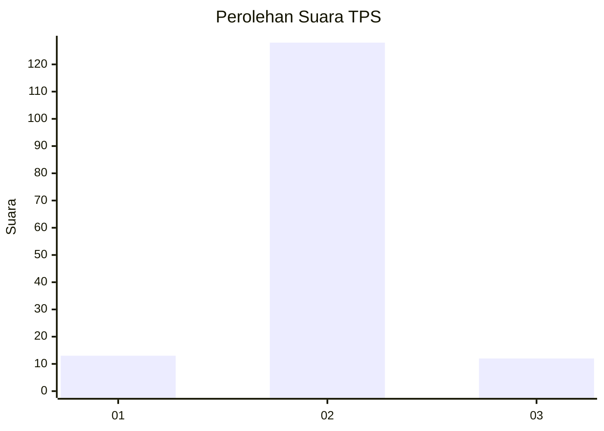
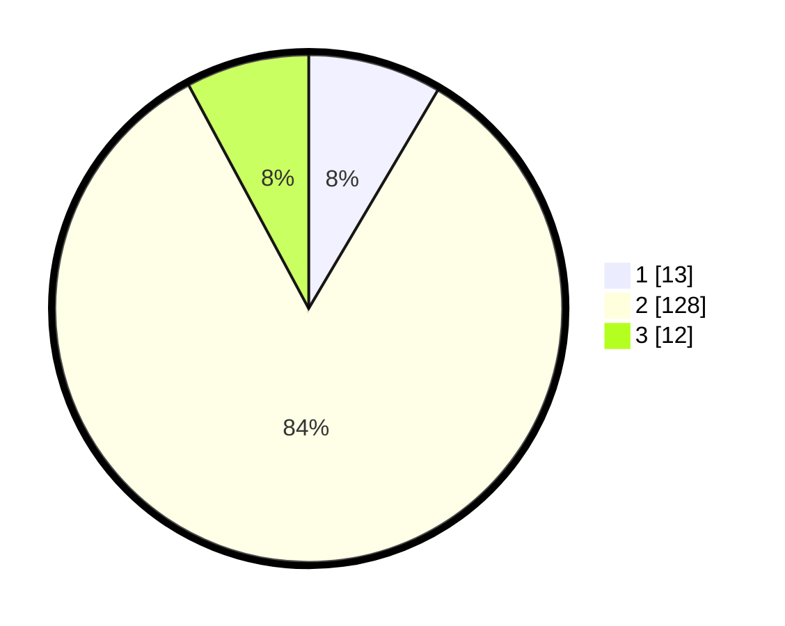

# Hasil

## Grafik

## Tabel

| No. | Nama Paslon    | Suara | Suara (raw) | Persentase |
|:--- |:-------------- | -----:| -----------:| ----------:|
| 1   | ANIES MUHAIMIN | 13    | [13][p-1]   | 8,50       |
| 2   | PRABOWO GIBRAN | 128   | [128][p-2]  | 83,66      |
| 3   | GANJAR MAHFUD  | 12    | [12][p-3]   | 7,84       |

[p-1]: https://github.com/gigit-pemilu/pemilu-2024-35-jawa-timur/blob/main/pilpres/hitung-suara/sub/35-jawa-timur/sub/09-jember/sub/10-balung/sub/2005-balunglor/sub/029-tps/sub/paslon-1.txt
[p-2]: https://github.com/gigit-pemilu/pemilu-2024-35-jawa-timur/blob/main/pilpres/hitung-suara/sub/35-jawa-timur/sub/09-jember/sub/10-balung/sub/2005-balunglor/sub/029-tps/sub/paslon-2.txt
[p-3]: https://github.com/gigit-pemilu/pemilu-2024-35-jawa-timur/blob/main/pilpres/hitung-suara/sub/35-jawa-timur/sub/09-jember/sub/10-balung/sub/2005-balunglor/sub/029-tps/sub/paslon-3.txt

## Foto C Plano

https://sirekap-obj-formc.kpu.go.id/7fcc/pemilu/ppwp/35/09/10/20/05/3509102005029-20240214-215748--a908245f-b505-48cd-8df8-025b1feaf378.jpg

https://sirekap-obj-formc.kpu.go.id/7fcc/pemilu/ppwp/35/09/10/20/05/3509102005029-20240214-220615--65c6c6b6-b788-4995-9dd3-7d5508d6203c.jpg

https://sirekap-obj-formc.kpu.go.id/7fcc/pemilu/ppwp/35/09/10/20/05/3509102005029-20240214-220801--c9461047-c070-498d-8edb-0906ca6de236.jpg

## Metadata

| Key        | Value               |
| ---------- | ------------------- |
| Time Stamp | 2024-02-24 23:00:00 |

