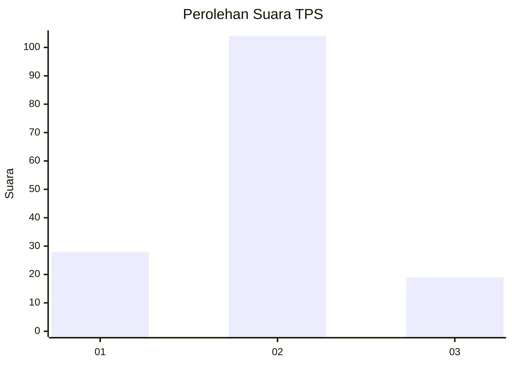
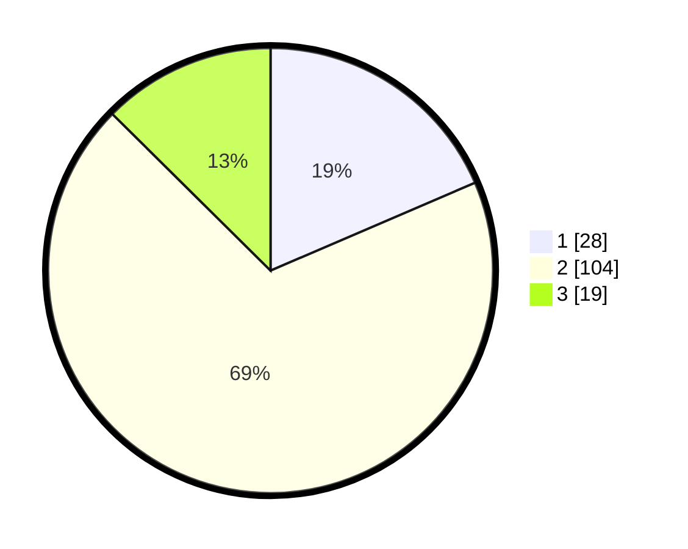

# Hasil

## Grafik

## Tabel

| No. | Nama Paslon    | Suara | Suara (raw) | Persentase |
|:--- |:-------------- | -----:| -----------:| ----------:|
| 1   | ANIES MUHAIMIN | 28    | [28][p-1]   | 18,54      |
| 2   | PRABOWO GIBRAN | 104   | [104][p-2]  | 68,87      |
| 3   | GANJAR MAHFUD  | 19    | [19][p-3]   | 12,58      |

[p-1]: https://github.com/gigit-pemilu/pemilu-2024/blob/main/pilpres/hitung-suara/sub/35-jawa-timur/sub/09-jember/sub/10-balung/sub/2005-balunglor/sub/040-tps/sub/paslon-1.txt
[p-2]: https://github.com/gigit-pemilu/pemilu-2024/blob/main/pilpres/hitung-suara/sub/35-jawa-timur/sub/09-jember/sub/10-balung/sub/2005-balunglor/sub/040-tps/sub/paslon-2.txt
[p-3]: https://github.com/gigit-pemilu/pemilu-2024/blob/main/pilpres/hitung-suara/sub/35-jawa-timur/sub/09-jember/sub/10-balung/sub/2005-balunglor/sub/040-tps/sub/paslon-3.txt

## Foto C Plano

https://sirekap-obj-formc.kpu.go.id/c3cf/pemilu/ppwp/35/09/10/20/05/3509102005040-20240219-150535--bb987352-12c4-4510-933f-004ab01cdda1.jpg

https://sirekap-obj-formc.kpu.go.id/c3cf/pemilu/ppwp/35/09/10/20/05/3509102005040-20240219-151642--e63927db-40b7-4160-b288-781b8b356e82.jpg

https://sirekap-obj-formc.kpu.go.id/c3cf/pemilu/ppwp/35/09/10/20/05/3509102005040-20240219-152642--8050a92b-ff98-402e-b314-237faf2088b8.jpg

## Metadata

| Key        | Value               |
| ---------- | ------------------- |
| Time Stamp | 2024-02-25 12:00:00 |

