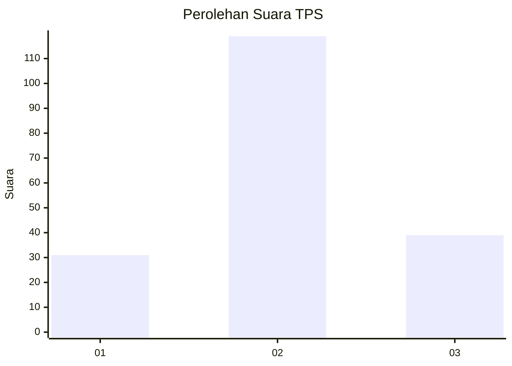
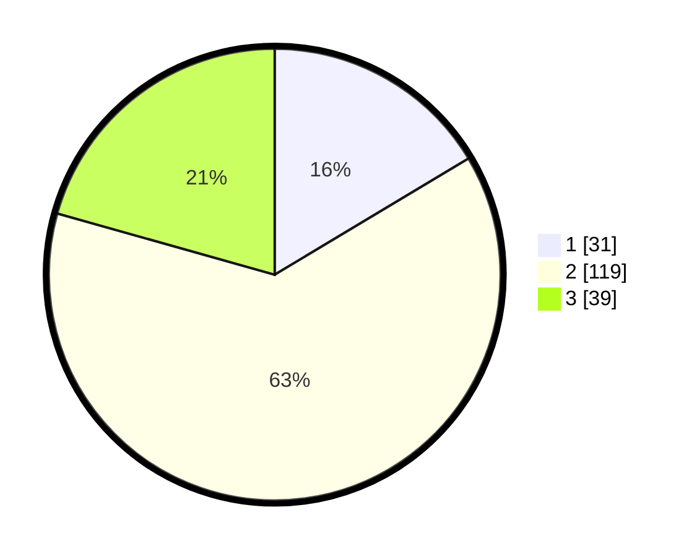

# Hasil

## Grafik

## Tabel

| No. | Nama Paslon    | Suara | Suara (raw) | Persentase |
|:--- |:-------------- | -----:| -----------:| ----------:|
| 1   | ANIES MUHAIMIN | 31    | [31][p-1]   | 16,40      |
| 2   | PRABOWO GIBRAN | 119   | [119][p-2]  | 62,96      |
| 3   | GANJAR MAHFUD  | 39    | [39][p-3]   | 20,63      |

[p-1]: https://github.com/gigit-pemilu/pemilu-2024/blob/main/pilpres/hitung-suara/sub/35-jawa-timur/sub/09-jember/sub/10-balung/sub/2005-balunglor/sub/051-tps/sub/paslon-1.txt
[p-2]: https://github.com/gigit-pemilu/pemilu-2024/blob/main/pilpres/hitung-suara/sub/35-jawa-timur/sub/09-jember/sub/10-balung/sub/2005-balunglor/sub/051-tps/sub/paslon-2.txt
[p-3]: https://github.com/gigit-pemilu/pemilu-2024/blob/main/pilpres/hitung-suara/sub/35-jawa-timur/sub/09-jember/sub/10-balung/sub/2005-balunglor/sub/051-tps/sub/paslon-3.txt

## Foto C Plano

https://sirekap-obj-formc.kpu.go.id/b5bc/pemilu/ppwp/35/09/10/20/05/3509102005051-20240215-094440--3afc97eb-3372-4d90-b794-f5481033fa27.jpg

https://sirekap-obj-formc.kpu.go.id/b5bc/pemilu/ppwp/35/09/10/20/05/3509102005051-20240215-094503--3a5bd19c-8d4f-47b0-8289-cf7925cacba2.jpg

https://sirekap-obj-formc.kpu.go.id/b5bc/pemilu/ppwp/35/09/10/20/05/3509102005051-20240215-094518--635a68a8-2851-4176-bf2b-8da29c87ef6b.jpg

## Metadata

| Key        | Value               |
| ---------- | ------------------- |
| Time Stamp | 2024-02-24 22:31:28 |

