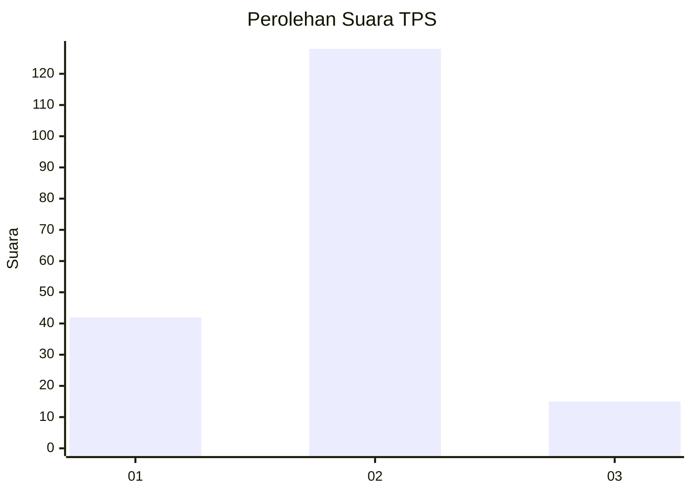
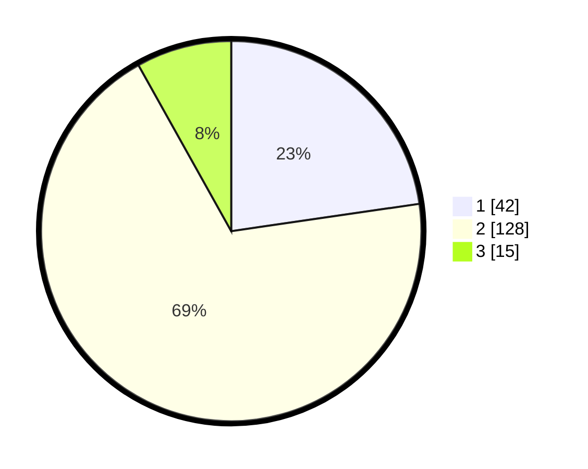

# Hasil

## Grafik

## Tabel

| No. | Nama Paslon    | Suara | Suara (raw) | Persentase |
|:--- |:-------------- | -----:| -----------:| ----------:|
| 1   | ANIES MUHAIMIN | 42    | [42][p-1]   | 22,70      |
| 2   | PRABOWO GIBRAN | 128   | [128][p-2]  | 69,19      |
| 3   | GANJAR MAHFUD  | 15    | [15][p-3]   | 8,11       |

[p-1]: https://github.com/gigit-pemilu/pemilu-2024-35-jawa-timur/blob/main/pilpres/hitung-suara/sub/35-jawa-timur/sub/09-jember/sub/10-balung/sub/2005-balunglor/sub/057-tps/sub/paslon-1.txt
[p-2]: https://github.com/gigit-pemilu/pemilu-2024-35-jawa-timur/blob/main/pilpres/hitung-suara/sub/35-jawa-timur/sub/09-jember/sub/10-balung/sub/2005-balunglor/sub/057-tps/sub/paslon-2.txt
[p-3]: https://github.com/gigit-pemilu/pemilu-2024-35-jawa-timur/blob/main/pilpres/hitung-suara/sub/35-jawa-timur/sub/09-jember/sub/10-balung/sub/2005-balunglor/sub/057-tps/sub/paslon-3.txt

## Foto C Plano

https://sirekap-obj-formc.kpu.go.id/7495/pemilu/ppwp/35/09/10/20/05/3509102005057-20240217-091123--0ad97a1f-e1b6-4fe2-9f85-4e8509867939.jpg

https://sirekap-obj-formc.kpu.go.id/7495/pemilu/ppwp/35/09/10/20/05/3509102005057-20240217-091245--244ab837-10cf-47d7-b942-070b5c31bd93.jpg

https://sirekap-obj-formc.kpu.go.id/7495/pemilu/ppwp/35/09/10/20/05/3509102005057-20240217-090908--78badcea-e3fd-408d-bf29-fd2794b0a9f7.jpg

## Metadata

| Key        | Value               |
| ---------- | ------------------- |
| Time Stamp | 2024-02-25 12:00:00 |

