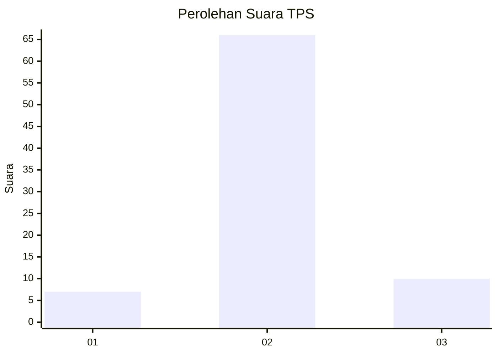
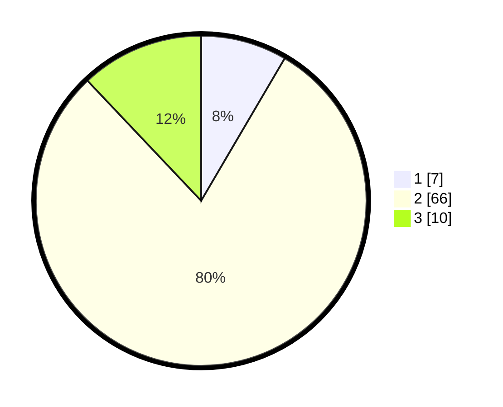

# Hasil

## Grafik

## Tabel

| No. | Nama Paslon    | Suara | Suara (raw) | Persentase |
|:--- |:-------------- | -----:| -----------:| ----------:|
| 1   | ANIES MUHAIMIN | 7     | [7][p-1]    | 8,43       |
| 2   | PRABOWO GIBRAN | 66    | [66][p-2]   | 79,52      |
| 3   | GANJAR MAHFUD  | 10    | [10][p-3]   | 12,05      |

[p-1]: https://github.com/gigit-pemilu/pemilu-2024-35-jawa-timur/blob/main/pilpres/hitung-suara/sub/35-jawa-timur/sub/09-jember/sub/10-balung/sub/2005-balunglor/sub/070-tps/sub/paslon-1.txt
[p-2]: https://github.com/gigit-pemilu/pemilu-2024-35-jawa-timur/blob/main/pilpres/hitung-suara/sub/35-jawa-timur/sub/09-jember/sub/10-balung/sub/2005-balunglor/sub/070-tps/sub/paslon-2.txt
[p-3]: https://github.com/gigit-pemilu/pemilu-2024-35-jawa-timur/blob/main/pilpres/hitung-suara/sub/35-jawa-timur/sub/09-jember/sub/10-balung/sub/2005-balunglor/sub/070-tps/sub/paslon-3.txt

## Foto C Plano

https://sirekap-obj-formc.kpu.go.id/b287/pemilu/ppwp/35/09/10/20/05/3509102005070-20240214-221144--d52c7365-7252-484b-aaeb-177e37001477.jpg

https://sirekap-obj-formc.kpu.go.id/b287/pemilu/ppwp/35/09/10/20/05/3509102005070-20240214-221307--8ecab96e-4e31-45bc-811b-26987fdc2c81.jpg

https://sirekap-obj-formc.kpu.go.id/b287/pemilu/ppwp/35/09/10/20/05/3509102005070-20240214-221401--124aca8e-3919-4cec-92e6-4f1d8e19a22e.jpg

## Metadata

| Key        | Value               |
| ---------- | ------------------- |
| Time Stamp | 2024-02-24 22:31:28 |

