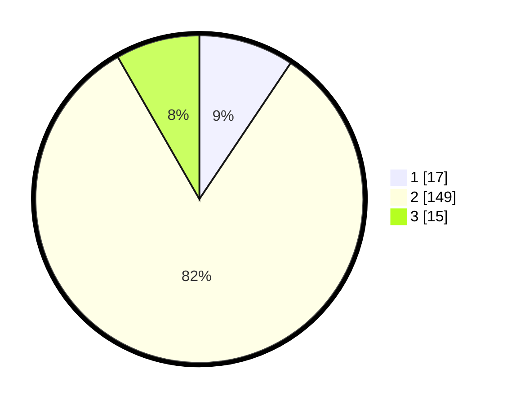

# Hasil

## Grafik

## Tabel

| No. | Nama Paslon    | Suara | Suara (raw) | Persentase |
|:--- |:-------------- | -----:| -----------:| ----------:|
| 1   | ANIES MUHAIMIN | 17    | [17][p-1]   | 9,39       |
| 2   | PRABOWO GIBRAN | 149   | [149][p-2]  | 82,32      |
| 3   | GANJAR MAHFUD  | 15    | [15][p-3]   | 8,29       |

[p-1]: https://github.com/gigit-pemilu/pemilu-2024-35-jawa-timur/blob/main/pilpres/hitung-suara/sub/35-jawa-timur/sub/09-jember/sub/10-balung/sub/2005-balunglor/sub/073-tps/sub/paslon-1.txt
[p-2]: https://github.com/gigit-pemilu/pemilu-2024-35-jawa-timur/blob/main/pilpres/hitung-suara/sub/35-jawa-timur/sub/09-jember/sub/10-balung/sub/2005-balunglor/sub/073-tps/sub/paslon-2.txt
[p-3]: https://github.com/gigit-pemilu/pemilu-2024-35-jawa-timur/blob/main/pilpres/hitung-suara/sub/35-jawa-timur/sub/09-jember/sub/10-balung/sub/2005-balunglor/sub/073-tps/sub/paslon-3.txt

## Foto C Plano

https://sirekap-obj-formc.kpu.go.id/9f24/pemilu/ppwp/35/09/10/20/05/3509102005073-20240218-191559--f5878586-f64b-4fa4-aeac-eb7cdc4cb1ba.jpg

https://sirekap-obj-formc.kpu.go.id/9f24/pemilu/ppwp/35/09/10/20/05/3509102005073-20240218-194839--32a6eb63-37cc-46d4-abff-3d65be6a3e86.jpg

https://sirekap-obj-formc.kpu.go.id/9f24/pemilu/ppwp/35/09/10/20/05/3509102005073-20240218-194852--93bfffb5-ee8f-4f9d-a4de-7f8d3110132a.jpg

## Metadata

| Key        | Value               |
| ---------- | ------------------- |
| Time Stamp | 2024-02-24 22:31:28 |

