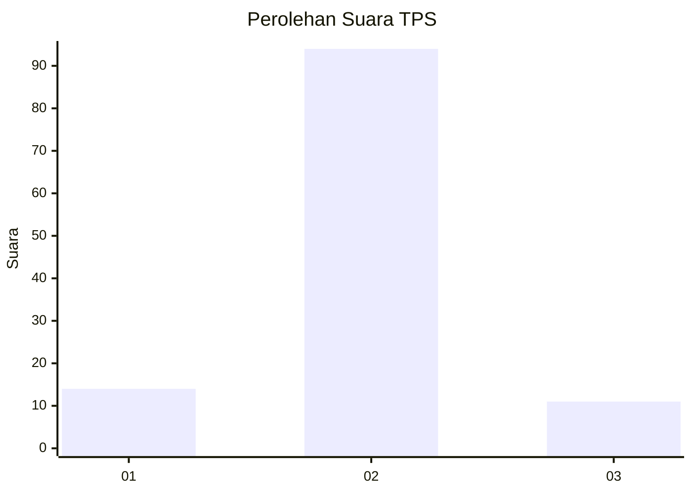
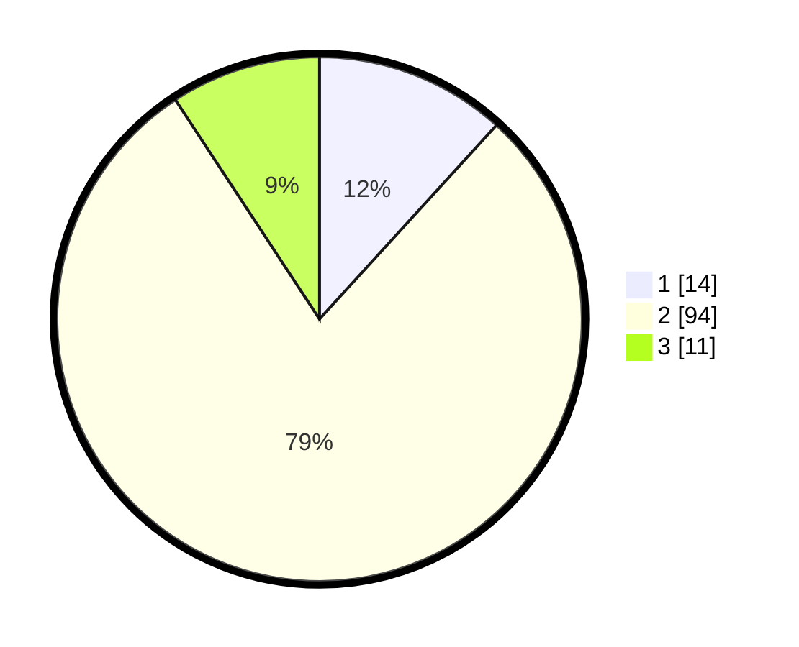

# Hasil

## Grafik

## Tabel

| No. | Nama Paslon    | Suara | Suara (raw) | Persentase |
|:--- |:-------------- | -----:| -----------:| ----------:|
| 1   | ANIES MUHAIMIN | 14    | [14][p-1]   | 11,76      |
| 2   | PRABOWO GIBRAN | 94    | [94][p-2]   | 78,99      |
| 3   | GANJAR MAHFUD  | 11    | [11][p-3]   | 9,24       |

[p-1]: https://github.com/gigit-pemilu/pemilu-2024/blob/main/pilpres/hitung-suara/sub/35-jawa-timur/sub/09-jember/sub/10-balung/sub/2005-balunglor/sub/074-tps/sub/paslon-1.txt
[p-2]: https://github.com/gigit-pemilu/pemilu-2024/blob/main/pilpres/hitung-suara/sub/35-jawa-timur/sub/09-jember/sub/10-balung/sub/2005-balunglor/sub/074-tps/sub/paslon-2.txt
[p-3]: https://github.com/gigit-pemilu/pemilu-2024/blob/main/pilpres/hitung-suara/sub/35-jawa-timur/sub/09-jember/sub/10-balung/sub/2005-balunglor/sub/074-tps/sub/paslon-3.txt

## Foto C Plano

https://sirekap-obj-formc.kpu.go.id/899c/pemilu/ppwp/35/09/10/20/05/3509102005074-20240214-233207--4ee8d81b-9909-4487-8dd0-a2340f0fad75.jpg

https://sirekap-obj-formc.kpu.go.id/899c/pemilu/ppwp/35/09/10/20/05/3509102005074-20240214-233401--b955f826-9369-4a3e-9c5d-99ef24c9bf3d.jpg

https://sirekap-obj-formc.kpu.go.id/899c/pemilu/ppwp/35/09/10/20/05/3509102005074-20240214-233535--cbeab4ec-45bd-417f-933e-999f14325a92.jpg

## Metadata

| Key        | Value               |
| ---------- | ------------------- |
| Time Stamp | 2024-02-15 16:00:26 |

