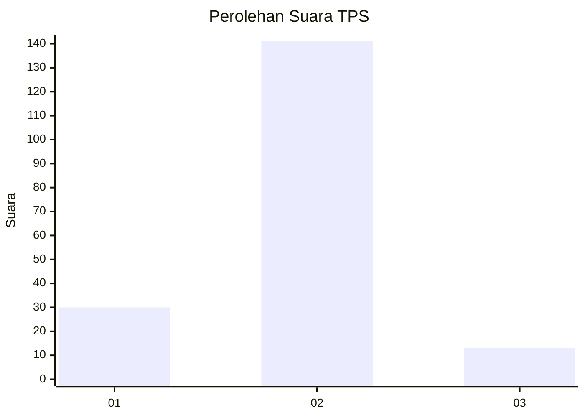
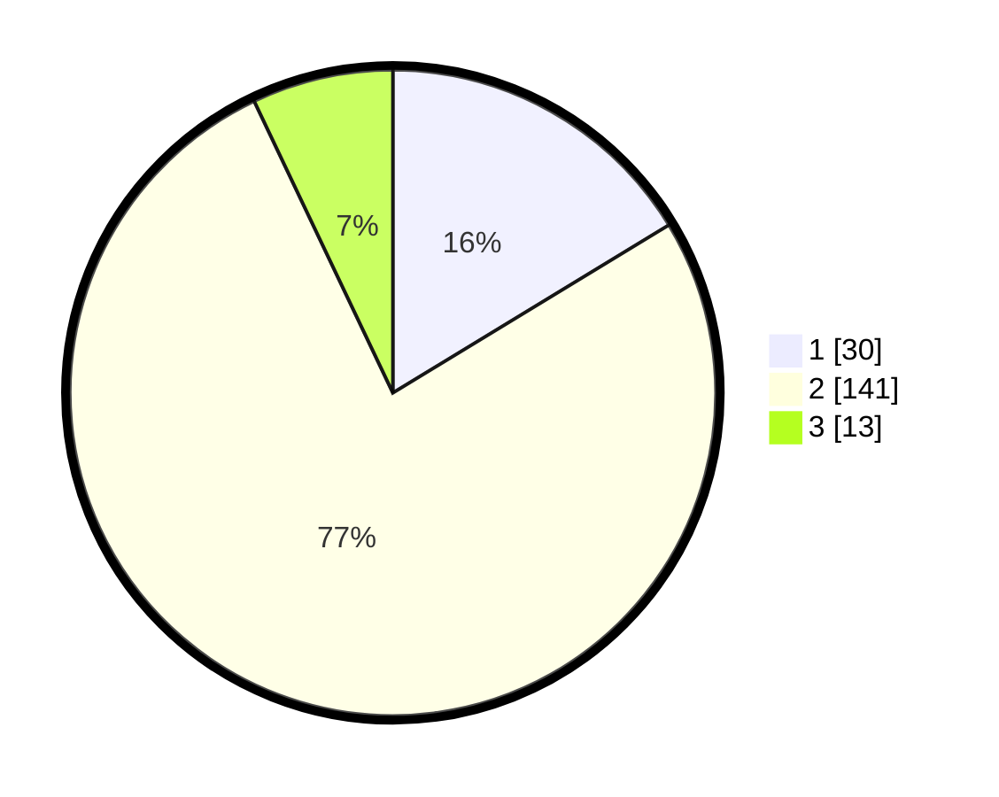

# Hasil

## Grafik

## Tabel

| No. | Nama Paslon    | Suara | Suara (raw) | Persentase |
|:--- |:-------------- | -----:| -----------:| ----------:|
| 1   | ANIES MUHAIMIN | 30    | [30][p-1]   | 16,30      |
| 2   | PRABOWO GIBRAN | 141   | [141][p-2]  | 76,63      |
| 3   | GANJAR MAHFUD  | 13    | [13][p-3]   | 7,07       |

[p-1]: https://github.com/gigit-pemilu/pemilu-2024/blob/main/pilpres/hitung-suara/sub/35-jawa-timur/sub/09-jember/sub/10-balung/sub/2007-curahlele/sub/005-tps/sub/paslon-1.txt
[p-2]: https://github.com/gigit-pemilu/pemilu-2024/blob/main/pilpres/hitung-suara/sub/35-jawa-timur/sub/09-jember/sub/10-balung/sub/2007-curahlele/sub/005-tps/sub/paslon-2.txt
[p-3]: https://github.com/gigit-pemilu/pemilu-2024/blob/main/pilpres/hitung-suara/sub/35-jawa-timur/sub/09-jember/sub/10-balung/sub/2007-curahlele/sub/005-tps/sub/paslon-3.txt

## Foto C Plano

https://sirekap-obj-formc.kpu.go.id/0125/pemilu/ppwp/35/09/10/20/07/3509102007005-20240218-234014--35821a10-0b12-4b3b-9747-6e75ac6554cf.jpg

https://sirekap-obj-formc.kpu.go.id/0125/pemilu/ppwp/35/09/10/20/07/3509102007005-20240218-234215--3b429eb8-fcb0-485b-af59-53ee7da2c9a2.jpg

https://sirekap-obj-formc.kpu.go.id/0125/pemilu/ppwp/35/09/10/20/07/3509102007005-20240218-234258--9037cfae-b234-4053-89c1-ed235fe93a7a.jpg

## Metadata

| Key        | Value               |
| ---------- | ------------------- |
| Time Stamp | 2024-02-25 14:00:00 |

