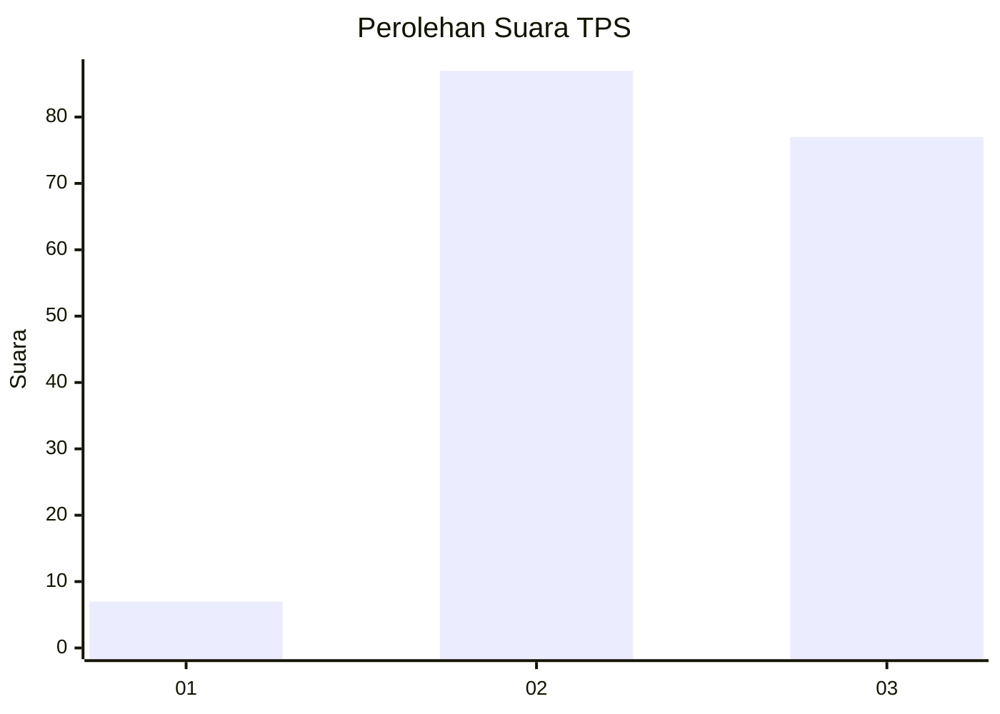
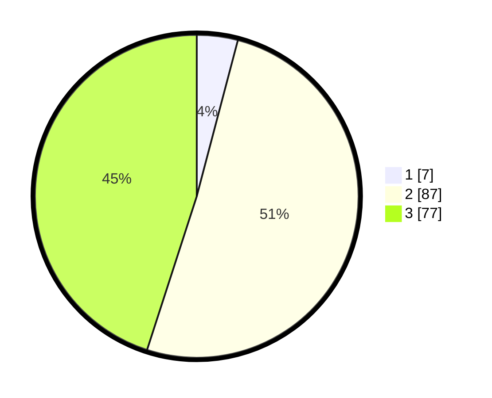

# Hasil

## Grafik

## Tabel

| No. | Nama Paslon    | Suara | Suara (raw) | Persentase |
|:--- |:-------------- | -----:| -----------:| ----------:|
| 1   | ANIES MUHAIMIN | 7     | [7][p-1]    | 4,09       |
| 2   | PRABOWO GIBRAN | 87    | [87][p-2]   | 50,88      |
| 3   | GANJAR MAHFUD  | 77    | [77][p-3]   | 45,03      |

[p-1]: https://github.com/gigit-pemilu/pemilu-2024/blob/main/pilpres/hitung-suara/sub/35-jawa-timur/sub/09-jember/sub/11-wuluhan/sub/2001-lojejer/sub/015-tps/sub/paslon-1.txt
[p-2]: https://github.com/gigit-pemilu/pemilu-2024/blob/main/pilpres/hitung-suara/sub/35-jawa-timur/sub/09-jember/sub/11-wuluhan/sub/2001-lojejer/sub/015-tps/sub/paslon-2.txt
[p-3]: https://github.com/gigit-pemilu/pemilu-2024/blob/main/pilpres/hitung-suara/sub/35-jawa-timur/sub/09-jember/sub/11-wuluhan/sub/2001-lojejer/sub/015-tps/sub/paslon-3.txt

## Foto C Plano

https://sirekap-obj-formc.kpu.go.id/4ee1/pemilu/ppwp/35/09/11/20/01/3509112001015-20240215-081444--80c05c3b-e601-481a-85aa-f167240b9bd9.jpg

https://sirekap-obj-formc.kpu.go.id/4ee1/pemilu/ppwp/35/09/11/20/01/3509112001015-20240215-081544--a4492642-d448-4b4f-b583-fac5159011b3.jpg

https://sirekap-obj-formc.kpu.go.id/4ee1/pemilu/ppwp/35/09/11/20/01/3509112001015-20240215-081631--9aeacf61-81c4-4f4b-b1e3-0da563c73ef7.jpg

## Metadata

| Key        | Value               |
| ---------- | ------------------- |
| Time Stamp | 2024-02-24 23:00:00 |

