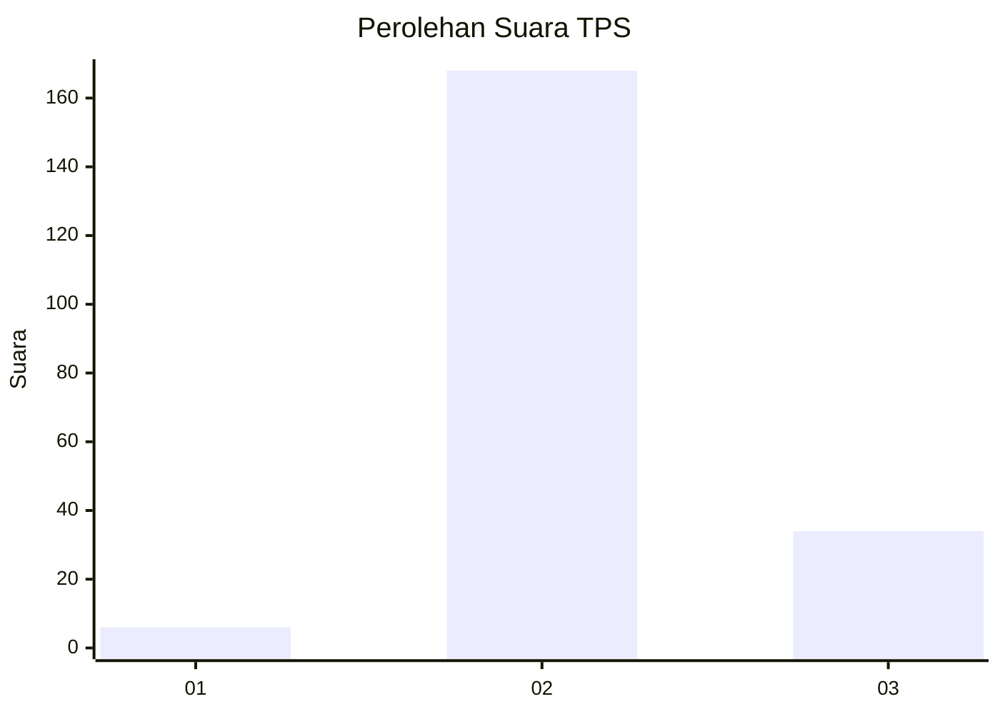
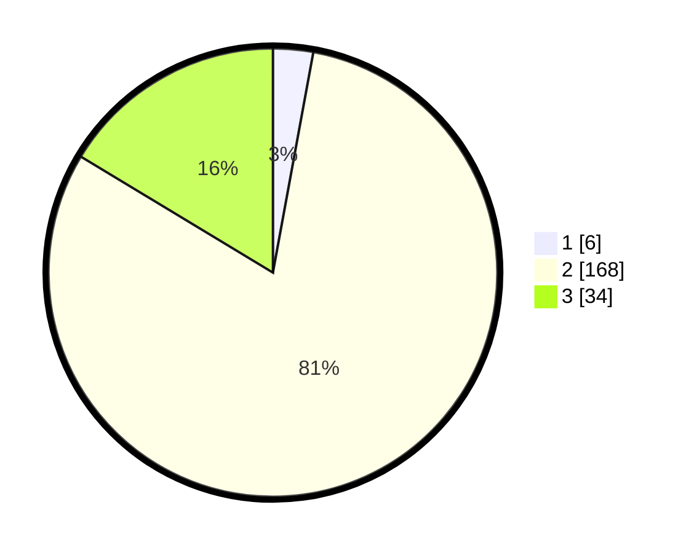

# Hasil

## Grafik

## Tabel

| No. | Nama Paslon    | Suara | Suara (raw) | Persentase |
|:--- |:-------------- | -----:| -----------:| ----------:|
| 1   | ANIES MUHAIMIN | 6     | [6][p-1]    | 2,88       |
| 2   | PRABOWO GIBRAN | 168   | [168][p-2]  | 80,77      |
| 3   | GANJAR MAHFUD  | 34    | [34][p-3]   | 16,35      |

[p-1]: https://github.com/gigit-pemilu/pemilu-2024/blob/main/pilpres/hitung-suara/sub/35-jawa-timur/sub/09-jember/sub/11-wuluhan/sub/2001-lojejer/sub/025-tps/sub/paslon-1.txt
[p-2]: https://github.com/gigit-pemilu/pemilu-2024/blob/main/pilpres/hitung-suara/sub/35-jawa-timur/sub/09-jember/sub/11-wuluhan/sub/2001-lojejer/sub/025-tps/sub/paslon-2.txt
[p-3]: https://github.com/gigit-pemilu/pemilu-2024/blob/main/pilpres/hitung-suara/sub/35-jawa-timur/sub/09-jember/sub/11-wuluhan/sub/2001-lojejer/sub/025-tps/sub/paslon-3.txt

## Foto C Plano

https://sirekap-obj-formc.kpu.go.id/467a/pemilu/ppwp/35/09/11/20/01/3509112001025-20240215-084900--16fed2a6-f28f-425d-9e40-298e9a544ce3.jpg

https://sirekap-obj-formc.kpu.go.id/467a/pemilu/ppwp/35/09/11/20/01/3509112001025-20240215-084938--050e3ffc-f17d-4783-9a82-c350c1c5cf9d.jpg

https://sirekap-obj-formc.kpu.go.id/467a/pemilu/ppwp/35/09/11/20/01/3509112001025-20240215-085029--a242f3ce-3d68-469e-b40d-63db75d215c1.jpg

## Metadata

| Key        | Value               |
| ---------- | ------------------- |
| Time Stamp | 2024-02-25 15:00:00 |

