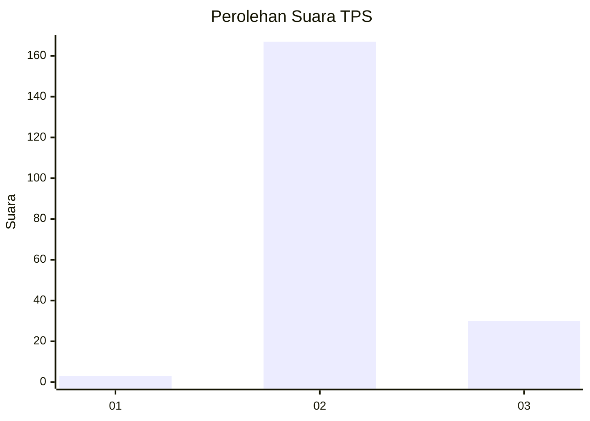
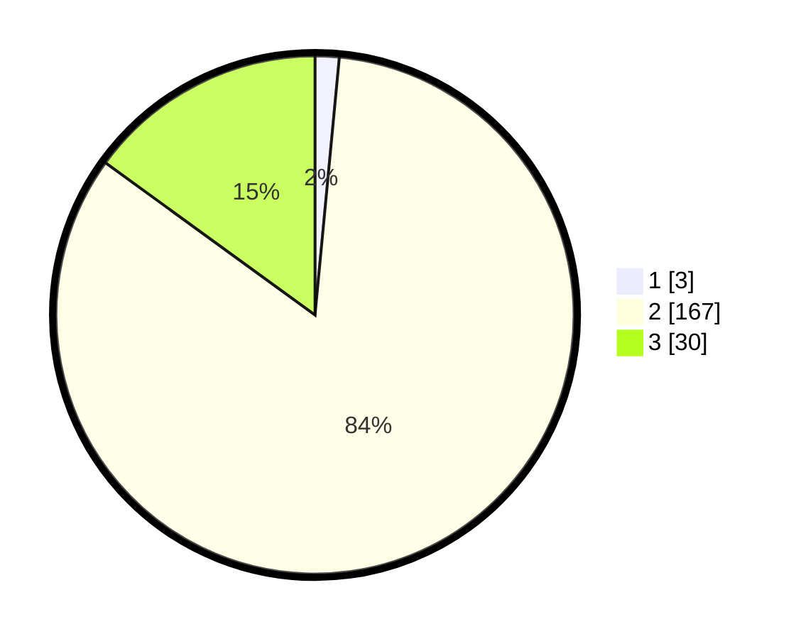

# Hasil

## Grafik

## Tabel

| No. | Nama Paslon    | Suara | Suara (raw) | Persentase |
|:--- |:-------------- | -----:| -----------:| ----------:|
| 1   | ANIES MUHAIMIN | 3     | [3][p-1]    | 1,50       |
| 2   | PRABOWO GIBRAN | 167   | [167][p-2]  | 83,50      |
| 3   | GANJAR MAHFUD  | 30    | [30][p-3]   | 15,00      |

[p-1]: https://github.com/gigit-pemilu/pemilu-2024/blob/main/pilpres/hitung-suara/sub/35-jawa-timur/sub/09-jember/sub/11-wuluhan/sub/2001-lojejer/sub/064-tps/sub/paslon-1.txt
[p-2]: https://github.com/gigit-pemilu/pemilu-2024/blob/main/pilpres/hitung-suara/sub/35-jawa-timur/sub/09-jember/sub/11-wuluhan/sub/2001-lojejer/sub/064-tps/sub/paslon-2.txt
[p-3]: https://github.com/gigit-pemilu/pemilu-2024/blob/main/pilpres/hitung-suara/sub/35-jawa-timur/sub/09-jember/sub/11-wuluhan/sub/2001-lojejer/sub/064-tps/sub/paslon-3.txt

## Foto C Plano

https://sirekap-obj-formc.kpu.go.id/f01a/pemilu/ppwp/35/09/11/20/01/3509112001064-20240215-004320--394d6091-2c9b-4d0d-b577-d63ce4937bf2.jpg

https://sirekap-obj-formc.kpu.go.id/f01a/pemilu/ppwp/35/09/11/20/01/3509112001064-20240217-092806--f06285a7-e215-4ebb-8043-abb4ff4d9d1c.jpg

https://sirekap-obj-formc.kpu.go.id/f01a/pemilu/ppwp/35/09/11/20/01/3509112001064-20240215-023855--b5e24f7e-0d69-4d0b-b5b9-778a43503d3b.jpg

## Metadata

| Key        | Value               |
| ---------- | ------------------- |
| Time Stamp | 2024-02-19 06:16:00 |

