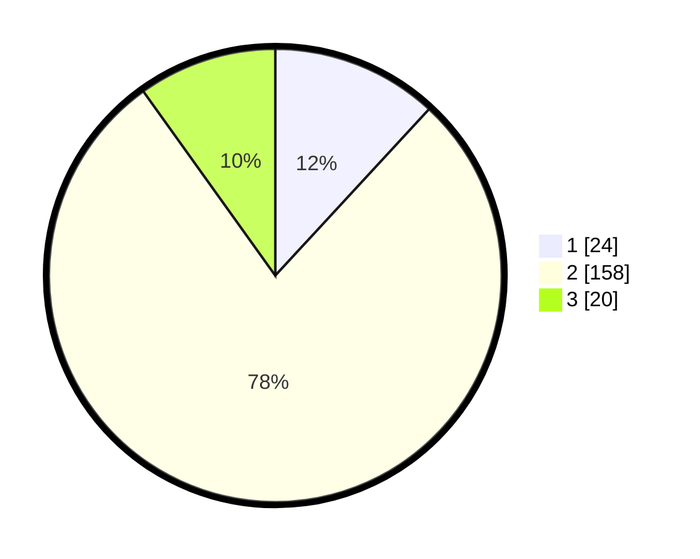

# Hasil

## Grafik

## Tabel

| No. | Nama Paslon    | Suara | Suara (raw) | Persentase |
|:--- |:-------------- | -----:| -----------:| ----------:|
| 1   | ANIES MUHAIMIN | 24    | [24][p-1]   | 11,88      |
| 2   | PRABOWO GIBRAN | 158   | [158][p-2]  | 78,22      |
| 3   | GANJAR MAHFUD  | 20    | [20][p-3]   | 9,90       |

[p-1]: https://github.com/gigit-pemilu/pemilu-2024/blob/main/pilpres/hitung-suara/sub/35-jawa-timur/sub/09-jember/sub/11-wuluhan/sub/2002-ampel/sub/016-tps/sub/paslon-1.txt
[p-2]: https://github.com/gigit-pemilu/pemilu-2024/blob/main/pilpres/hitung-suara/sub/35-jawa-timur/sub/09-jember/sub/11-wuluhan/sub/2002-ampel/sub/016-tps/sub/paslon-2.txt
[p-3]: https://github.com/gigit-pemilu/pemilu-2024/blob/main/pilpres/hitung-suara/sub/35-jawa-timur/sub/09-jember/sub/11-wuluhan/sub/2002-ampel/sub/016-tps/sub/paslon-3.txt

## Foto C Plano

https://sirekap-obj-formc.kpu.go.id/e9a0/pemilu/ppwp/35/09/11/20/02/3509112002016-20240215-215217--53e8291a-0c24-4ffb-bc7a-ba328ede9cab.jpg

https://sirekap-obj-formc.kpu.go.id/e9a0/pemilu/ppwp/35/09/11/20/02/3509112002016-20240216-000522--338bf733-13ba-450a-a793-d06487eb75cb.jpg

https://sirekap-obj-formc.kpu.go.id/e9a0/pemilu/ppwp/35/09/11/20/02/3509112002016-20240215-222149--01af7167-1394-41a5-9060-0df7a85c6ac9.jpg

## Metadata

| Key        | Value               |
| ---------- | ------------------- |
| Time Stamp | 2024-02-16 10:30:29 |

