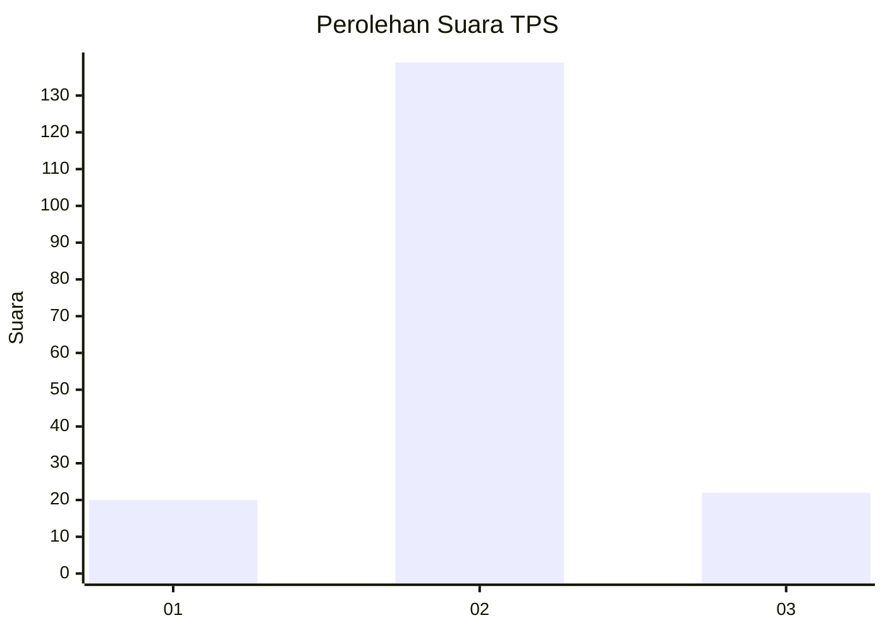
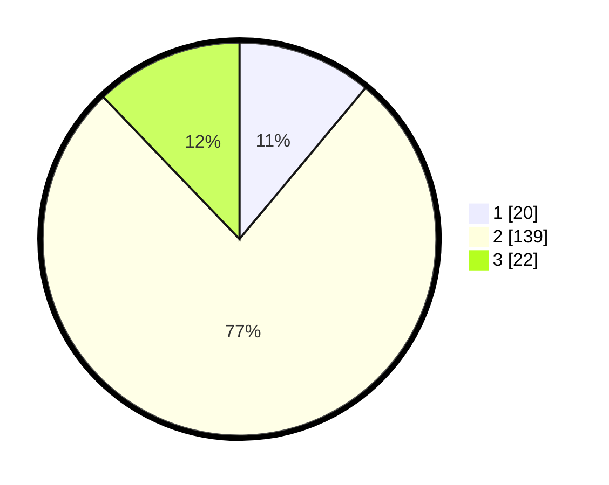

# Hasil

## Grafik

## Tabel

| No. | Nama Paslon    | Suara | Suara (raw) | Persentase |
|:--- |:-------------- | -----:| -----------:| ----------:|
| 1   | ANIES MUHAIMIN | 20    | [20][p-1]   | 11,05      |
| 2   | PRABOWO GIBRAN | 139   | [139][p-2]  | 76,80      |
| 3   | GANJAR MAHFUD  | 22    | [22][p-3]   | 12,15      |

[p-1]: https://github.com/gigit-pemilu/pemilu-2024/blob/main/pilpres/hitung-suara/sub/35-jawa-timur/sub/09-jember/sub/11-wuluhan/sub/2002-ampel/sub/044-tps/sub/paslon-1.txt
[p-2]: https://github.com/gigit-pemilu/pemilu-2024/blob/main/pilpres/hitung-suara/sub/35-jawa-timur/sub/09-jember/sub/11-wuluhan/sub/2002-ampel/sub/044-tps/sub/paslon-2.txt
[p-3]: https://github.com/gigit-pemilu/pemilu-2024/blob/main/pilpres/hitung-suara/sub/35-jawa-timur/sub/09-jember/sub/11-wuluhan/sub/2002-ampel/sub/044-tps/sub/paslon-3.txt

## Foto C Plano

https://sirekap-obj-formc.kpu.go.id/40ae/pemilu/ppwp/35/09/11/20/02/3509112002044-20240215-014038--7a347a52-b4d9-4a36-8ec9-1f7bf6c46fa6.jpg

https://sirekap-obj-formc.kpu.go.id/40ae/pemilu/ppwp/35/09/11/20/02/3509112002044-20240215-014055--be9bc150-e597-4891-8a12-7fe780da0282.jpg

https://sirekap-obj-formc.kpu.go.id/40ae/pemilu/ppwp/35/09/11/20/02/3509112002044-20240215-014111--5dcfd5b0-fef0-4fc7-85ff-ff4873a3b72f.jpg

## Metadata

| Key        | Value               |
| ---------- | ------------------- |
| Time Stamp | 2024-02-25 15:00:00 |

