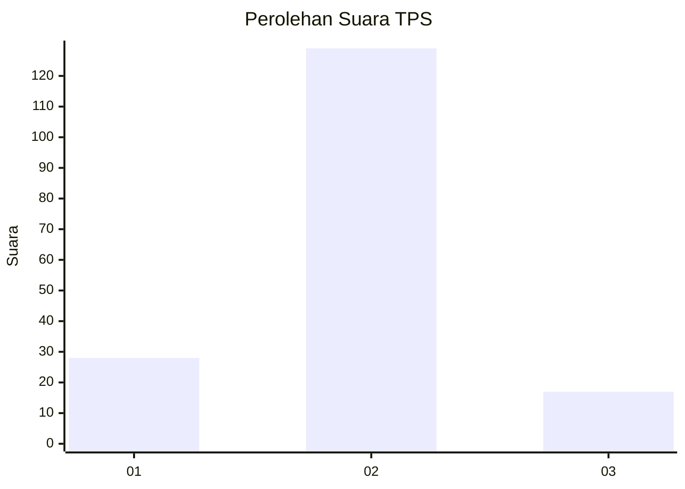
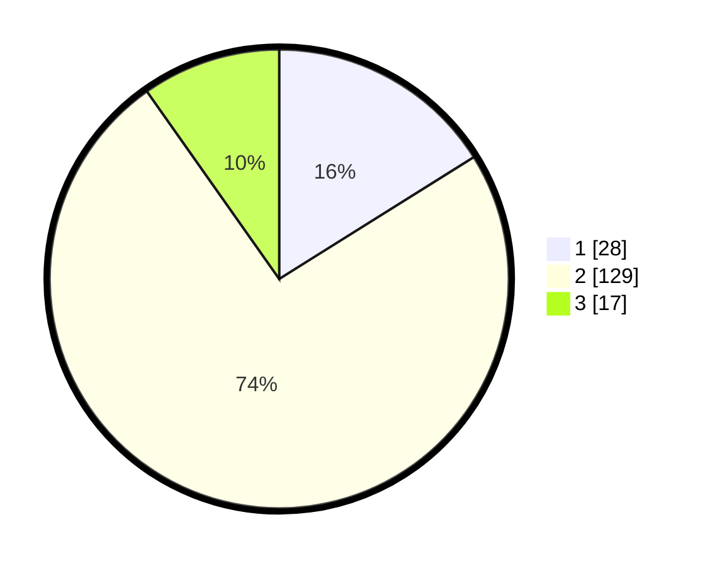

# Hasil

## Grafik

## Tabel

| No. | Nama Paslon    | Suara | Suara (raw) | Persentase |
|:--- |:-------------- | -----:| -----------:| ----------:|
| 1   | ANIES MUHAIMIN | 28    | [28][p-1]   | 16,09      |
| 2   | PRABOWO GIBRAN | 129   | [129][p-2]  | 74,14      |
| 3   | GANJAR MAHFUD  | 17    | [17][p-3]   | 9,77       |

[p-1]: https://github.com/gigit-pemilu/pemilu-2024-35-jawa-timur/blob/main/pilpres/hitung-suara/sub/35-jawa-timur/sub/09-jember/sub/11-wuluhan/sub/2002-ampel/sub/046-tps/sub/paslon-1.txt
[p-2]: https://github.com/gigit-pemilu/pemilu-2024-35-jawa-timur/blob/main/pilpres/hitung-suara/sub/35-jawa-timur/sub/09-jember/sub/11-wuluhan/sub/2002-ampel/sub/046-tps/sub/paslon-2.txt
[p-3]: https://github.com/gigit-pemilu/pemilu-2024-35-jawa-timur/blob/main/pilpres/hitung-suara/sub/35-jawa-timur/sub/09-jember/sub/11-wuluhan/sub/2002-ampel/sub/046-tps/sub/paslon-3.txt

## Foto C Plano

https://sirekap-obj-formc.kpu.go.id/b01c/pemilu/ppwp/35/09/11/20/02/3509112002046-20240214-221830--86d06a12-e7cc-414c-a6d8-845434d45cb5.jpg

https://sirekap-obj-formc.kpu.go.id/b01c/pemilu/ppwp/35/09/11/20/02/3509112002046-20240214-222036--42cd4809-44d3-4563-a5cf-591d7f9d004a.jpg

https://sirekap-obj-formc.kpu.go.id/b01c/pemilu/ppwp/35/09/11/20/02/3509112002046-20240214-222301--bdc04655-5eb9-4a5f-8d60-7fca69ee8672.jpg

## Metadata

| Key        | Value               |
| ---------- | ------------------- |
| Time Stamp | 2024-02-15 15:00:29 |

