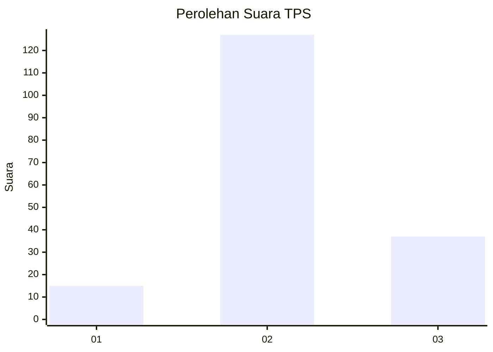
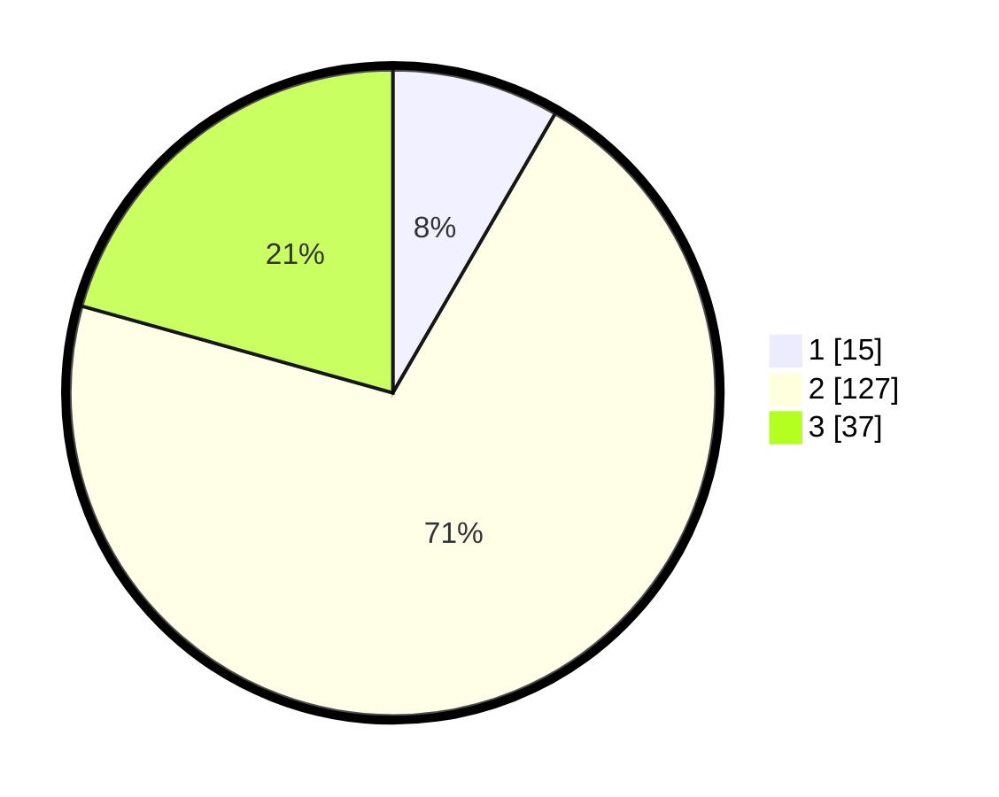

# Hasil

## Grafik

## Tabel

| No. | Nama Paslon    | Suara | Suara (raw) | Persentase |
|:--- |:-------------- | -----:| -----------:| ----------:|
| 1   | ANIES MUHAIMIN | 15    | [15][p-1]   | 8,38       |
| 2   | PRABOWO GIBRAN | 127   | [127][p-2]  | 70,95      |
| 3   | GANJAR MAHFUD  | 37    | [37][p-3]   | 20,67      |

[p-1]: https://github.com/gigit-pemilu/pemilu-2024-35-jawa-timur/blob/main/pilpres/hitung-suara/sub/35-jawa-timur/sub/09-jember/sub/11-wuluhan/sub/2002-ampel/sub/048-tps/sub/paslon-1.txt
[p-2]: https://github.com/gigit-pemilu/pemilu-2024-35-jawa-timur/blob/main/pilpres/hitung-suara/sub/35-jawa-timur/sub/09-jember/sub/11-wuluhan/sub/2002-ampel/sub/048-tps/sub/paslon-2.txt
[p-3]: https://github.com/gigit-pemilu/pemilu-2024-35-jawa-timur/blob/main/pilpres/hitung-suara/sub/35-jawa-timur/sub/09-jember/sub/11-wuluhan/sub/2002-ampel/sub/048-tps/sub/paslon-3.txt

## Foto C Plano

https://sirekap-obj-formc.kpu.go.id/658a/pemilu/ppwp/35/09/11/20/02/3509112002048-20240217-115421--361f519e-37e8-4d78-85ff-7c7e163025b5.jpg

https://sirekap-obj-formc.kpu.go.id/658a/pemilu/ppwp/35/09/11/20/02/3509112002048-20240215-004357--56b786bf-c5b1-46ee-bbd1-e31b42246c0b.jpg

https://sirekap-obj-formc.kpu.go.id/658a/pemilu/ppwp/35/09/11/20/02/3509112002048-20240215-004429--7a6d6246-08a0-47cf-9c1e-e5de97ef2bbc.jpg

## Metadata

| Key        | Value               |
| ---------- | ------------------- |
| Time Stamp | 2024-02-24 22:31:28 |

