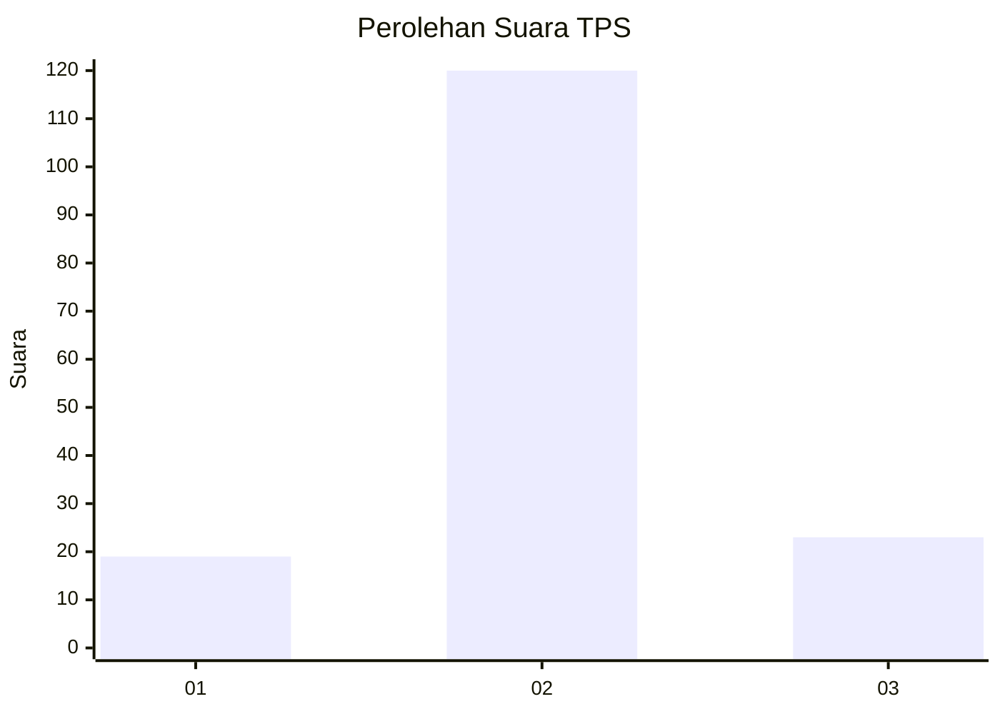
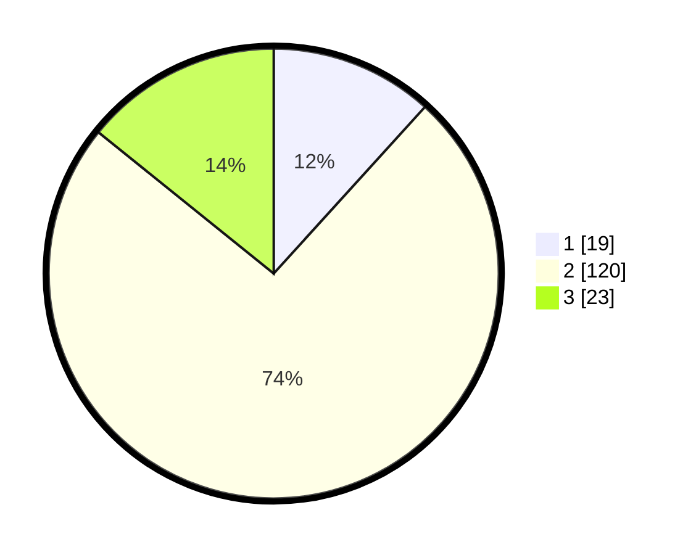

# Hasil

## Grafik

## Tabel

| No. | Nama Paslon    | Suara | Suara (raw) | Persentase |
|:--- |:-------------- | -----:| -----------:| ----------:|
| 1   | ANIES MUHAIMIN | 19    | [19][p-1]   | 11,73      |
| 2   | PRABOWO GIBRAN | 120   | [120][p-2]  | 74,07      |
| 3   | GANJAR MAHFUD  | 23    | [23][p-3]   | 14,20      |

[p-1]: https://github.com/gigit-pemilu/pemilu-2024-35-jawa-timur/blob/main/pilpres/hitung-suara/sub/35-jawa-timur/sub/09-jember/sub/11-wuluhan/sub/2003-tamansari/sub/009-tps/sub/paslon-1.txt
[p-2]: https://github.com/gigit-pemilu/pemilu-2024-35-jawa-timur/blob/main/pilpres/hitung-suara/sub/35-jawa-timur/sub/09-jember/sub/11-wuluhan/sub/2003-tamansari/sub/009-tps/sub/paslon-2.txt
[p-3]: https://github.com/gigit-pemilu/pemilu-2024-35-jawa-timur/blob/main/pilpres/hitung-suara/sub/35-jawa-timur/sub/09-jember/sub/11-wuluhan/sub/2003-tamansari/sub/009-tps/sub/paslon-3.txt

## Foto C Plano

https://sirekap-obj-formc.kpu.go.id/6e2d/pemilu/ppwp/35/09/11/20/03/3509112003009-20240215-175951--629169d8-35a2-4260-b4d6-3b3c33af0dc0.jpg

https://sirekap-obj-formc.kpu.go.id/6e2d/pemilu/ppwp/35/09/11/20/03/3509112003009-20240215-174722--9920bed4-a11a-4fb3-894d-e8672ffafb79.jpg

https://sirekap-obj-formc.kpu.go.id/6e2d/pemilu/ppwp/35/09/11/20/03/3509112003009-20240215-175000--9a08cd14-43ed-45b9-84ee-37200acb3e60.jpg

## Metadata

| Key        | Value               |
| ---------- | ------------------- |
| Time Stamp | 2024-02-16 11:00:29 |

