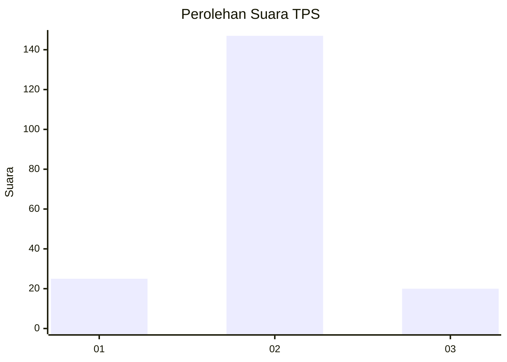
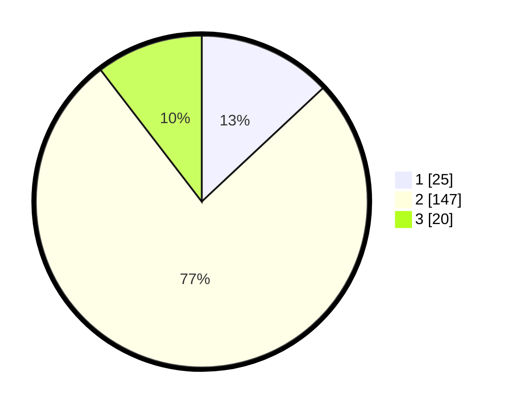

# Hasil

## Grafik

## Tabel

| No. | Nama Paslon    | Suara | Suara (raw) | Persentase |
|:--- |:-------------- | -----:| -----------:| ----------:|
| 1   | ANIES MUHAIMIN | 25    | [25][p-1]   | 13,02      |
| 2   | PRABOWO GIBRAN | 147   | [147][p-2]  | 76,56      |
| 3   | GANJAR MAHFUD  | 20    | [20][p-3]   | 10,42      |

[p-1]: https://github.com/gigit-pemilu/pemilu-2024/blob/main/pilpres/hitung-suara/sub/35-jawa-timur/sub/09-jember/sub/11-wuluhan/sub/2003-tamansari/sub/012-tps/sub/paslon-1.txt
[p-2]: https://github.com/gigit-pemilu/pemilu-2024/blob/main/pilpres/hitung-suara/sub/35-jawa-timur/sub/09-jember/sub/11-wuluhan/sub/2003-tamansari/sub/012-tps/sub/paslon-2.txt
[p-3]: https://github.com/gigit-pemilu/pemilu-2024/blob/main/pilpres/hitung-suara/sub/35-jawa-timur/sub/09-jember/sub/11-wuluhan/sub/2003-tamansari/sub/012-tps/sub/paslon-3.txt

## Foto C Plano

https://sirekap-obj-formc.kpu.go.id/8df6/pemilu/ppwp/35/09/11/20/03/3509112003012-20240218-192525--9debd5c4-5dd4-4d9e-816e-e3ab39c67bf9.jpg

https://sirekap-obj-formc.kpu.go.id/8df6/pemilu/ppwp/35/09/11/20/03/3509112003012-20240218-192818--b3667dc3-5538-4d91-99f3-31f2b6c522fd.jpg

https://sirekap-obj-formc.kpu.go.id/8df6/pemilu/ppwp/35/09/11/20/03/3509112003012-20240218-193146--5a9fb83c-bf9d-4319-95c1-cc935b0f498e.jpg

## Metadata

| Key        | Value               |
| ---------- | ------------------- |
| Time Stamp | 2024-02-19 06:16:00 |

