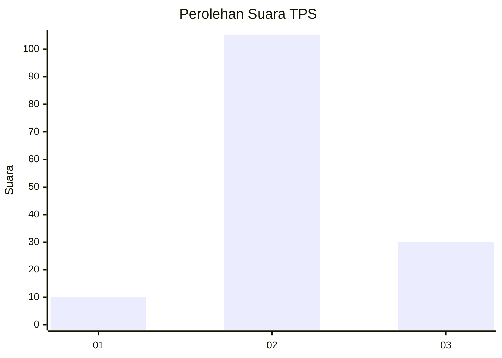

# Hasil

## Grafik

## Tabel

| No. | Nama Paslon    | Suara | Suara (raw) | Persentase |
|:--- |:-------------- | -----:| -----------:| ----------:|
| 1   | ANIES MUHAIMIN | 10    | [10][p-1]   | 6,90       |
| 2   | PRABOWO GIBRAN | 105   | [105][p-2]  | 72,41      |
| 3   | GANJAR MAHFUD  | 30    | [30][p-3]   | 20,69      |

[p-1]: https://github.com/gigit-pemilu/pemilu-2024/blob/main/pilpres/hitung-suara/sub/35-jawa-timur/sub/09-jember/sub/11-wuluhan/sub/2003-tamansari/sub/013-tps/sub/paslon-1.txt
[p-2]: https://github.com/gigit-pemilu/pemilu-2024/blob/main/pilpres/hitung-suara/sub/35-jawa-timur/sub/09-jember/sub/11-wuluhan/sub/2003-tamansari/sub/013-tps/sub/paslon-2.txt
[p-3]: https://github.com/gigit-pemilu/pemilu-2024/blob/main/pilpres/hitung-suara/sub/35-jawa-timur/sub/09-jember/sub/11-wuluhan/sub/2003-tamansari/sub/013-tps/sub/paslon-3.txt

## Foto C Plano

https://sirekap-obj-formc.kpu.go.id/9dda/pemilu/ppwp/35/09/11/20/03/3509112003013-20240214-224416--de1cf87b-8fed-4aad-8f38-60e907dae8fc.jpg

https://sirekap-obj-formc.kpu.go.id/9dda/pemilu/ppwp/35/09/11/20/03/3509112003013-20240216-160732--0b1548de-6bc0-47fc-b1d9-6483883e9e9e.jpg

https://sirekap-obj-formc.kpu.go.id/9dda/pemilu/ppwp/35/09/11/20/03/3509112003013-20240214-230818--a7f1419d-12da-4be4-a098-9132457a197f.jpg

## Metadata

| Key        | Value               |
| ---------- | ------------------- |
| Time Stamp | 2024-02-24 22:31:28 |

